# 🏦 Apex Arbitrage Windows Desktop - Features Blueprint

**MASTER ARCHITECTURAL COMMAND CENTER**  
*Complete Windows-Native Desktop Application Development Framework*

---

## 🎯 Mission Statement

This directory contains the **complete technical specifications** for building the Apex Arbitrage Multichain Bot as a **professional Windows desktop application**. Every feature is designed from the ground up for Windows users who want **one-click installation** and **desktop control** of sophisticated arbitrage operations.

**Key Principle**: Transform complex blockchain arbitrage into **simple desktop software** that anyone can install and operate.

---

## 📊 Complete Feature Architecture

### **🔥 Critical Features (P0) - MVP Foundation**

| Feature File | Windows Implementation | Purpose | Development Time | Dependencies |
|-------------|----------------------|---------|-----------------|-------------|
| **install-dependencies.md** | NSIS/Inno Setup installer with embedded runtimes | Auto-install Node.js, Python, SQLite, configure Windows Service | 4 days | None |
| **config.md** | Registry + %AppData% JSON configuration with GUI editor | Secure configuration management with hot-reload | 3 days | install-dependencies |
| **backend.md** | Windows Service + localhost API server | Core arbitrage execution engine with SQLite logging | 6 days | config |
| **dashboard.md** | Electron desktop app with native Windows integration | Real-time control center with system tray support | 5 days | backend, config |

### **⚡ High-Value Features (P1) - Core Functionality**

| Feature File | Windows Implementation | Purpose | Development Time | Dependencies |
|-------------|----------------------|---------|-----------------|-------------|
| **ai-modules.md** | Embedded Python ML models with Node.js bridge | Intelligent arbitrage opportunity detection | 5 days | backend |
| **security.md** | Windows Credential Manager + AES encryption | Enterprise-grade security and key management | 4 days | config, backend |
| **contracts.md** | Hardhat integration with Windows batch scripts | Smart contract deployment and management | 4 days | backend |

### **🛠️ Supporting Features (P2-P3) - Polish & Operations**

| Feature File | Windows Implementation | Purpose | Development Time | Dependencies |
|-------------|----------------------|---------|-----------------|-------------|
| **testing.md** | Jest + Playwright with Windows-specific tests | Comprehensive quality assurance framework | 3 days | All features |
| **deployment.md** | Electron Builder + code signing + auto-update | Professional distribution and update system | 4 days | All features |
| **docs.md** | Integrated help system + operator guides | User documentation and troubleshooting | 2 days | All features |

---

## 🏗️ Windows Desktop Architecture Deep Dive

### **System Overview Diagram**

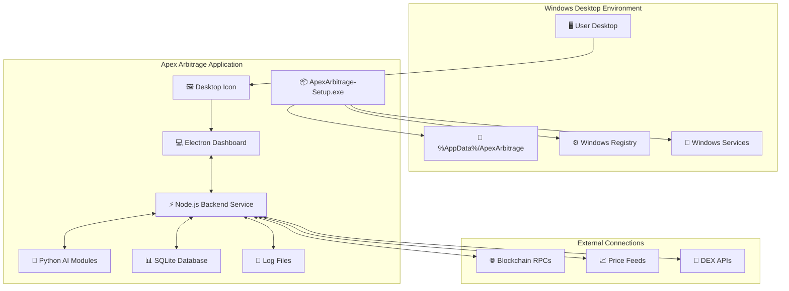

### **Application Startup Sequence**

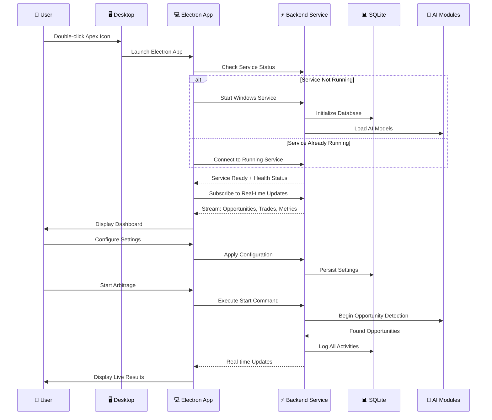

### **Data Flow Architecture**

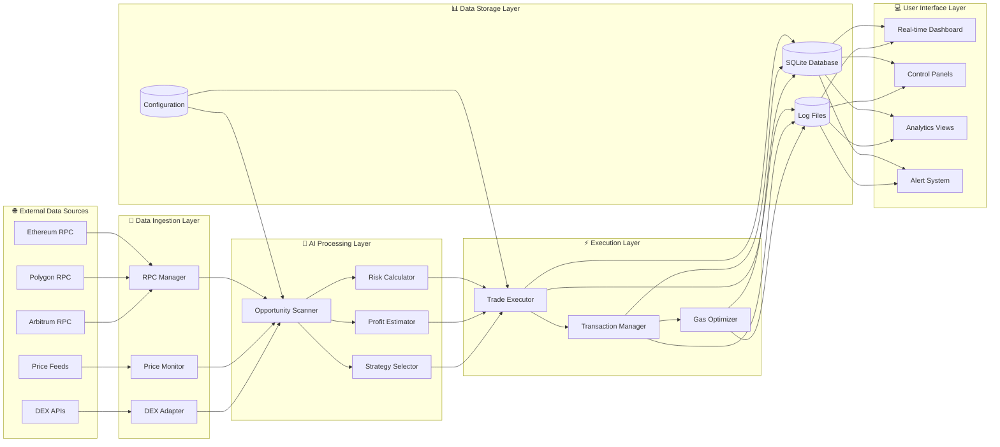

---

## 🔧 Windows Implementation Details

### **Installation & Bootstrap Process**

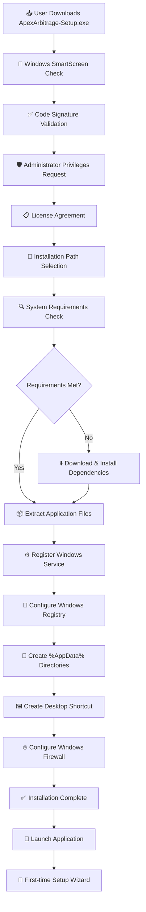

### **Service Architecture**

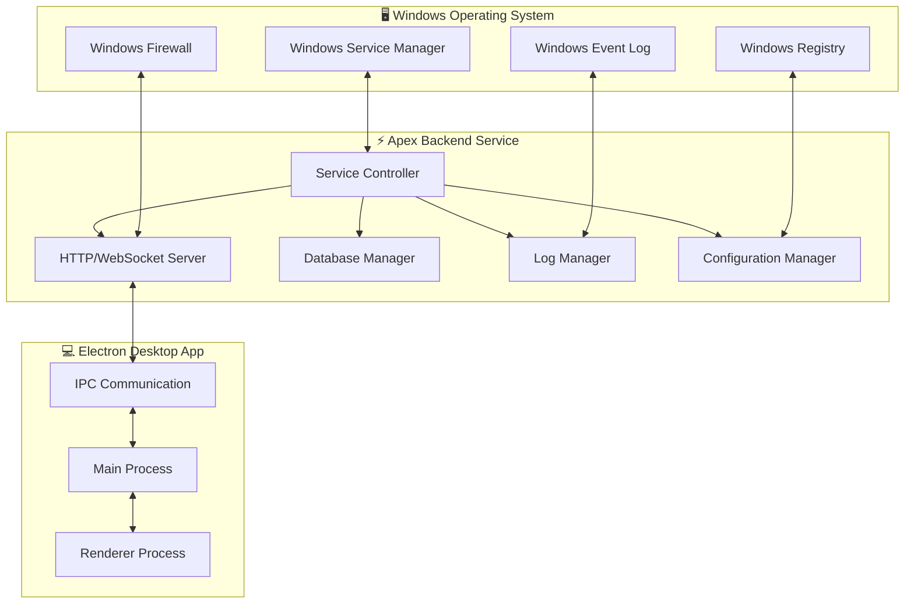

### **Configuration Management System**

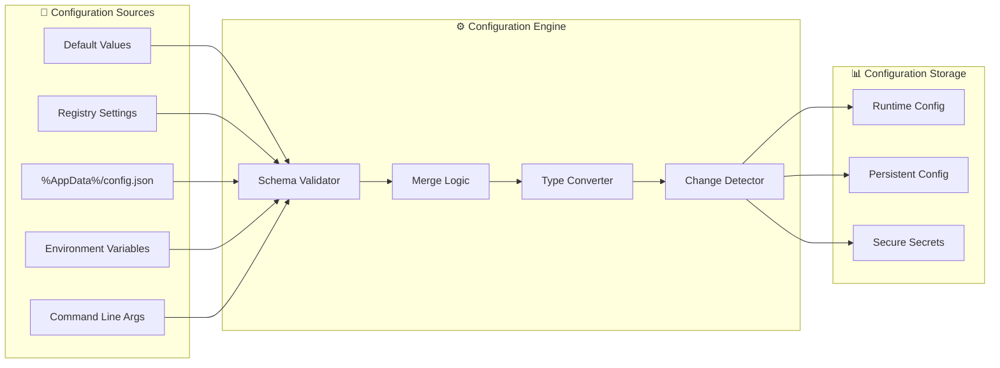

---

## 📊 Development Workflow Diagrams

### **Feature Development Lifecycle**

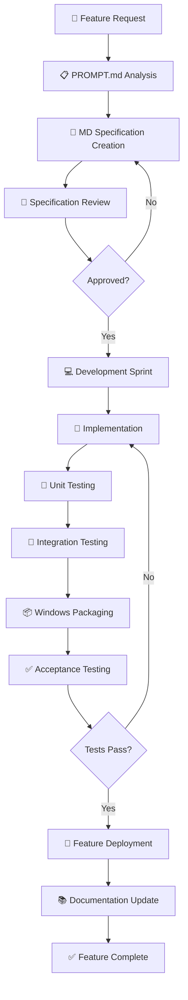

### **Testing Strategy Matrix**

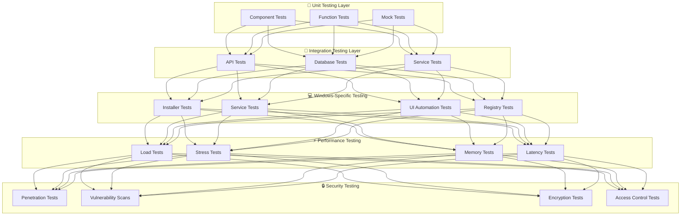

### **Deployment Pipeline**

```mermaid
flowchart LR
    subgraph "💻 Development"
        A["Feature Branch"]
        B["Local Testing"]
        C["Code Review"]
    end
    
    subgraph "🔄 CI/CD Pipeline"
        D["Automated Tests"]
        E["Windows Build"]
        F["Code Signing"]
        G["Package Creation"]
    end
    
    subgraph "📦 Distribution"
        H["Alpha Channel"]
        I["Beta Channel"]
        J["Production Channel"]
    end
    
    subgraph "🎯 Deployment"
        K["Auto-Update Server"]
        L["User Installation"]
        M["Monitoring & Alerts"]
    end
    
    A --> B --> C --> D
    D --> E --> F --> G
    G --> H --> I --> J
    J --> K --> L --> M
```

---

## 💰 Business Value Metrics

### **ROI Calculation Model**

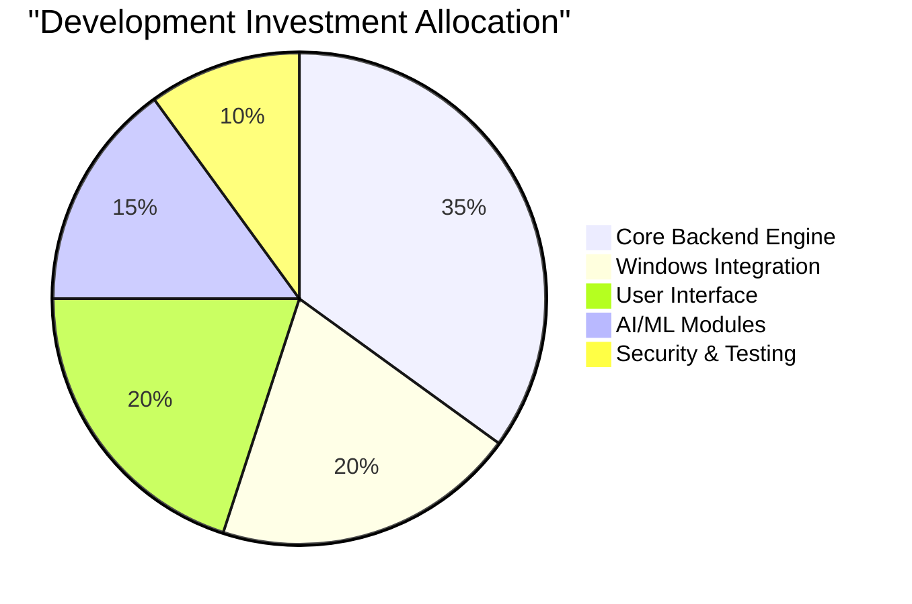

### **Performance Targets**

| Metric | Target | Measurement Method |
|--------|--------|-----------------|
| **Installation Time** | < 3 minutes | Automated installer tests |
| **Startup Time** | < 10 seconds | Service ready + dashboard loaded |
| **Memory Usage** | < 500MB idle | Windows Task Manager monitoring |
| **CPU Usage** | < 5% idle, < 50% active | Performance counters |
| **Arbitrage Detection** | < 2 seconds | Real-time opportunity scanning |
| **Trade Execution** | < 5 seconds | End-to-end transaction time |
| **UI Responsiveness** | < 100ms | User interaction response time |
| **Data Persistence** | 99.99% | Zero data loss during crashes |
| **Uptime SLA** | 99.9% | 24/7 monitoring and alerting |

### **Success Criteria Dashboard**

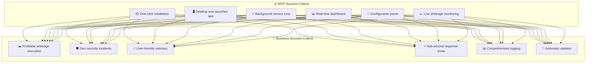

---

## 🔒 Enterprise Security Architecture

### **Security Layers Diagram**

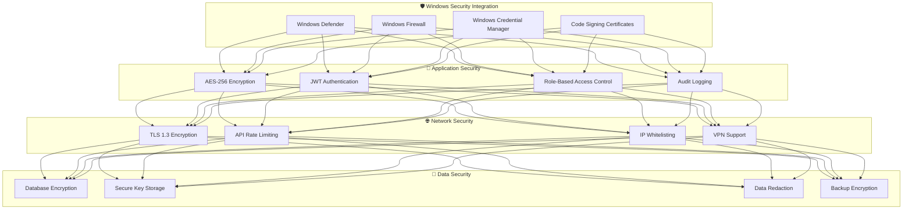

### **Threat Model Matrix**

| Threat Category | Risk Level | Mitigation Strategy | Implementation |
|----------------|------------|-------------------|----------------|
| **Malware Infection** | High | Code signing + Windows Defender integration | security.md |
| **Data Theft** | High | AES encryption + secure storage | security.md, config.md |
| **Network Attacks** | Medium | TLS encryption + firewall rules | security.md, backend.md |
| **Social Engineering** | Medium | User education + secure defaults | docs.md, security.md |
| **System Compromise** | High | Privilege separation + auditing | security.md, backend.md |
| **Configuration Tampering** | Medium | Registry protection + checksums | config.md, security.md |

---

## 📈 Monitoring & Observability

### **Telemetry Architecture**

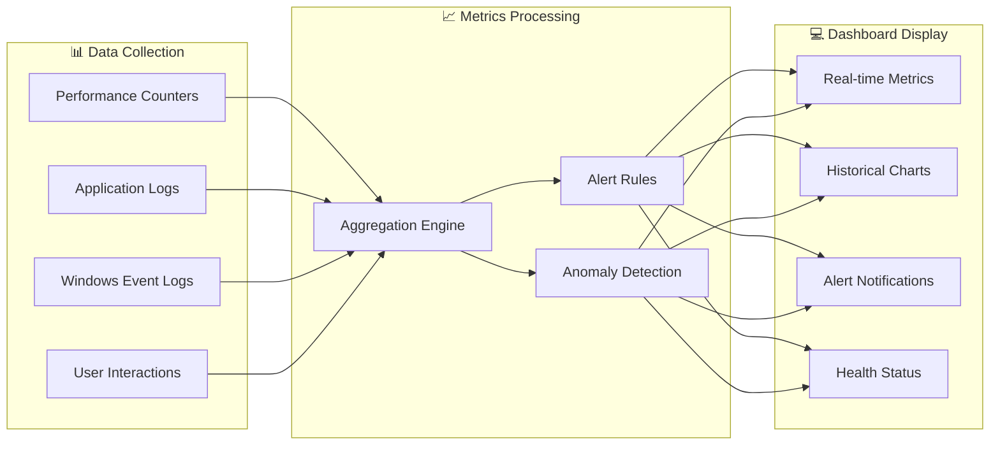

### **Key Performance Indicators (KPIs)**

```mermaid
gauge
    title System Health Score
    min 0
    max 100
    ranges [0, 50, "#ff4444", 50, 80, "#ffaa00", 80, 100, "#44ff44"]
    value 95
```

---

## 🚀 Getting Started Guide

### **For Developers - Complete Setup**

1. **📋 Read This README** - Understand the complete architecture
2. **📄 Review Feature MDs** - Study each component specification
3. **🔧 Setup Development Environment**:
   - Windows 10/11 (required)
   - Node.js 18+ with npm
   - Python 3.9+ with pip
   - Visual Studio Code with extensions
   - Git with GitHub credentials
4. **📦 Clone Repository**:

   ```bash
   git clone https://github.com/pavan53732/Apex-Arbitrage-Multichain-bot-for-windows.git
   cd Apex-Arbitrage-Multichain-bot-for-windows
   ```

5. **🎯 Choose Your Feature** - Select P0 feature to implement
6. **📝 Use PROMPT.md** - Generate detailed specifications
7. **💻 Implement & Test** - Follow feature development lifecycle

### **For Users - Installation Guide**

1. **📥 Download Latest Release**:
   - Visit [Releases Page](https://github.com/pavan53732/Apex-Arbitrage-Multichain-bot-for-windows/releases)
   - Download `ApexArbitrage-Setup.exe`
2. **🔐 Run Installer**:
   - Right-click → "Run as Administrator"
   - Follow installation wizard
   - Accept Windows Defender/Firewall prompts
3. **🖥️ Launch Application**:
   - Double-click desktop icon
   - Complete first-time setup wizard
   - Configure blockchain connections
4. **🎯 Start Trading**:
   - Review configuration settings
   - Click "Start Arbitrage" button
   - Monitor real-time dashboard

### **For Operators - Management Guide**

1. **📊 Monitor Dashboard** - Watch real-time metrics and alerts
2. **🔧 Manage Configuration** - Adjust settings through GUI
3. **📝 Review Logs** - Check execution logs and error reports
4. **🔄 Update Software** - Allow automatic updates or manual updates
5. **🛡️ Security Monitoring** - Review audit logs and security alerts

---

## 📞 Support & Community

### **Getting Help**

- **📚 Documentation**: Complete guides in `docs.md`
- **🐛 Bug Reports**: GitHub Issues with detailed templates
- **💡 Feature Requests**: GitHub Discussions for new ideas
- **🔧 Technical Support**: Community support through GitHub

### **Contributing**

- **🔀 Fork Repository** - Create your own development branch
- **📝 Follow Standards** - Use PROMPT.md for feature specifications
- **🧪 Write Tests** - Comprehensive testing required
- **📋 Submit Pull Request** - Detailed review process

---

**🎯 This Features README represents the complete blueprint for building institutional-grade blockchain arbitrage technology as an accessible Windows desktop application. Every diagram, specification, and implementation detail is designed to ensure success from development through deployment.**
