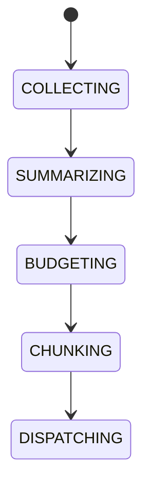

# AI Context Window Management

## Purpose
Defines context compression, rolling summaries, token budgeting, memory retrieval, and chunk selection.

## State machine

## Failure modes
Context overflow, stale summary, missing retrieval, token budget breach.

## Recovery
Compress, trim, retrieve alternate memory, or refuse request.

## Cross-references
- `AI-PIPELINE.md`
- `AI-MEMORY-SYSTEM.md`
- `CONTEXT-BUILDER.md`
