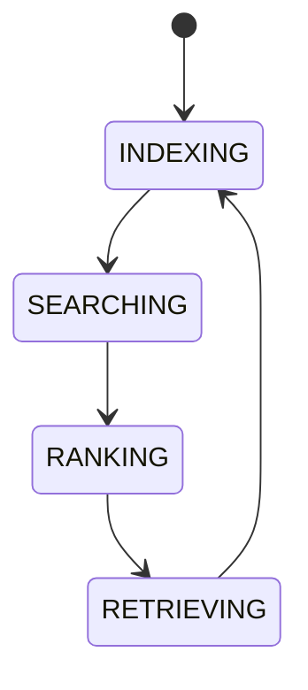

# AI Knowledge Index

## Purpose
Defines how AI searches the knowledge graph, indexes documents, ranks retrieval results, and applies embedding strategies if added later.

## State machine

## Cross-references
- `KNOWLEDGE-GRAPH.md`
- `AI-MEMORY-SYSTEM.md`
- `CONTEXT-BUILDER.md`
