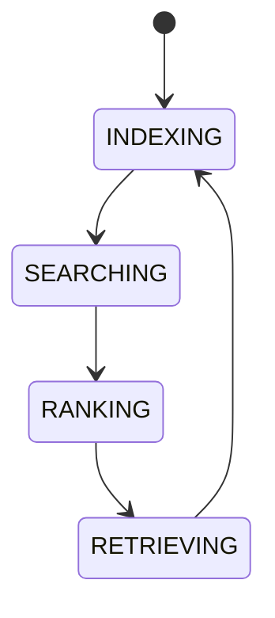

# AI Knowledge Index

## Purpose
Defines how AI searches the knowledge graph, indexes documents, ranks retrieval results, and applies embedding strategies if added later.

## State machine

## Cross-references
- `KNOWLEDGE-GRAPH.md`
- `AI-MEMORY-SYSTEM.md`
- `CONTEXT-BUILDER.md`

## Interface Contract
Defines indexing, ranking, retrieval, embedding strategy hooks, and document search semantics.

## Example
A planner prompt retrieves strategy docs, market notes, and memory summaries ranked by relevance.

## Knowledge rules
- Define canonical knowledge sources and retrieval priority.
- Define freshness and de-duplication rules.
