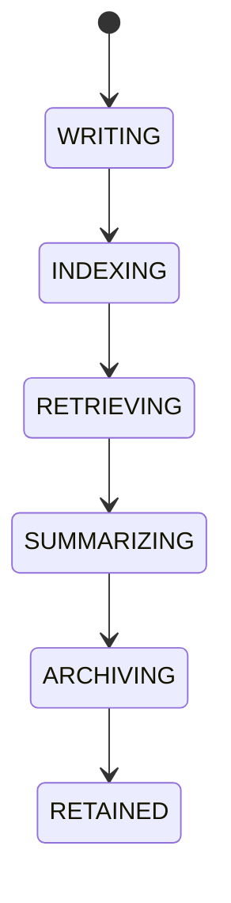

# AI Memory System

## Purpose
Defines the layered memory model for session, trade, strategy, knowledge, long-term, and archived memory.

## Scope
Storage, retrieval, summarization, retention, expiration, and privacy controls for AI memory.

## Responsibilities
- Persist and retrieve memory across layers.
- Summarize and compress context for downstream use.
- Enforce retention and archival rules.
- Expose memory state to context builder and AI services.

## Interfaces
- Input: memory write, recall, summarization request, purge request.
- Output: memory items, summaries, retrieval results, archival status.
- Events: memory stored, memory recalled, memory expired, memory purged.

## State machine

## Configuration
Retention periods, privacy level, summary window, archival policy, retrieval limits, and purge rules.

## Failure handling
Missing record, stale summary, retrieval miss, storage error, or policy violation.

## Recovery
Reindex memory, regenerate summaries, or fall back to durable archives.

## Security considerations
Protect sensitive user data, wallet references, and prompts from unauthorized access.

## Performance expectations
Fast retrieval for active layers and bounded summarization latency.

## Extension points
New memory layers, summarizers, indexing strategies, and privacy policies.

## Cross references
- `CONTEXT-BUILDER.md`
- `AI-KNOWLEDGE-INDEX.md`
- `LEARNING-PIPELINE.md`
- `KNOWLEDGE-GRAPH.md`

## Implementation constraints
Memory semantics must remain independent of any AI provider.

## Future compatibility notes
Additional retrieval backends may be introduced without changing memory contracts.

## Example
A trade outcome is stored in trade memory, summarized into strategy memory, and later promoted to long-term knowledge.

## Future compatibility notes
Additional retrieval backends may be added without changing memory layers.
