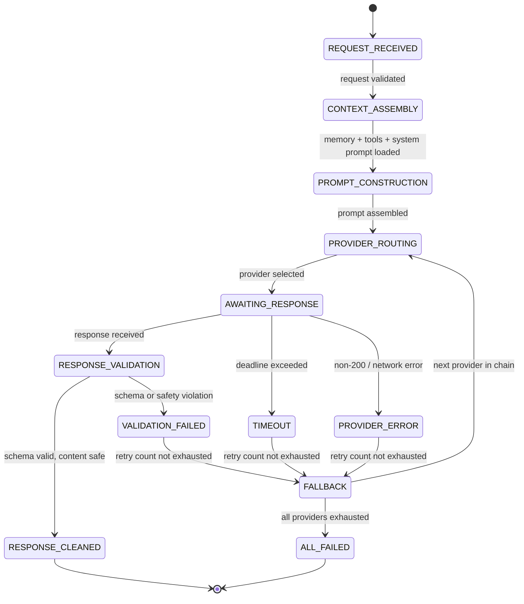

# AI Pipeline

## Document type
Document type: [REFERENCE]

## Version
**Version:** 0.2.0 | **Status:** Draft | **Last Updated:** 2026-07-27 | **Owner:** AI Team

## Purpose
Defines AI request routing, prompt construction, context assembly, provider routing, confidence scoring, fallback policy, and recovery — from request to structured response.

---

## 1. AI Pipeline State Machine



---

## 2. Request Validation

Every AI request must pass:

| Check | Condition | Failure Action |
|-------|-----------|----------------|
| Authorization | Caller is in allowed subsystem list | Reject with `UNAUTHORIZED` |
| Rate limit | Requests/sec < `ai.providers.rate_limit` | Queue or reject with `RATE_LIMITED` |
| Budget check | Cost this month < `ai.cost.max_monthly_usd` | Reject with `BUDGET_EXCEEDED` |
| Prompt length | Total tokens < `ai.context.max_tokens` | Truncate (lowest priority) or reject |
| Tool availability | Requested tools are registered | Reject with `TOOL_UNAVAILABLE` |

---

## 3. Context Assembly

Context is assembled in strict order:

```
Order | Component | Source | Priority
1     | System prompt | Active persona / strategy | Highest
2     | AI memory entries | Memory store (scored, top `ai.memory.injection_count`) | High
3     | Current state | Trading state, risk state, wallet balance | High
4     | Tool definitions | Registered tool schemas | Medium
5     | Conversation history | Last N exchanges | Medium
6     | Market context (optional) | Price feeds, recent events | Low
7     | User request | The incoming prompt | Highest (last for recency)
```

### Pruning Rules
- If total tokens > `ai.context.max_tokens` (default 32768), prune from Lowest priority upward.
- Within equal priority: pruning is LRU (least recently referenced first).
- System prompt and user request are never pruned.
- A warning is logged when pruning exceeds 30% of assembled context.

---

## 4. Prompt Construction

```
Prompt = SystemInstruction + Separator
       + MemorySection + Separator
       + StateSection + Separator
       + ToolListSection + Separator
       + HistorySection + Separator
       + UserRequestSection
```

| Section | Delimiter | Max Tokens | Prunable |
|---------|-----------|------------|----------|
| System instruction | `[SYSTEM]` | 2048 | No |
| Memory | `[MEMORY]` | `ai.context.max_tokens × 0.15` | Yes (LRU) |
| State | `[STATE]` | 1024 | No |
| Tools | `[TOOLS]` | `ai.context.max_tokens × 0.20` | Yes (remove unused tools first) |
| History | `[HISTORY]` | `ai.context.max_tokens × 0.15` | Yes (FIFO) |
| User request | `[REQUEST]` | 4096 | No |

---

## 5. Provider Routing

### 5.1 Provider Selection Algorithm

```
1. From request intent, determine required capabilities (chat, function-calling, streaming).
2. Query provider registry for providers supporting all required capabilities.
3. Score each eligible provider:
   score = speed_weight × (1 / latency_p50) + cost_weight × (1 / cost_per_token) + reliability_weight × uptime_pct
4. Select highest-scored provider.
5. If provider has FAILED in last `ai.providers.failure_cooldown_ms`: skip, select next.
```

### 5.2 Provider Configuration

| Provider | Supported Models | Capabilities | Fallback Priority |
|----------|-----------------|--------------|-------------------|
| OpenAI | GPT-4o, GPT-4o-mini | Chat, FC, Streaming, Vision | 1 |
| Anthropic | Claude 3.5 Sonnet, Haiku | Chat, FC, Streaming | 2 |
| Local (Ollama) | Llama 3, Mistral | Chat, FC | 3 (last resort) |
| Custom | User-defined | Per provider definition | Configurable |

### 5.3 Fallback Chain

```
Primary → Secondary → Tertiary → All Failed
(OpenAI)  (Anthropic)  (Local)
```

- Each fallback step increments a counter.
- After 3 fallback trips in 5 minutes, throttle to 1 request/min for 10 minutes.

---

## 6. Response Validation

| Check | Type | Failure Action |
|-------|------|----------------|
| JSON schema (if FC mode) | Schema validation | Retry with strict instruction, then fallback |
| Content safety | Regex filter + blocklist | Strip unsafe content, log violation |
| Hallucination guard | Confidence score < `ai.confidence.threshold` | Reject response, return fallback |
| Tool call validation | Arguments match tool schema | Reject invalid call, ask provider to fix |
| Response length | Within `ai.response.max_tokens` | Truncate with warning |

### Confidence Scoring

```
confidence = grammar_score × 0.3 + semantic_coherence × 0.4 + tool_validity × 0.3
threshold: ai.confidence.threshold (default 0.7)
```

If confidence < threshold → fallback to next provider.

---

## 7. Fallback Policy

| Scenario | Fallback Action |
|----------|-----------------|
| Provider returns 429 (rate limit) | Wait `ai.providers.retry.rate_limit_wait_ms`, retry 1×, then fallback |
| Provider returns 5xx | Retry 2× with backoff (1s, 3s), then fallback |
| Provider request timeout | Timeout after `ai.providers.timeout_ms`, retry 1×, then fallback |
| Response validation fails | Re-prompt with stricter instructions, retry 1×, then fallback |
| All providers failed | Return structured error to caller; emit `ai.critical.all_providers_failed` event |
| Local provider unavailable | Skip local, fall through to next remote provider |

---

## 8. Windows-Specific AI Behavior

| Scenario | Behavior |
|----------|----------|
| Proxy-aware requests | AI requests respect system proxy settings (`HTTP_PROXY`, `HTTPS_PROXY`). |
| Local GPU fallback | If `ai.local.enabled` and GPU available, use local model for low-complexity queries. |
| Offline mode | No AI available (all fallback exhausted). Return cached response if available. |
| Restart recovery | Pending AI requests are cancelled (not retried on restart). Provider states reloaded. |

---

## Cross-References

- **AI-PROVIDER-MANAGER.md** — Provider registry and configuration.
- **MODEL-CAPABILITY-NEGOTIATION.md** — Model capability negotiation.
- **PROMPT-LIFECYCLE.md** — Detailed prompt lifecycle state machine.
- **AI-TOOL-INVOCATION-CONTRACT.md** — Tool invocation priority and fallback.
- **AI-MEMORY.md** — Memory store for context injection.
- **INTERFACE-AGENT-MESSAGE.md** — Agent message protocol.
- **CONFIGURATION-REFERENCE.md** — AI config keys (`ai.*`).
- **TRACEABILITY-MATRIX.md** — AI requirement coverage.

---

## Version History

| Version | Date | Changes | Author |
|---------|------|---------|--------|
| 0.2.0 | 2026-07-27 | Full pipeline with context assembly, prompt construction, provider routing, fallback, confidence scoring | AI Team |
| 0.1.0 | 2026-07-27 | Initial stub | AI Team |