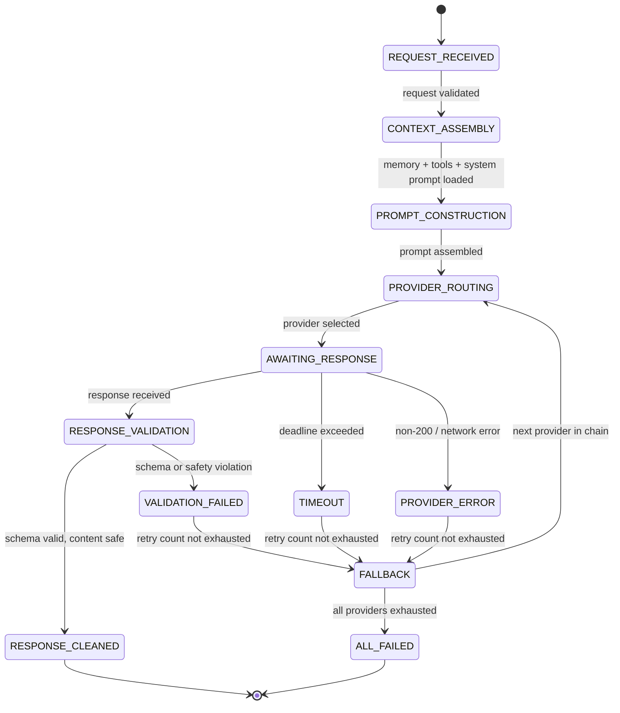

# AI Pipeline

## Document type
Document type: [CONTRACT]

## Version
**Version:** 1.0.0 | **Status:** Canonical | **Last Updated:** 2026-07-29 | **Owner:** AI Team

## Purpose
Defines AI request routing, prompt assembly pipeline, context assembly, context compression, token budgeting, prompt construction, provider routing, confidence scoring, streaming lifecycle, cancellation, fallback policy, and recovery — from request to structured response.

---

## 1. AI Pipeline State Machine



---

## 2. Request Validation

Every AI request must pass:

| Check | Condition | Failure Action |
|-------|-----------|----------------|
| Authorization | Caller is in allowed subsystem list | Reject with `UNAUTHORIZED` |
| Rate limit | Requests/sec < `ai.providers.rate_limit` | Queue or reject with `RATE_LIMITED` |
| Budget check | Cost this month < `ai.cost.max_monthly_usd` | Reject with `BUDGET_EXCEEDED` |
| Prompt length | Total tokens < `ai.context.max_tokens` | Truncate (lowest priority) or reject |
| Tool availability | Requested tools are registered | Reject with `TOOL_UNAVAILABLE` |

---

## 3. Context Assembly

Context is assembled in strict order:

```
Order | Component | Source | Priority
1     | System prompt | Active persona / strategy | Highest
2     | AI memory entries | Memory store (scored, top `ai.memory.injection_count`) | High
3     | Current state | Trading state, risk state, wallet balance | High
4     | Tool definitions | Registered tool schemas | Medium
5     | Conversation history | Last N exchanges | Medium
6     | Market context (optional) | Price feeds, recent events | Low
7     | User request | The incoming prompt | Highest (last for recency)
```

### Pruning Rules
- If total tokens > `ai.context.max_tokens` (default 32768), prune from Lowest priority upward.
- Within equal priority: pruning is LRU (least recently referenced first).
- System prompt and user request are never pruned.
- A warning is logged when pruning exceeds 30% of assembled context.

---

## 4. Prompt Construction

```
Prompt = SystemInstruction + Separator
       + MemorySection + Separator
       + StateSection + Separator
       + ToolListSection + Separator
       + HistorySection + Separator
       + UserRequestSection
```

| Section | Delimiter | Max Tokens | Prunable |
|---------|-----------|------------|----------|
| System instruction | `[SYSTEM]` | 2048 | No |
| Memory | `[MEMORY]` | `ai.context.max_tokens × 0.15` | Yes (LRU) |
| State | `[STATE]` | 1024 | No |
| Tools | `[TOOLS]` | `ai.context.max_tokens × 0.20` | Yes (remove unused tools first) |
| History | `[HISTORY]` | `ai.context.max_tokens × 0.15` | Yes (FIFO) |
| User request | `[REQUEST]` | 4096 | No |

---

## 5. Provider Routing

### 5.1 Provider Selection Algorithm

```
1. From request intent, determine required capabilities (chat, function-calling, streaming).
2. Query provider registry for providers supporting all required capabilities.
3. Score each eligible provider:
   score = speed_weight × (1 / latency_p50) + cost_weight × (1 / cost_per_token) + reliability_weight × uptime_pct
4. Select highest-scored provider.
5. If provider has FAILED in last `ai.providers.failure_cooldown_ms`: skip, select next.
```

### 5.2 Provider Configuration

| Provider | Supported Models | Capabilities | Fallback Priority |
|----------|-----------------|--------------|-------------------|
| OpenAI | GPT-4o, GPT-4o-mini | Chat, FC, Streaming, Vision | 1 |
| Anthropic | Claude 3.5 Sonnet, Haiku | Chat, FC, Streaming | 2 |
| Local (Ollama) | Llama 3, Mistral | Chat, FC | 3 (last resort) |
| Custom | User-defined | Per provider definition | Configurable |

### 5.3 Fallback Chain

```
Primary → Secondary → Tertiary → All Failed
(OpenAI)  (Anthropic)  (Local)
```

- Each fallback step increments a counter.
- After 3 fallback trips in 5 minutes, throttle to 1 request/min for 10 minutes.

---

## 6. Response Validation

| Check | Type | Failure Action |
|-------|------|----------------|
| JSON schema (if FC mode) | Schema validation | Retry with strict instruction, then fallback |
| Content safety | Regex filter + blocklist | Strip unsafe content, log violation |
| Hallucination guard | Confidence score < `ai.confidence.threshold` | Reject response, return fallback |
| Tool call validation | Arguments match tool schema | Reject invalid call, ask provider to fix |
| Response length | Within `ai.response.max_tokens` | Truncate with warning |

### Confidence Scoring

```
confidence = grammar_score × 0.3 + semantic_coherence × 0.4 + tool_validity × 0.3
threshold: ai.confidence.threshold (default 0.7)
```

If confidence < threshold → fallback to next provider.

---

## 7. Fallback Policy

| Scenario | Fallback Action |
|----------|-----------------|
| Provider returns 429 (rate limit) | Wait `ai.providers.retry.rate_limit_wait_ms`, retry 1×, then fallback |
| Provider returns 5xx | Retry 2× with backoff (1s, 3s), then fallback |
| Provider request timeout | Timeout after `ai.providers.timeout_ms`, retry 1×, then fallback |
| Response validation fails | Re-prompt with stricter instructions, retry 1×, then fallback |
| All providers failed | Return structured error to caller; emit `ai.critical.all_providers_failed` event |
| Local provider unavailable | Skip local, fall through to next remote provider |

---

## 8. Windows-Specific AI Behavior

| Scenario | Behavior |
|----------|----------|
| Proxy-aware requests | AI requests respect system proxy settings (`HTTP_PROXY`, `HTTPS_PROXY`). |
| Local GPU fallback | If `ai.local.enabled` and GPU available, use local model for low-complexity queries. |
| Offline mode | No AI available (all fallback exhausted). Return cached response if available. |
| Restart recovery | Pending AI requests are cancelled (not retried on restart). Provider states reloaded. |

---

## 9. Prompt Assembly Pipeline

### 9.1 Assembly Stages

```
1. Intent Classification → determine prompt type (trade_analysis, risk_check, planning, learning, ops)
2. Persona Selection → select active persona from ai.persona.active
3. System Instruction Assembly → build system instruction from persona + domain constraints
4. Memory Injection → inject top-K scored memory entries (see AI-MEMORY-SYSTEM.md)
5. State Injection → inject current trading/risk/wallet state
6. Tool Definition Injection → inject available tool schemas for the target agent
7. History Injection → inject last N conversation exchanges
8. User Request Injection → inject the actual request
9. Token Budget Validation → verify total tokens within budget
10. Pruning (if over budget) → prune lowest-priority sections per CONTEXT-PRIORITY-MATRIX.md
11. Final Prompt Assembly → concatenate all sections with delimiters
```

### 9.2 Assembly Budget

| Stage | Budget (ms) | Failure Action |
|-------|-------------|----------------|
| Intent classification | 10 | Default to `general_analysis` |
| Persona selection | 5 | Default persona |
| System instruction | 10 | Use fallback instruction |
| Memory injection | 50 | Skip memory (no injection) |
| State injection | 20 | Inject last cached state |
| Tool definition | 30 | Skip unused tools |
| History injection | 20 | Truncate history |
| User request | 5 | Cannot fail |
| Token budget validation | 5 | Cannot fail |
| Pruning | 50 | Hard truncate (drop lowest priority entirely) |
| Final assembly | 10 | Cannot fail |

### 9.3 Assembly Output Format

```
[SYSTEM]
<persona instruction + domain constraints + safety rules>

[MEMORY]
<top-K scored memory entries>

[STATE]
<trading state + risk state + wallet balances + active chains>

[TOOLS]
<available tool schemas for target agent>

[HISTORY]
<last N exchanges with this agent>

[REQUEST]
<user request with context>
```

---

## 10. Context Compression Strategy

### 10.1 Compression Trigger

Compression is triggered when assembled context exceeds `ai.context.compression_threshold_pct` (default 80%) of the maximum token budget.

### 10.2 Compression Algorithm

```
1. Calculate current_token_count and max_token_budget.
2. If current <= max × compression_threshold_pct → no compression needed.
3. If current > max × compression_threshold_pct → compress:

   Compression Priority Order (compress from bottom up):
   a. Market context (low priority) → summarize to 1-line headline
   b. History (medium priority) → summarize last 5 exchanges to key decisions
   c. Tool definitions (medium priority) → remove unused tools, keep only requested
   d. Memory entries (high priority) → keep only top-K/2 entries
   e. State section (high priority) → keep only critical state fields
   
   Never compress:
   - System instruction (highest priority, mandatory)
   - User request (highest priority, mandatory)

4. After compression, validate token count within budget.
5. If still over budget → hard truncate from bottom of priority list.
6. Log compression ratio for monitoring.
```

### 10.3 Compression Quality Metrics

| Metric | Description | Threshold | Action |
|--------|-------------|-----------|--------|
| **Compression ratio** | `compressed_tokens / original_tokens` | > 0.7 → acceptable | < 0.7 → warn (significant loss) |
| **Critical fields retained** | % of critical state fields kept | > 95% | < 95% → abort compression, hard truncate instead |
| **Memory entries retained** | % of memory entries kept | > 50% | < 50% → warn (significant context loss) |
| **Tool definitions retained** | % of requested tools kept | 100% | < 100% → warn (tools dropped) |

---

## 11. Token Budgeting Algorithm

### 11.1 Token Budget Allocation

```
total_budget = ai.context.max_tokens (default 32768)

Allocation:
  system_instruction: min(max_tokens × 0.08, 2048) = 2048 (6.25%)
  memory:             max_tokens × 0.15 = 4915 (15%)
  state:              min(max_tokens × 0.05, 1024) = 1024 (3.1%)
  tools:              max_tokens × 0.20 = 6554 (20%)
  history:            max_tokens × 0.15 = 4915 (15%)
  request:            min(max_tokens × 0.15, 4096) = 4096 (12.5%)
  response_reserved:  max_tokens × 0.22 = 7229 (22%) — reserved for provider response
  
  Total allocated: ~85% input + ~22% response = within 100%
  Buffer: ~15% unallocated for safety margin
```

### 11.2 Per-Agent Budget Override

| Agent | Override | Reason |
|-------|----------|--------|
| Risk Agent | Memory × 0.20, History × 0.05 | Risk needs more memory context, less history |
| Planner Agent | Tools × 0.30, State × 0.10 | Planner needs more tools and state context |
| Market Agent | Memory × 0.10, Market × 0.20 | Market needs more market data context |
| Execution Agent | State × 0.10, Tools × 0.05 | Execution needs more state, minimal tools |
| Learning Agent | History × 0.30, Memory × 0.10 | Learning needs more history context |

---

## 12. Streaming Lifecycle & Cancellation

### 12.1 Streaming Protocol

| Stage | Behavior | Timeout | Failure |
|-------|----------|---------|---------|
| **Stream start** | Provider begins streaming response | — | — |
| **Chunk delivery** | Each chunk delivered within `ai.streaming.chunk_timeout_ms` (default 5000ms) | Timeout → process partial response |
| **Stream completion** | Provider sends `[DONE]` marker | `ai.streaming.max_duration_ms` (default 60000ms) | Timeout → process partial |
| **Stream cancellation** | Caller sends cancel → provider stops generating | 1000ms acknowledge | Unacknowledged → discard stream |

### 12.2 Cancellation Rules

- Operator can cancel any AI request via dashboard or API.
- Cancellation propagates to provider (stop generating).
- Cancelled request does not count toward cost budget (partial token cost only).
- If cancelled request has already triggered downstream action (e.g., trade plan), cancellation does NOT abort that action.

---

## 13. Autonomous Retry Logic

### 13.1 Retry Decision Matrix

| Failure | Retry? | Max Retries | Backoff | Fallback? |
|---------|--------|-------------|---------|-----------|
| Provider 429 (rate limit) | Yes | 1 | `rate_limit_wait_ms` | After retry fails |
| Provider 5xx (server error) | Yes | 2 | 1s, 3s exponential | After retries exhaust |
| Provider timeout | Yes | 1 | Same timeout, 2× duration | After retry fails |
| Validation failure (schema) | Yes | 1 | Immediate, stricter instructions | After retry fails |
| Validation failure (safety) | No | 0 | — | Reject response |
| Auth error (401) | No | 0 | — | Immediate fallback or reject |
| Bad request (400) | No | 0 | — | Reject (request issue) |
| All providers failed | No | — | — | Return structured error to caller |

### 13.2 Retry Token Budget

- Each retry consumes tokens from the same per-request budget.
- If retry budget exceeds `ai.pipeline.retry.max_total_tokens` (default 1.5× original budget), reject with `BUDGET_EXCEEDED_RETRY`.
- Retry attempts are tracked: `attempt_number`, `tokens_used_cumulative`, `provider_id`.

---

## 14. Cross-Subsystem Integration

### 14.1 Who Calls AI Pipeline

| Caller | Purpose | Contract |
|--------|---------|----------|
| AI Orchestration | Execute agent requests | `ai.pipeline.submit` API |
| Dashboard | Display AI status | `dashboard.ai` IPC channel |
| Trading Engine | Request market/risk analysis | `ai.pipeline.request` event |
| Config Manager | Config change notification | `config.updated` event |

### 14.2 Who AI Pipeline Calls

| Target | Purpose | Contract |
|--------|---------|----------|
| AI Provider Manager | Select provider | `ai.provider.select` API |
| AI Memory System | Get memory entries | `ai.memory.query` API |
| AI Safety Boundary | Validate response | `ai.safety.validate` API |
| AI Orchestration | Report completion | `ai.orchestration.completed` event |
| Event Bus | Emit pipeline events | `ai.pipeline.*` events |

### 14.3 Events AI Pipeline Emits

| Event | Payload | Consumer |
|-------|---------|----------|
| `ai.request.started` | `{request_id, requestor, intent, model, token_budget}` | AI Orchestration, Dashboard, Audit |
| `ai.request.completed` | `{request_id, model, latency_ms, tokens_used, cost_usd, confidence}` | AI Orchestration, Dashboard, Cost Tracking |
| `ai.request.failed` | `{request_id, provider, error_code, retry_count, fallback_triggered}` | AI Orchestration, Health |
| `ai.pipeline.context_compressed` | `{request_id, original_tokens, compressed_tokens, compression_ratio}` | Dashboard, Audit |
| `ai.pipeline.budget_exceeded` | `{request_id, budget_type, current_usd, limit_usd}` | Dashboard, Operator |

### 14.4 Configuration AI Pipeline Owns

| Config Key | Default | Description |
|-----------|---------|-------------|
| `ai.context.max_tokens` | `32768` | Maximum total token budget per request |
| `ai.context.compression_threshold_pct` | `0.8` | Compression trigger threshold |
| `ai.pipeline.cache_enabled` | `true` | Enable semantic similarity caching |
| `ai.pipeline.retry.max_attempts` | `3` | Maximum retry attempts per failure type |
| `ai.pipeline.retry.max_total_tokens_multiplier` | `1.5` | Max tokens for retries vs original |
| `ai.streaming.chunk_timeout_ms` | `5000` | Per-chunk timeout for streaming |
| `ai.streaming.max_duration_ms` | `60000` | Maximum stream duration |
| `ai.confidence.threshold` | `0.7` | Minimum confidence for response acceptance |

---

## Cross-References

- **AI-PROVIDER-MANAGER.md** — Provider registry, scoring, health, failover.
- **AI-ORCHESTRATION.md** — Multi-agent orchestration and coordination.
- **MODEL-CAPABILITY-NEGOTIATION.md** — Model capability negotiation.
- **PROMPT-LIFECYCLE.md** — Detailed prompt lifecycle state machine.
- **AI-TOOL-INVOCATION-CONTRACT.md** — Tool invocation priority and fallback.
- **AI-MEMORY-SYSTEM.md** — Memory store for context injection.
- **AI-SAFETY-BOUNDARY.md** — Safety boundary enforcement.
- **CONTEXT-PRIORITY-MATRIX.md** — Context pruning priority rules.
- **INTERFACE-AGENT-MESSAGE.md** — Agent message protocol.
- **CONFIGURATION-REFERENCE.md** — AI config keys (`ai.*`).
- **END-TO-END-WIRING-CONTRACT.md** — Cross-subsystem wiring.
- **TRACEABILITY-MATRIX.md** — AI requirement coverage.

---

## Version History

| Version | Date | Changes | Author |
|---------|------|---------|--------|
| 1.0.0 | 2026-07-29 | Added formal Document type declaration, Version block, and Version History section to satisfy [CONTRACT] compliance (`architecture-tests/validate_contracts.py`, `architecture-tests/validate_ownership.py`). Substantive content unchanged. | AI Team |
