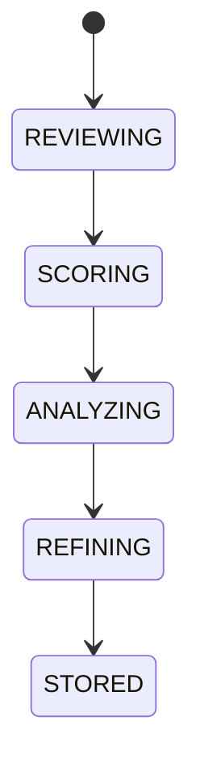

# Ai Reflection

## Document type
This document is an overview, reference, or index as noted below.

# AI Reflection

## Purpose
Defines self-evaluation for response review, decision review, confidence assessment, error analysis, and prompt refinement.

## State machine

## Cross-references
- `AI-ORCHESTRATION.md`
- `LEARNING-PIPELINE.md`
- `EXPLAINABILITY.md`

## Operational Contract
Defines how responses, decisions, and prompts are reviewed for confidence, errors, and refinement.

## Example
A failed recommendation is analyzed and turned into a prompt refinement action.

## Required details
- Define reflection inputs and decision quality criteria.

## Reflection rules
- Define the inputs, scoring, and outcomes used for reflection.
- Tie reflections to trade quality and decision quality.

## Reflection rules
- Define inputs, scoring, and outputs for reflection on decisions.
- Tie reflection to trade and reasoning quality.
