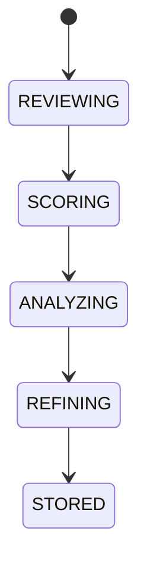

# AI Reflection

## Purpose
Defines self-evaluation for response review, decision review, confidence assessment, error analysis, and prompt refinement.

## State machine

## Cross-references
- `AI-ORCHESTRATION.md`
- `LEARNING-PIPELINE.md`
- `EXPLAINABILITY.md`

## Operational Contract
Defines how responses, decisions, and prompts are reviewed for confidence, errors, and refinement.

## Example
A failed recommendation is analyzed and turned into a prompt refinement action.
