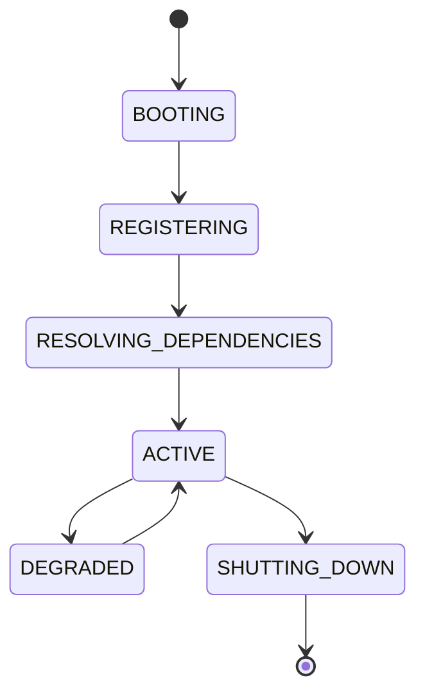

# Apex Kernel

## Purpose
Defines the runtime kernel that owns service registration, lifecycle, events, health, dependency injection, configuration, and plugin loading.

## State machine

## Responsibilities
The kernel is the root coordination layer beneath the UI, orchestrator, workers, strategies, AI, and blockchain adapters.

## Inputs
Startup config, plugin manifests, service registrations, health signals, and dependency declarations.

## Outputs
Registered services, lifecycle events, dependency bindings, health state, and plugin activation results.

## Failure modes
Dependency resolution failure, plugin load failure, health degradation, and configuration corruption.

## Recovery
Retry registration, isolate failed plugins, fall back to safe defaults, and alert through the observability stack.

## Cross-references
- `ORCHESTRATOR.md`
- `EVENT-BUS.md`
- `SERVICE-REGISTRY.md`
- `HEALTHCHECKS.md`
- `PLUGIN-SDK.md`

## Operational Contract
Defines the responsibilities, invariants, and expected behavior for this component.

## Example
An input is validated before any state-changing action.
