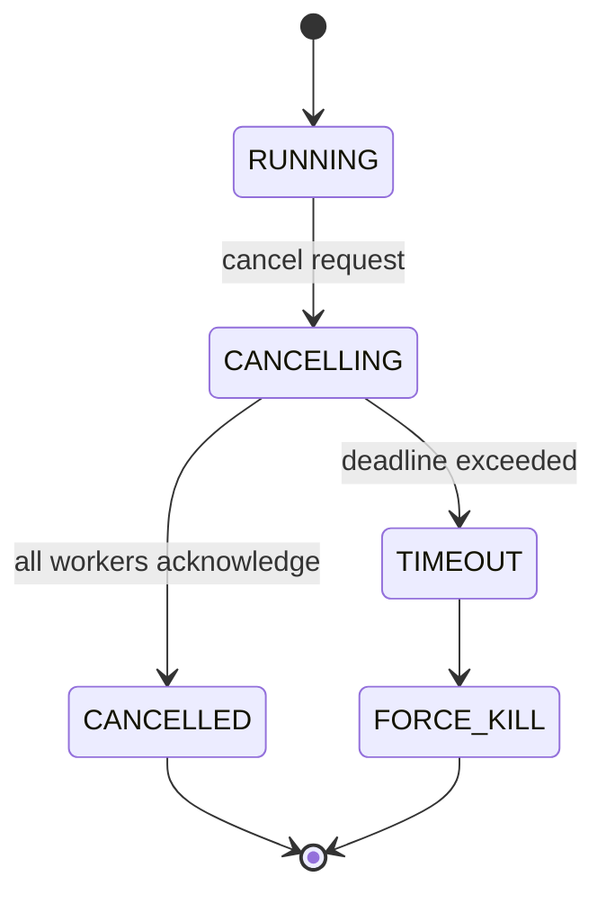

# Concurrency Model

## Document type
Document type: [REFERENCE]

## Version
**Version:** 0.2.0 | **Status:** Draft | **Last Updated:** 2026-07-27 | **Owner:** Runtime Team

## Purpose
Defines concurrency primitives — locks, queues, cancellation, deadlock avoidance, atomic operations, and synchronization barriers.

---

## 1. Concurrency Primitives

| Primitive | Scope | Use Case | Contention Model |
|-----------|-------|----------|------------------|
| `std::mutex` | Per-resource | Exclusive write access to shared state | Contended writes block readers |
| `std::shared_mutex` | Per-resource | Read-heavy shared state (config, registries) | Multiple readers; exclusive writer |
| `std::atomic<T>` | Per-variable | Counters, flags, sequence numbers | Lock-free; CAS on write |
| Lock-free SPSC queue | Event bus channel | Event delivery between producer/consumer | No contention (single producer per channel) |
| `std::condition_variable` | Per-queue | Blocking dequeue, timed wait | Wake on push / timeout |
| `std::barrier` | Per-phase | Synchronization at lifecycle phase gates | All threads arrive before any proceeds |
| `std::latch` | Per-count | Countdown synchronization (startup ready) | Counter decremented by each subsystem |
| `std::future<T>` | Per-operation | Async result retrieval | Promise set on completion |

---

## 2. Queue Architecture

### Event Bus Queue

```
Producer → [SPSC Channel per Key Partition] → Consumer(s)
```

- One SPSC channel per ordering key (see `EVENT-OWNERSHIP-MATRIX.md`).
- Events are enqueued lock-free on the producer side.
- Consumer reads are blocking (condition variable wait) or timed.

### Work Queue (Worker Pool)

```
Submitter → [MPMC Work Queue] → Worker 1
                            → Worker 2
                            → Worker N
```

- MPMC (multiple-producer, multiple-consumer) queue for work distribution.
- Workers pull tasks when idle.
- Queue depth is bounded at `event.max_queue_size` (default: 10000).
- Backpressure: if queue exceeds 80% capacity, new submissions block until capacity frees.

### Plugin Queue

```
Plugin Host → [SPSC per Plugin] → Plugin Sandbox
```

- Each plugin gets its own SPSC channel.
- Plugin must read from channel within 100ms or is considered unresponsive.

---

## 3. Cancellation Model



| Mechanism | Description |
|-----------|-------------|
| **Cooperative cancellation** | `std::stop_token` / `std::stop_source`. Threads check `stop_requested()` at safe points. Preferred. |
| **Deadline-based cancellation** | Tasks carry a deadline timestamp. If exceeded, the task is abandoned and result discarded. |
| **Force kill** | `std::thread::detach()` + resource cleanup. Last resort — only for plugin sandbox timeouts. |

### Safe Cancellation Points

Threads must check for cancellation at:
- Between event processing iterations
- Before and after AI provider calls
- Before and after RPC/network calls
- Between trading lifecycle state transitions
- Every 100ms in long-running computations

---

## 4. Locking Rules & Deadlock Avoidance

### Lock Order Hierarchy

All locks in the system must be acquired in the following order (lowest number = acquire first):

| Order | Lock Domain | Examples |
|-------|-------------|----------|
| 1 | Event bus channels | SPSC queue mutex |
| 2 | Registry locks | Chain registry, token registry, DEX registry |
| 3 | Config locks | Configuration read/write lock |
| 4 | Trading state locks | Position, order, trade lifecycle locks |
| 5 | Wallet locks | Balance, nonce, TX queue locks |
| 6 | Database pool lock | Connection acquire/release |
| 7 | Plugin sandbox lock | Plugin state, capability check |
| 8 | UI state lock | Dashboard workspace, widget state |

**Rule**: A thread holding lock N must not acquire lock M where M < N (lower number). Violation triggers deadlock detection.

### Lock-Free Guarantees

The following operations are guaranteed lock-free:
- Counter increments (atomic)
- Flag reads/writes (atomic)
- Event bus enqueue (single-producer)
- Read-only config access (shared_mutex, no writer)

---

## 5. Synchronization Barriers

### Startup Barrier

All subsystems must reach READY state before trading begins:
1. Event Bus → READY
2. Database Pool → READY
3. Chain/RPC Connections → READY
4. Wallet Manager → READY
5. AI Pipeline → READY
6. Trading Engine → READY

Barrier: `std::latch(6)`, each subsystem counts down on READY.

### Shutdown Barrier

All subsystems must acknowledge shutdown before process exits:
1. Trading Engine → STOPPED
2. Worker Pool → DRAINED
3. Event Bus → DRAINED
4. Database Pool → STOPPED

Barrier: `std::latch(4)`, each counts down on STOPPED/DRAINED.

---

## 6. Race Condition Prevention

| Pattern | Protection |
|---------|------------|
| Check-then-act (state read + transition) | Lock held across both read and write |
| Read-copy-update (config reload) | Copy-on-write with RCU pointer swap |
| Lazy initialization | `std::call_once` or double-checked locking with atomic |
| Sequence number ordering | Monotonic seqno on events; consumer checks for gaps |
| ABA problem | Tagged pointers or version counters on lock-free structures |

---

## Cross-References

- **THREADING-MODEL.md** — Thread architecture and lifecycle.
- **EVENT-BUS.md** — Event bus concurrency.
- **WORKER-POOL.md** — Worker pool queueing.
- **DATABASE-SCHEMA.md** — Database connection concurrency.
- **LOCK-ORDER.md** (future) — Detailed lock order graph.
- **CONFIGURATION-REFERENCE.md** — Queue sizing config keys.

---

## Version History

| Version | Date | Changes | Author |
|---------|------|---------|--------|
| 0.2.0 | 2026-07-27 | Complete concurrency model with primitives, queues, cancellation, locking hierarchy | Runtime Team |
| 0.1.0 | 2026-07-27 | Initial stub | Runtime Team |