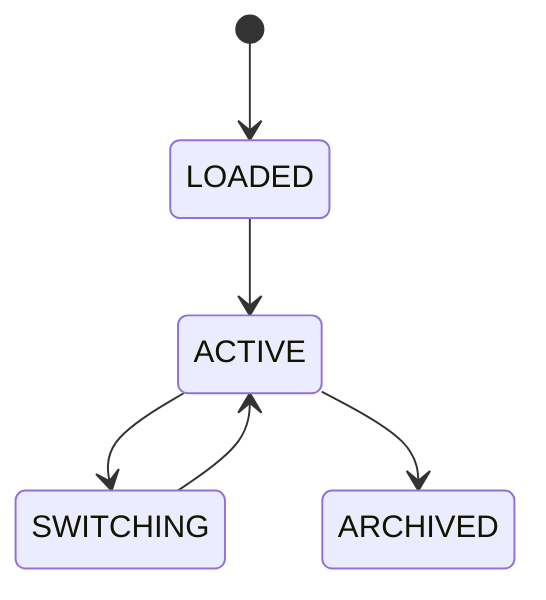

# Configuration Profiles

## Document type
This document is an overview, reference, or index as noted below.

# Configuration Profiles

## Purpose
Defines profile inheritance, overrides, defaults, and switching for platform modes.

## Profiles
Safe, Balanced, Aggressive, Research, Simulation, Developer.

## State machine

## Failure modes
Conflicting override, missing parent, invalid profile selection.

## Recovery
Fallback to safe defaults and validate merged config.

## Cross-references
- `CONFIGURATION.md`
- `AI-SETTINGS.md`
- `DASHBOARD-WORKSPACES.md`
- `TRACEABILITY-MATRIX.md`

## Governance Rules
Defines named configuration bundles, defaults, overrides, environment targeting, and validation.

## Example
A production profile enables stricter risk limits than a sandbox profile.

## Arbitrage profiles
- Must define profile presets for low-latency, cross-exchange, and simulation use cases.

## Required details
- Define named profiles and their settings.

## Profile rules
- Define named profiles, their defaults, and arbitrage-specific presets.
- Define profile storage and switching behavior.
