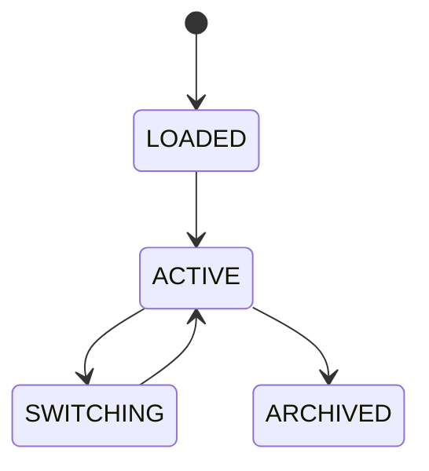

# Configuration Profiles

## Purpose
Defines profile inheritance, overrides, defaults, and switching for platform modes.

## Profiles
Safe, Balanced, Aggressive, Research, Simulation, Developer.

## State machine

## Failure modes
Conflicting override, missing parent, invalid profile selection.

## Recovery
Fallback to safe defaults and validate merged config.

## Cross-references
- `CONFIGURATION.md`
- `AI-SETTINGS.md`
- `DASHBOARD-WORKSPACES.md`
