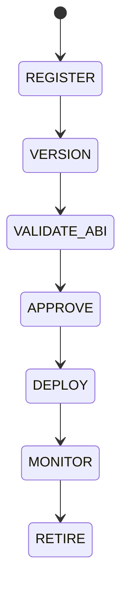

# Contract Management

## Purpose
Defines registry-based contract storage, ABI versioning, governance approval, deployment selection, and retirement.

## State machine

## Governance
New deployments are selected via configuration and governance approval, not automatic rotation.

## Configuration
- DEPLOYMENT_WHITELIST.
- MIN_APPROVALS.
- ABI_STORAGE_PATH.

## Security
Must be secured with multi-sig and emergency pause controls.

## Cross-references
- `SECURITY-CONTRACTS.md`
- `CHAIN-REGISTRY.md`
- `ORCHESTRATOR.md`
