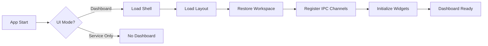
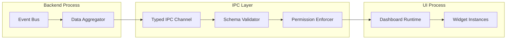

# Dashboard Runtime

## Document type
Document type: [CONTRACT]

## Version
**Version:** 1.0.0 | **Status:** Canonical | **Last Updated:** 2026-07-29 | **Owner:** UI Team

## Purpose
Defines the dashboard runtime composition — initialization sequence, page routing, rendering pipeline, IPC data flow, modal/overlay system, sandbox/preview modes, permission model, workspace persistence, state synchronization, event routing, and cross-subsystem integration contracts.

---

## 1. Dashboard Initialization Sequence



### Startup Steps (with Timing Budgets)

| Step | Action | Budget | Failure Recovery |
|------|--------|--------|-----------------|
| 1 | Shell loads: title bar, side panel frame, status bar (no data) | < 100ms | Fallback to minimal shell |
| 2 | Layout restored from workspace JSON (or default layout if first launch) | < 200ms | Use default layout |
| 3 | Workspace state loaded: active tab, panel positions, widget config | < 300ms | Use default workspace |
| 4 | IPC channels opened: subscribe to event streams for active widgets | < 500ms | Retry 3×, then show offline |
| 5 | P0 widgets initialized first (spread monitor, trade list, order book) | < 1000ms | Show skeleton |
| 6 | P1-P2 widgets initialized (wallet, risk, chains, system) | < 2000ms | Show skeleton |
| 7 | P3-P4 widgets lazy-loaded (charts, AI, monitoring) | On-demand | Show placeholder |
| 8 | Dashboard signals `dashboard.ready` event | — | — |

**Total startup budget:** < 3000ms for P0-P2 widgets visible with data.

---

## 2. Page Routing

The dashboard uses a flat page system — each tab is a page with its own route:

| Route | Page | Content | Default Widgets | Permission |
|-------|------|---------|-----------------|------------|
| `/trading` | Trading page | Spread monitor, trade list, P&L, order book | Spread monitor, trade list, P&L tracker, order book | Operator, Trader |
| `/analysis` | Analysis page | Charts, heatmaps, backtest results | Spread chart, P&L chart, heatmap | Operator, Trader |
| `/wallet` | Wallet page | Balances, transactions, gas management | Balance, gas tracker, transaction history | Operator, Trader |
| `/settings` | Settings page | Config, profiles, secrets, plugins | Config tree, profile editor, secret vault | Operator only |
| `/plugins` | Plugins page | Installed plugins, marketplace, developer tools | Plugin list, marketplace browser, SDK tester | Operator only |
| `/logs` | Logs page | Event stream, log viewer, diagnostics | Log stream, event stream, DLQ viewer | Operator, Trader, Viewer |
| `/admin` | Admin page (operator only) | System health, capacity, recovery | Health dashboard, capacity chart, recovery panel | Operator only |

### Routing Rules
- Tab switch triggers widget suspend/resume (not destroy/recreate).
- Route changes persist in workspace (restored on restart).
- Unregistered routes fall back to `/trading`.
- Permission check before route activation — unauthorized routes show "Access denied" overlay.

---

## 3. Rendering Pipeline

```
Event → IPC Bridge → Schema Validate → Data Normalizer → Widget Update Queue → Debounce Window → Diff Engine → Render Scheduler → Virtual DOM Diff → Paint → Compositing → Display
```

| Stage | Function | Budget | Failure Mode | Recovery |
|-------|----------|--------|--------------|----------|
| IPC reception | Deserialize typed message | < 1ms | Malformed message | Drop, log warning |
| Schema validation | Validate payload against widget schema | < 0.5ms | Invalid schema | Drop, show mismatch warning |
| Data normalization | Transform raw data to widget model | < 2ms | Transform error | Use last valid data |
| Update queue | Buffer high-frequency updates per widget | 50ms debounce window | Queue overflow (>100) | Flush, render latest only |
| Diff engine | Compute minimal state change | < 1ms | Diff exceeds threshold | Force full re-render |
| Render scheduler | Schedule render at next animation frame | < 0.5ms | Frame missed | Deferred to next frame (max 2 skips) |
| Virtual DOM diff | Compute minimal DOM change | < 5ms | Diff too complex | Full subtree rebuild |
| Paint | Apply DOM changes | < 8ms | Paint exceeds budget | Skip non-essential updates |
| Compositing | GPU composition (Windows DWM) | < 1ms | GPU stall | Software fallback |
| Display | Swap frame buffer | < 1ms | — | — |

---

## 4. IPC Data Flow



### Data Types

| Channel | Payload Type | Rate Limit | Schema | Priority | Delivery |
|---------|-------------|------------|--------|----------|----------|
| `dashboard.trade` | TradeSummary | 50 msg/s | `schemas/event.schema.json` | P0 Critical | Exactly-once |
| `dashboard.wallet` | WalletSummary | 10 msg/s | `schemas/event.schema.json` | P1 High | At-least-once |
| `dashboard.risk` | RiskSummary | 10 msg/s | `schemas/event.schema.json` | P1 High | Exactly-once |
| `dashboard.system` | SystemHealth | 5 msg/s | `schemas/event.schema.json` | P2 Medium | At-least-once |
| `dashboard.widget` | WidgetConfig | 1 msg/s | `schemas/settings.schema.json` | P3 Low | At-least-once |
| `dashboard.command` | UIAction | 10 msg/s | `schemas/event.schema.json` | Per-action | Exactly-once |
| `dashboard.plugin` | PluginData | 5 msg/s | `schemas/plugin.schema.json` | P3 Low | At-least-once |

### IPC Bridge Contract
- All messages must pass schema validation before reaching widgets.
- Permission enforcer checks `UIAction` commands against user role.
- Rate limits are enforced per channel — overflow messages are dropped with warning.
- IPC channels are opened on dashboard init, closed on shutdown.
- If IPC bridge crashes, dashboard shows "Connection lost" overlay and attempts reconnect every 5s.

---

## 5. Modal & Overlay System

| Component | Behavior | Stacking | Z-Index Range |
|-----------|----------|----------|---------------|
| **Modal dialog** | Blocking — user must respond | Single modal at a time | 1000 |
| **Toast notification** | Non-blocking, auto-dismiss (5s) | Stacked, max 5 visible | 900 |
| **Context menu** | Right-click, dismiss on click-outside | Single | 800 |
| **Dropdown** | Click-triggered, dismiss on blur | Single per trigger | 700 |
| **Tooltip** | Hover, dismiss on leave | Single | 600 |
| **Floating panel** | Draggable, always-on-top | Max 3 floating panels | 500 |
| **Widget error overlay** | Non-blocking (within widget) | Per widget | Widget-local |

### Overlay Manager Rules
- All modals and overlays are rendered in the overlay layer (above all panels).
- Modal opens: all other interactions blocked; focus trap within modal.
- Modal closes: focus returns to previously focused widget.
- Toast notifications are queued — max 5 visible, oldest dismissed when new arrives.
- Only one modal can be active at a time — second modal request queued behind first.

---

## 6. Sandbox & Preview Modes

| Mode | Description | Data Access | Widgets | IPC Channels |
|------|-------------|-------------|---------|-------------|
| **Normal** | Live data, full interaction | Full | All | All subscribed |
| **Preview** (widget config) | Mock data, see how widget looks | None | Single widget | None |
| **Sandbox** (plugin dev) | Simulated environment | Mock data | Test plugins only | Plugin data channel only |
| **Read-only** (viewer role) | No mutation actions | Read-only | All (no submit) | Subscribe-only (no command) |
| **Offline** | Cached data, no network | Cache only | All | None |

---

## 7. Permission Model

| Role | Dashboard Access | Widgets | Actions | IPC Permissions |
|------|-----------------|---------|---------|-----------------|
| **Operator** | Full | All | Configure, override trades, manage secrets | All channels (subscribe + command) |
| **Trader** | Trading, Analysis, Wallet, Logs | Trading, Charts, Wallet, Logs | View, submit trades, adjust strategies | Trade, wallet, risk (subscribe + limited command) |
| **Viewer** | All read-only | All (read-only) | View only | All channels (subscribe only) |
| **Plugin** | Sandbox only | Self widgets only | None (isolated) | Plugin data channel only |

Permission enforcement: IPC bridge rejects unauthorized commands before they reach the backend.

---

## 8. Workspace Persistence Semantics

| Event | Save Trigger | Debounce | Persistence Path |
|-------|-------------|----------|-----------------|
| Panel dock/undock | Immediate | None | `workspaces/<profile>/<id>.json` |
| Widget config change | After change | 500ms | Same |
| Tab reorder | After reorder | 500ms | Same |
| Layout resize | On resize end | 500ms | Same |
| Workspace switch | On switch | Immediate | Same |
| Periodic autosave | Every `AUTO_SAVE_DEBOUNCE_MS` | 30000 | Same |
| Shutdown | Immediate (blocking flush) | 0 | Same |

Workspace data is stored at `WORKSPACE_STORAGE_PATH`. Corrupt files fall back to default workspace.

---

## 9. Cross-Subsystem Integration Contracts

### 9.1 Who Calls Dashboard

| Caller | Purpose | Contract |
|--------|---------|----------|
| Runtime Orchestrator | Startup/shutdown signal | `dashboard.mode.transition` event |
| Config Manager | Config change notification | `config.updated` → dashboard broadcast |
| Health Checker | Health status data | `health.check.completed` IPC channel |
| Plugin Manager | Plugin widget registration | `plugin.loaded` / `plugin.unloaded` events |

### 9.2 Who Dashboard Calls

| Target | Purpose | Contract |
|--------|---------|----------|
| Trading Engine | Submit/cancel trades | `dashboard.command` IPC channel |
| Config Manager | Get/set config values | `config.get` / `config.set` IPC commands |
| Notification Center | Show toast/notification | `notification.show` IPC command |
| Event Bus | Subscribe to event streams | Topic subscription |
| Plugin Manager | Load/unload plugin widgets | `plugin.load` / `plugin.unload` IPC commands |

### 9.3 Events Dashboard Emits

| Event | Payload | Consumer |
|-------|---------|----------|
| `dashboard.ready` | `{startup_time_ms, widgets_loaded, workspace_id}` | Runtime, Health |
| `dashboard.mode.transition` | `{from_mode, to_mode, reason}` | Runtime, Audit |
| `dashboard.widget.error` | `{widget_id, error_code, message, severity}` | Health, Event Store |
| `dashboard.workspace.switched` | `{from_id, to_id}` | Workspace Manager |
| `dashboard.command.submitted` | `{action, target, payload, user_role}` | Audit |

### 9.4 Events Dashboard Consumes

| Event | Source | Handler |
|-------|--------|---------|
| `trade.*` | Trading Engine | Route to Trading widgets |
| `execution.*` | Execution Engine | Route to Trade List, P&L |
| `risk.*` | Risk Engine | Route to Risk widgets |
| `wallet.*` | Wallet Manager | Route to Wallet widgets |
| `network.*` | Network Manager | Route to Chain Health |
| `system.*` | Runtime | Route to System Stats, Log Stream |
| `health.*` | Health Checker | Route to Health Status |
| `ai.*` | AI Pipeline | Route to AI widgets |
| `config.*` | Config Manager | Broadcast to all widgets |
| `security.*` | Security Manager | Show security alert overlay |

### 9.5 Configuration Dashboard Owns

| Config Key | Default | Description |
|-----------|---------|-------------|
| `dashboard.theme` | `dark` | UI theme (dark/light) |
| `dashboard.font_size` | `14` | Base font size (px) |
| `dashboard.auto_save_interval_ms` | `30000` | Workspace autosave interval |
| `dashboard.offline_banner_enabled` | `true` | Show offline banner |
| `dashboard.max_floating_panels` | `3` | Max floating panels |
| `dashboard.max_toast_notifications` | `5` | Max visible toast notifications |

### 9.6 State Dashboard Owns

| State Domain | Type | Persistence | Recovery |
|-------------|------|-------------|----------|
| Active workspace | Workspace ID | Workspace JSON | Default workspace on corrupt |
| Layout state | Panel positions/sizes | Workspace JSON | Default layout on corrupt |
| Widget config | Per-widget config | Workspace JSON | Widget defaults on missing |
| Widget data (cache) | Per-widget data snapshot | In-memory only | Empty on restart |
| Active modal/overlay | Overlay stack | Not persisted | None on restart |
| Selected items | Per-widget selection | Not persisted | None on restart |

### 9.7 Startup Dependencies

| Dependency | Required For | Timeout | Failure Action |
|-----------|-------------|---------|----------------|
| IPC bridge connection | All widgets | 5000ms | Show "Connection lost" overlay |
| Workspace file | Layout, widget config | 1000ms | Use default workspace |
| Event bus subscription | Real-time widgets | 3000ms | Show offline mode |
| Config service | Settings page | 1000ms | Show "Config unavailable" |
| Health checker | Health status | 2000ms | Show "Health unknown" |

### 9.8 Shutdown Dependencies

| Dependency | Action | Timeout | Failure Action |
|-----------|--------|---------|----------------|
| All active widgets | Call `onDestroy()` | 500ms per widget | Force reclaim |
| Workspace file | Flush final state | 1000ms | Skip save (next restart uses autosave) |
| IPC subscriptions | Unsubscribe all | 500ms | Forced disconnect |
| Modal/overlay stack | Close all | 100ms | Forced close |

### 9.9 Recovery Dependencies

| Scenario | Recovery Action | Dependencies |
|----------|----------------|-------------|
| IPC bridge crash | Reconnect every 5s | IPC bridge, Event bus |
| Workspace corrupt | Load default workspace | Config service (defaults) |
| Widget crash | Reinitialize widget from config | Widget registry, IPC subscriptions |
| Full dashboard crash | Restart from saved workspace | Workspace file, IPC bridge, Event bus |

---

## 10. Dashboard Event Routing

See **DASHBOARD-WIDGETS.md §7** for the complete event routing table. This document defines the routing infrastructure; widget-level routing is owned by the widgets document.

### Routing Infrastructure
- **Topic-based routing:** Events matched by topic prefix to subscribed widgets.
- **Broadcast routing:** `config.*`, `dashboard.mode.*`, `workspace.*` broadcast to all widgets.
- **Permission routing:** Commands filtered by IPC permission enforcer based on user role.
- **Priority routing:** P0 widget data routed immediately; P3-P4 queued for next frame.

---

## Cross-References

- **DASHBOARD-LAYOUT.md** — Panel placement, docking, DPI scaling, multi-monitor.
- **DASHBOARD-WIDGETS.md** — Widget lifecycle, rendering pipeline, dependency graph, communication.
- **DASHBOARD-WORKSPACES.md** — Workspace lifecycle, persistence, crash recovery.
- **WORKSPACE-MANAGER.md** — Workspace manager service.
- **WINDOWS-DESKTOP.md** — Windows desktop integration, tray, sleep/resume.
- **IPC-PROTOCOL.md** — Typed IPC protocol.
- **PERMISSION-MODEL.md** — Full permission model.
- **CONFIGURATION-REFERENCE.md** — Dashboard config keys.
- **END-TO-END-WIRING-CONTRACT.md** — Cross-subsystem wiring.
- **TRACEABILITY-MATRIX.md** — Dashboard requirement coverage.

---

## Version History

| Version | Date | Changes | Author |
|---------|------|---------|--------|
| 1.0.0 | 2026-07-29 | Added formal Document type declaration, Version block, and Version History section to satisfy [CONTRACT] compliance (`architecture-tests/validate_contracts.py`, `architecture-tests/validate_ownership.py`). Substantive content unchanged. | UI Team |
