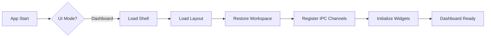
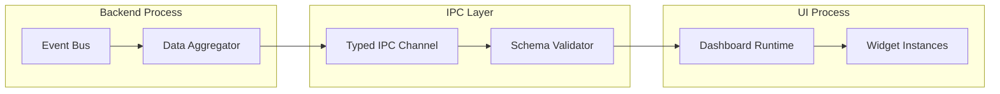

# Dashboard Runtime

## Document type
Document type: [REFERENCE]

## Version
**Version:** 0.1.0 | **Status:** Draft | **Last Updated:** 2026-07-27 | **Owner:** Dashboard Team

## Purpose
Defines the dashboard runtime composition — initialization, page routing, rendering pipeline, IPC data flow, modal/overlay system, sandbox/preview modes, permission model, and workspace persistence semantics.

---

## 1. Dashboard Initialization



### Startup Steps
1. Shell loads: title bar, side panel frame, status bar (no data).
2. Layout restored from workspace JSON (or default layout if first launch).
3. Workspace state loaded: active tab, panel positions, widget config.
4. IPC channels opened: subscribe to event streams for active widgets.
5. Widgets initialized in order: system → wallet → trading → AI → plugins.
6. Dashboard signals `dashboard.ready` event.

---

## 2. Page Routing

The dashboard uses a flat page system — each tab is a page with its own route:

| Route | Page | Content |
|-------|------|---------|
| `/trading` | Trading page | Spread monitor, trade list, P&L, order book |
| `/analysis` | Analysis page | Charts, heatmaps, backtest results |
| `/wallet` | Wallet page | Balances, transactions, gas management |
| `/settings` | Settings page | Config, profiles, secrets, plugins |
| `/plugins` | Plugins page | Installed plugins, marketplace, developer tools |
| `/logs` | Logs page | Event stream, log viewer, diagnostics |
| `/admin` | Admin page (operator only) | System health, capacity, recovery |

---

## 3. Rendering Pipeline

```
Event → IPC Bridge → Data Normalizer → Widget Update Queue → Render → Display
```

| Stage | Function | Budget |
|-------|----------|--------|
| IPC reception | Deserialize typed message | < 1ms |
| Data normalization | Transform to widget schema | < 5ms |
| Queue | Debounce high-frequency updates | 50ms interval |
| Render | Re-render affected widgets | < 16ms (60fps target) |
| Display | Swap buffer (Windows composition) | < 1ms |

---

## 4. IPC Data Flow



### Data Types
| Channel | Payload Type | Rate Limit | Schema |
|---------|-------------|------------|--------|
| `dashboard.trade` | TradeSummary | 50 msg/s | `schemas/event.schema.json` |
| `dashboard.wallet` | WalletSummary | 10 msg/s | `schemas/event.schema.json` |
| `dashboard.risk` | RiskSummary | 10 msg/s | `schemas/event.schema.json` |
| `dashboard.system` | SystemHealth | 5 msg/s | `schemas/event.schema.json` |
| `dashboard.widget` | WidgetConfig | 1 msg/s | `schemas/settings.schema.json` |
| `dashboard.command` | UIAction | 10 msg/s | `schemas/event.schema.json` |

---

## 5. Modal & Overlay System

| Component | Behavior | Stacking |
|-----------|----------|----------|
| **Modal dialog** | Blocking — user must respond | Single modal at a time |
| **Toast notification** | Non-blocking, auto-dismiss | Stacked, max 5 visible |
| **Context menu** | Right-click, dismiss on click-outside | Single |
| **Dropdown** | Click-triggered, dismiss on blur | Single per trigger |
| **Tooltip** | Hover, dismiss on leave | Single |
| **Floating panel** | Draggable, always-on-top | Max 3 floating panels |

All modals and overlays are rendered in the overlay layer (above all panels) and managed by the Overlay Manager.

---

## 6. Sandbox & Preview Modes

| Mode | Description | Data Access | Widgets |
|------|-------------|-------------|---------|
| **Normal** | Live data, full interaction | Full | All |
| **Preview** (widget config) | Mock data, see how widget looks | None | Single widget |
| **Sandbox** (plugin dev) | Simulated environment | Mock data | Test plugins only |
| **Read-only** (viewer role) | No mutation actions | Read-only | All (no submit) |

---

## 7. Permission Model

| Role | Dashboard Access | Widgets | Actions |
|------|-----------------|---------|---------|
| **Operator** | Full | All | Configure, override trades, manage secrets |
| **Trader** | Trading, Analysis, Wallet | Trading, Charts, Wallet | View, submit trades, adjust strategies |
| **Viewer** | All read-only | All (read-only) | View only |
| **Plugin** | Sandbox only | Self widgets only | None (isolated) |

Permission enforcement: IPC bridge rejects unauthorized commands before they reach the backend.

---

## 8. Workspace Persistence Semantics

| Event | Save Trigger | Debounce |
|-------|-------------|----------|
| Panel dock/undock | Immediate | None |
| Widget config change | After change | 500ms |
| Tab reorder | After reorder | 500ms |
| Layout resize | On resize end | 500ms |
| Workspace switch | On switch | Immediate |
| Periodic autosave | Every `AUTO_SAVE_DEBOUNCE_MS` | Configurable |

Workspace data is stored at `WORKSPACE_STORAGE_PATH` as a JSON file. Corrupt files fall back to default workspace.

---

## Cross-References

- **DASHBOARD-LAYOUT.md** — Panel placement and docking.
- **DASHBOARD-WIDGETS.md** — Widget lifecycle and data binding.
- **DASHBOARD-WORKSPACES.md** — Workspace lifecycle and persistence.
- **WORKSPACE-MANAGER.md** — Workspace manager service.
- **WINDOWS-DESKTOP.md** — Windows desktop integration.
- **IPC-PROTOCOL.md** — Typed IPC protocol.
- **PERMISSION-MODEL.md** — Full permission model.
- **CONFIGURATION-REFERENCE.md** — Dashboard config keys.

---

## Version History

| Version | Date | Changes | Author |
|---------|------|---------|--------|
| 0.1.0 | 2026-07-27 | Full dashboard runtime spec — init, routing, rendering, IPC, overlays, sandbox, permissions, persistence | Dashboard Team |