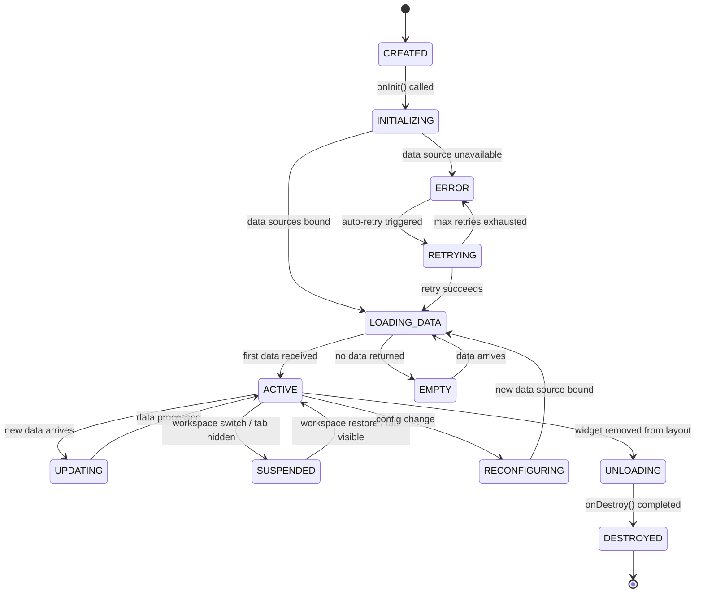
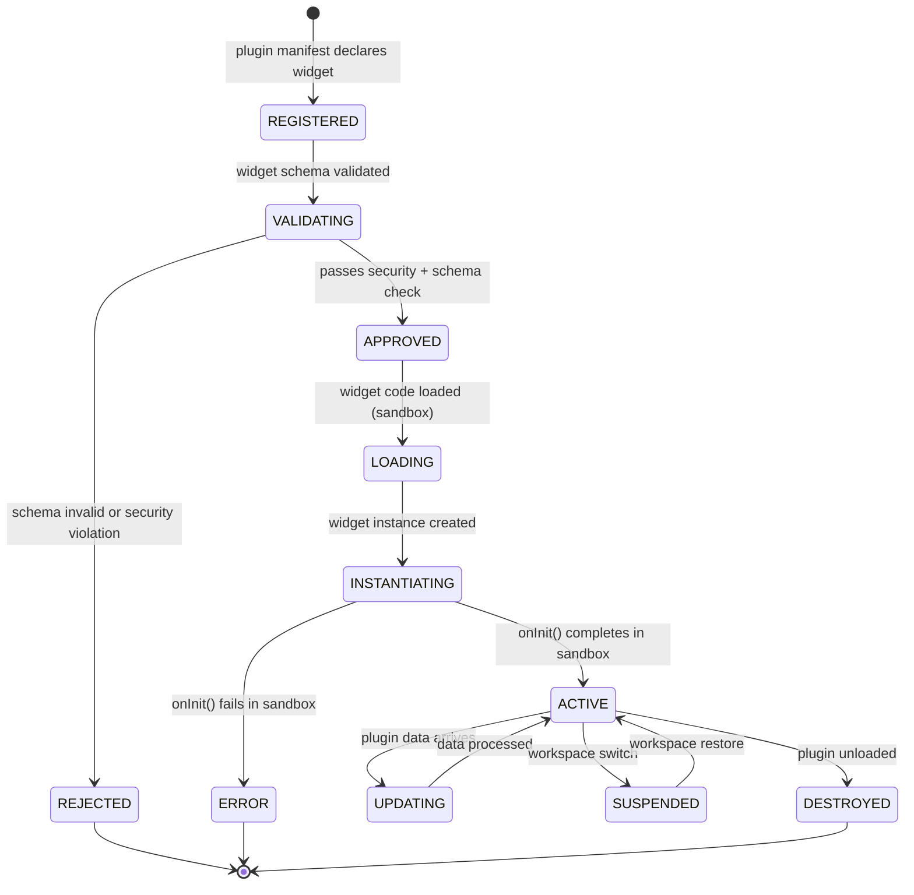

# Dashboard Widgets

## Document type
Document type: [CONTRACT]

## Version
**Version:** 1.0.0 | **Status:** Canonical | **Last Updated:** 2026-07-29 | **Owner:** UI Team

## Purpose
Defines the reusable dashboard widgets — widget lifecycle, rendering pipeline, dependency graph, communication contracts, state synchronization, display states, refresh scheduling, performance budgets, lazy loading, virtualization, error overlays, offline behavior, plugin widget integration, and the Widget SDK lifecycle.

---

## 1. Widget Groups

| Group | Widgets | Update Cadence | Data Source | Max Count per Workspace |
|-------|---------|----------------|-------------|------------------------|
| **Trading** | Spread monitor, P&L tracker, trade list, order book, opportunity feed | Real-time (event-driven) | Event bus | 5 |
| **Wallet** | Balance, exposure, gas balance, transaction history, wallet selector | 10s poll | Wallet Manager | 3 |
| **Risk** | Exposure gauge, circuit breaker status, loss tracker, risk score | 5s poll | Risk Engine | 3 |
| **AI** | Confidence score, active model, provider status, reasoning summary | 30s poll | AI Pipeline | 2 |
| **Chains** | Chain health, RPC latency, block height, gas tracker | 15s poll | Network Manager | 4 |
| **System** | CPU, RAM, thread count, event queue depth, disk usage | 5s poll | Runtime | 2 |
| **Monitoring** | Health check status, log stream, event stream, DLQ viewer | Real-time | Event bus / Health | 3 |
| **Charts** | Price chart, spread chart, P&L chart, volume chart, heatmap | 30s aggregate | Market Data | 4 |
| **Plugin** | Plugin-defined (see §15) | Plugin-defined | Plugin data channel | Unlimited |

---

## 2. Widget Lifecycle State Machine



### Lifecycle Hook Contract

| Hook | Purpose | Implementation Constraint | Timeout | Failure Action |
|------|---------|---------------------------|---------|----------------|
| `onInit(config)` | Allocate resources, bind data sources, register IPC channels | Must not block render; async only | 1000ms | Widget enters ERROR state |
| `onData(data)` | Update widget state from new data | Must be pure; no side effects outside widget scope | 50ms per call | Data dropped, stale state maintained |
| `onRefresh()` | Force data reload from source | Re-subscribes to IPC channel | 2000ms | Show stale indicator |
| `onSuspend()` | Release UI resources on workspace switch / tab hidden | Free framebuffer, stop render loop, keep data cache | 100ms | Forced suspend (resources reclaimed) |
| `onResume()` | Rebuild UI after suspend | Full re-render from cached data | 500ms | Show skeleton, retry render |
| `onReconfig(newConfig)` | Apply configuration change without full rebuild | Diff old vs new config; only rebind changed data sources | 300ms | Fall back to LOADING_DATA (full rebuild) |
| `onDestroy()` | Clean up subscriptions, timers, memory, IPC channels | Must complete within budget; no async cleanup allowed | 500ms | Resources force-reclaimed by runtime |

### Hook Ordering Guarantees
- `onInit` → `onData` → `onSuspend` → `onResume` → `onDestroy` follows strict ordering.
- `onData` may be called concurrently from multiple IPC channels — widget must merge internally.
- `onSuspend` is guaranteed before `onResume` (no resume without prior suspend).
- `onDestroy` is guaranteed after `onSuspend` (never during active state).
- `onReconfig` may be called in ACTIVE or SUSPENDED state.

---

## 3. Widget Rendering Pipeline

```
IPC Message → Deserialize → Schema Validate → Data Normalizer
    → Update Queue (per-widget) → Debounce Window → Diff Engine
    → Render Scheduler → Virtual DOM Diff → Paint → Compositing → Display
```

### Pipeline Stages with Budgets

| Stage | Function | Budget | Failure Mode | Recovery |
|-------|----------|--------|--------------|----------|
| **IPC reception** | Deserialize typed message from IPC channel | < 1ms | Malformed message | Drop message, log warning |
| **Schema validation** | Validate payload against widget's expected schema | < 0.5ms | Invalid schema | Drop message, show data mismatch warning |
| **Data normalization** | Transform raw data to widget's internal data model | < 2ms | Transform error | Use last valid data, show stale indicator |
| **Update queue** | Buffer high-frequency updates per widget | 50ms debounce window | Queue overflow (>100 items) | Flush queue, render latest only |
| **Diff engine** | Compute minimal state change between old and new data | < 1ms | Diff exceeds threshold | Force full re-render |
| **Render scheduler** | Schedule render at next animation frame | < 0.5ms | Frame missed | Deferred to next frame (max 2 skips) |
| **Virtual DOM diff** | Compute minimal DOM change | < 5ms | Diff too complex | Full subtree rebuild |
| **Paint** | Apply DOM changes | < 8ms | Paint exceeds budget | Skip non-essential updates |
| **Compositing** | GPU composition (Windows DWM) | < 1ms | GPU stall | Fallback to software compositing |
| **Display** | Swap frame buffer | < 1ms | — | — |

### Total Pipeline Budget
- **Real-time widgets (Trading, Monitoring):** < 16ms total (60fps target)
- **Polling widgets (Wallet, Risk, AI, Chains, System):** < 32ms total (30fps target)
- **Aggregate widgets (Charts):** < 100ms total (10fps acceptable, data updates every 30s)

### Rendering Priority Classes

| Priority | Widgets | FPS Target | GPU Budget | CPU Budget |
|----------|---------|------------|------------|------------|
| **P0 Critical** | Spread monitor, trade list, order book | 60fps | 5ms | 10ms |
| **P1 High** | P&L tracker, risk gauges, exposure | 30fps | 3ms | 15ms |
| **P2 Medium** | Wallet balance, chain health, system stats | 15fps | 2ms | 15ms |
| **P3 Low** | Charts, heatmaps, log stream | 10fps | 5ms | 25ms |
| **P4 Background** | Health status, AI provider status | 5fps | 1ms | 10ms |

---

## 4. Widget Dependency Graph

### 4.1 Data Dependencies

```mermaid
graph TD
    SM[Spread Monitor] --> MD[Market Data Event]
    TL[Trade List] --> TE[Trade Events]
    PL[P&L Tracker] --> TE
    PL --> WE[Wallet Events]
    OB[Order Book] --> MD
    OF[Opportunity Feed] --> OE[Opportunity Events]
    BG[Balance Widget] --> WE
    EG[Exposure Gauge] --> WE
    EG --> RE[Risk Events]
    CB[Circuit Breaker] --> RE
    LT[Loss Tracker] --> TE
    LT --> RE
    RS[Risk Score] --> RE
    CH[Chain Health] --> NE[Network Events]
    RL[RPC Latency] --> NE
    BH[Block Height] --> NE
    GT[Gas Tracker] --> MD
    GT --> NE
    SI[System Stats] --> SE[System Events]
    LS[Log Stream] --> SE
    ES[Event Stream] --> AE[All Events]
    DL[DLQ Viewer] --> DE[DLQ Events]
    HS[Health Status] --> HE[Health Events]
    CS[Confidence Score] --> AIE[AI Events]
    AM[Active Model] --> AIE
    PS[Provider Status] --> AIE
    PC[Price Chart] --> MD
    SC[Spread Chart] --> MD
    PLC[P&L Chart] --> TE
    VC[Volume Chart] --> MD
    HM[Heatmap] --> MD
```



### 4.2 Widget-to-Widget Dependencies

Some widgets depend on state from other widgets:

| Widget | Depends On | Dependency Type |
|--------|-----------|-----------------|
| P&L Tracker | Trade List, Balance Widget | Shares trade IDs and wallet state |
| Exposure Gauge | Balance Widget, Risk Score | Aggregates wallet + risk data |
| Opportunity Feed | Spread Monitor, Risk Score | Correlates spreads with risk checks |
| Gas Tracker | Chain Health, Balance Widget | Needs gas price + native balance |
| P&L Chart | P&L Tracker | Receives aggregated P&L data |
| Spread Chart | Spread Monitor | Receives spread history |

### 4.3 Dependency Resolution Rules
- Widgets may subscribe to the same IPC channel independently (no shared subscription).
- Widgets that depend on other widgets receive data via a **widget-to-widget event channel** (`widget://<source_id>/<field>`).
- If a dependency widget is DESTROYED, dependent widgets fall back to direct IPC subscription.
- Circular dependencies are forbidden — validated at widget registration.

---

## 5. Widget Communication Contracts

### 5.1 Communication Channels

| Channel Type | Direction | Transport | Use Case |
|-------------|-----------|-----------|----------|
| **IPC subscribe** | Backend → Widget | Typed IPC channel | Primary data source |
| **Widget-to-widget** | Widget → Widget | In-process event | Cross-widget state sharing |
| **Command dispatch** | Widget → Backend | IPC command | User actions (submit trade, change config) |
| **Broadcast** | Dashboard → All Widgets | In-process broadcast | Theme change, workspace switch, mode change |
| **Plugin data** | Plugin → Widget | Plugin data channel | Plugin widget data feed |

### 5.2 Message Protocol

Every widget message follows this envelope:

```json
{
  "channel": "dashboard.trade",
  "seq": 42,
  "ts": "2026-07-27T12:34:56.789Z",
  "correlation_id": "trade-abc123",
  "payload_type": "TradeSummary",
  "payload": { ... },
  "metadata": {
    "source_widget": "spread-monitor",
    "priority": "P0",
    "delivery_guarantee": "at-least-once"
  }
}
```

### 5.3 Communication Rules
- Widgets **must not** call backend APIs directly — all communication goes through IPC bridge.
- Widgets **must not** mutate global state — all mutations are commands dispatched to backend.
- Widgets **must** handle out-of-order delivery (sequence numbers).
- Widgets **must** debounce high-frequency updates (< 50ms intervals).
- Widgets **must** treat received data as immutable — create new state objects on each update.
- Widget-to-widget events are **fire-and-forget** — no acknowledgment required.
- Broadcast events are **synchronous** — all widgets receive before next frame.

---

## 6. Dashboard State Synchronization

### 6.1 State Domains

| Domain | Owner | Sync Mechanism | Consistency Model |
|--------|-------|---------------|-------------------|
| **Widget data state** | Individual widget | IPC subscription + debounce | Eventually consistent |
| **Widget config state** | Workspace Manager | Workspace persistence | Strongly consistent (persist-before-ack) |
| **Layout state** | Layout Manager | Workspace persistence | Strongly consistent (persist-before-ack) |
| **Global dashboard state** | Dashboard Runtime | In-process singleton | Strongly consistent (synchronous) |
| **Selection state** | Active widget | Widget-to-widget events | Eventually consistent |
| **Filter state** | Active widget | Command dispatch → backend | Strongly consistent (persist-before-ack) |

### 6.2 Synchronization Protocol

```
1. Widget receives data update → updates local state → emits render
2. Widget config change → dispatches command to backend → backend persists → ack → widget updates
3. Layout change → Layout Manager persists → ack → all widgets notified via broadcast
4. Workspace switch → Dashboard Runtime saves current → loads target → broadcast to all widgets
5. Filter change → Widget dispatches → backend applies → backend emits filtered data → widget updates
```

### 6.3 Conflict Resolution
- If two widgets emit conflicting commands (e.g., both set different filters), the **last command wins** (timestamp-based).
- If backend rejects a command (permission, validation), widget reverts to last accepted state.
- If widget data state diverges from backend state (detected by checksum mismatch), widget forces full data reload.

---

## 7. Dashboard Event Routing

### 7.1 Event Routing Table

| Event Category | Route To | Routing Rule | Fan-out |
|---------------|----------|-------------|---------|
| `trade.*` | All Trading widgets + P&L widgets | Topic match | Per-widget subscription |
| `execution.*` | Trade List, P&L Tracker | Topic match | Per-widget subscription |
| `risk.*` | Risk widgets, Exposure Gauge | Topic match | Per-widget subscription |
| `wallet.*` | All Wallet widgets | Topic match | Per-widget subscription |
| `network.*` | Chain Health widgets | Topic match | Per-widget subscription |
| `system.*` | System Stats, Log Stream | Topic match | Per-widget subscription |
| `health.*` | Health Status widget | Topic match | Single widget |
| `ai.*` | AI widgets | Topic match | Per-widget subscription |
| `config.*` | All widgets (broadcast) | Full fan-out | All widgets |
| `dashboard.mode.*` | All widgets (broadcast) | Full fan-out | All widgets |
| `workspace.*` | Layout Manager, all widgets (broadcast) | Full fan-out | All widgets |

### 7.2 Routing Performance Budget

| Routing Type | Budget | Max Subscribers |
|-------------|--------|-----------------|
| Direct (single widget) | < 1ms | 1 |
| Topic match (per-widget) | < 2ms | 20 |
| Broadcast (all widgets) | < 5ms | 50 |

---

## 8. Display States

| State | Visual | Transitions | Duration Budget |
|-------|--------|-------------|-----------------|
| **Loading** | Skeleton / spinner | → Active, → Error | Max 5s skeleton, then show "loading..." text |
| **Active** | Live data, real-time updates | → Updating, → Error, → Suspended, → Reconfiguring | — |
| **Updating** | Active + subtle pulse on changed values | → Active | < 100ms pulse animation |
| **Warning** | Yellow border + warning icon + tooltip | Threshold exceeded | Until threshold clears |
| **Error** | Red border + error detail + retry button | → Retrying (auto), → Stale | Auto-retry every 5s for up to 3 attempts |
| **Stale** | Grey overlay + "last updated Xs ago" + refresh button | Data source disconnected > 30s | Until data arrives or manual refresh |
| **Suspended** | Dimmed, no updates, frozen layout | → Active on workspace restore | Until workspace restore |
| **Empty** | "No data" placeholder + configure button | No data source configured | Until configuration provided |
| **Reconfiguring** | Skeleton overlay (data sources rebinding) | → Loading Data | Max 3s |
| **Offline** | "Offline" banner + cached data display | Network unavailable | Until network restored |
| **Permission Denied** | "Access denied" overlay + role explanation | Unauthorized IPC response | Until role change |

---

## 9. Error Overlays

### 9.1 Error Overlay Levels

| Level | Visual | Auto-dismiss | User Action |
|-------|--------|-------------|-------------|
| **Info** | Blue banner, bottom of widget | 5s auto-dismiss | None required |
| **Warning** | Yellow banner + icon | No auto-dismiss | Click to dismiss or resolve |
| **Error** | Red overlay covering widget content | No auto-dismiss | Click "retry" or "dismiss" |
| **Critical** | Full widget replacement with error detail | No auto-dismiss | Must click action (retry, reconfigure, or dismiss) |
| **Offline** | Grey overlay + cached data visible | No auto-dismiss | Auto-resolves on reconnect |

### 9.2 Error Overlay Rules
- Only one overlay per widget at a time (higher severity replaces lower).
- Error overlays must not block the dashboard shell or other widgets.
- Critical overlay on P0 widgets triggers a dashboard-level notification (toast).
- After 3 consecutive critical errors on the same widget, it enters SUSPENDED state.
- Error overlay renders in the widget's error boundary (catches render crashes).

---

## 10. Refresh Scheduling

### 10.1 Refresh Modes

| Mode | Trigger | Widgets | Config Key |
|------|---------|---------|------------|
| **Event-driven** | New data arrives via IPC | Trading, Monitoring | `dashboard.widgets.trading.refresh_mode: event` |
| **Poll** | Timer expires | Wallet, Risk, AI, Chains, System | `dashboard.widgets.<group>.poll_interval_ms` |
| **Aggregate** | Timer + batch | Charts | `dashboard.widgets.charts.aggregate_interval_ms: 30000` |
| **Manual** | User clicks refresh | All widgets | — |
| **On-demand** | Widget requests data on init/resume | All widgets on state transition | — |

### 10.2 Poll Interval Table

| Widget Group | Default Poll (ms) | Min Poll (ms) | Max Poll (ms) | Config Key |
|-------------|-------------------|---------------|---------------|------------|
| Wallet | 10000 | 5000 | 30000 | `dashboard.widgets.wallet.poll_interval_ms` |
| Risk | 5000 | 2000 | 15000 | `dashboard.widgets.risk.poll_interval_ms` |
| AI | 30000 | 10000 | 60000 | `dashboard.widgets.ai.poll_interval_ms` |
| Chains | 15000 | 5000 | 30000 | `dashboard.widgets.chains.poll_interval_ms` |
| System | 5000 | 1000 | 10000 | `dashboard.widgets.system.poll_interval_ms` |
| Charts | 30000 | 10000 | 120000 | `dashboard.widgets.charts.aggregate_interval_ms` |

### 10.3 Refresh Budget Rules
- Event-driven refresh: widget must process data within 50ms of receipt.
- Poll refresh: widget must issue request within 10ms of timer, process response within 100ms.
- Aggregate refresh: batch processor must complete aggregation within 500ms.
- Manual refresh: same budget as poll refresh.
- If refresh exceeds budget, widget shows stale indicator and defers to next cycle.

---

## 11. Performance Budgets

### 11.1 Per-Widget Resource Budgets

| Resource | Budget (per widget) | Overflow Action | Monitoring |
|----------|---------------------|-----------------|------------|
| **Memory** | 5 MB (active), 1 MB (suspended) | Force suspend, free framebuffer | `dashboard.widget.memory_usage_bytes` metric |
| **CPU (render)** | 8ms per frame (P0), 15ms per frame (P1-P4) | Skip frame, deferred render | `dashboard.widget.render_time_ms` metric |
| **GPU** | 5ms per frame (P0), 3ms per frame (P1-P4) | Software fallback | `dashboard.widget.gpu_time_ms` metric |
| **IPC bandwidth** | 100 msg/s (P0), 50 msg/s (P1-P2), 10 msg/s (P3-P4) | Drop oldest, keep latest | `dashboard.widget.ipc_msg_count` metric |
| **DOM nodes** | 500 nodes (active), 50 nodes (suspended) | Virtualize (see §12) | `dashboard.widget.dom_node_count` metric |
| **Network** | 1 request per poll cycle | Cache, defer to next cycle | `dashboard.widget.network_request_count` metric |

### 11.2 Dashboard Aggregate Budgets

| Resource | Total Budget | Overflow Action |
|----------|-------------|-----------------|
| **Memory (all widgets)** | 50 MB | Suspend lowest-priority widgets |
| **CPU (all widgets)** | 30ms per frame | Skip P3/P4 widgets |
| **GPU (all widgets)** | 15ms per frame | Disable GPU compositing for P3/P4 |
| **IPC channels** | 100 total subscriptions | Merge similar subscriptions |

### 11.3 Performance Degradation Ladder

```
Normal (all budgets met)
  → P4 widgets suspend (P0-P3 active)
  → P3 widgets suspend (P0-P2 active)
  → P2 widgets reduce to 5fps (P0-P1 active)
  → P1 widgets reduce to 15fps (P0 only active)
  → Emergency: only P0 widgets active, all others suspended
  → Critical: only spread monitor and trade list active
```

---

## 12. Lazy Loading & Virtualization

### 12.1 Lazy Loading Rules

| Widget Priority | Load Trigger | Unload Trigger | Preload |
|----------------|-------------|----------------|---------|
| P0 | Dashboard init (immediate) | Never (unless workspace switch) | Always loaded |
| P1 | Tab activation | Tab deactivation (suspend) | Preload on tab hover |
| P2 | Tab activation + viewport visible | Tab deactivation or viewport hidden | No preload |
| P3 | Tab activation + user scroll to widget | Tab deactivation or scroll away | No preload |
| P4 | Manual navigation only | Tab deactivation | No preload |

### 12.2 Virtualization (Scroll/List Widgets)

Widgets that render long lists (trade list, log stream, event stream, transaction history) must use virtualization:

| Rule | Implementation |
|------|---------------|
| **Render window** | Only render items within viewport + 5 items buffer above/below |
| **Item height** | Fixed item height (or measured first N items, then extrapolate) |
| **Scroll position** | Maintained in widget state (not DOM) — survives suspend/resume |
| **Total count** | Display total count; render only visible window |
| **Scroll to** | `scrollTo(index)` renders target item + buffer, skips intermediate |
| **Reverse scroll** | New items appended at bottom; auto-scroll if user is at bottom |
| **Memory cap** | Max 10000 items in virtual list; older items discarded with summary |

### 12.3 Widget Code Lazy Loading

- Widget component code is loaded on-demand (not bundled in initial shell).
- Widget bundles are cached after first load.
- Suspended widgets retain code in memory (no re-download on resume).
- Destroyed widgets release code reference (GC eligible).

---

## 13. Multi-Monitor Behavior

### 13.1 Multi-Monitor Rules

| Scenario | Behavior |
|----------|----------|
| **Widget on Monitor A** | Widget renders at Monitor A's DPI scale |
| **Drag widget to Monitor B** | Widget re-renders at Monitor B's DPI scale during drag |
| **Drop widget on Monitor B** | Widget fully re-renders at Monitor B's DPI; position persisted |
| **Monitor disconnect** | Widgets on disconnected monitor move to primary monitor (cascade layout) |
| **Monitor reconnect** | Widgets restore to original monitor if position saved |
| **Mixed DPI** | Each widget renders at its current monitor's DPI; no global scaling |
| **Floating panel on separate monitor** | Independent window with its own DPI awareness |

### 13.2 Multi-Monitor Persistence
- Workspace schema stores `{monitor_index, x, y, width, height}` per widget.
- On restore, if `monitor_index` is unavailable, widget falls back to primary monitor.
- Position is validated against available monitors before rendering.

---

## 14. Drag-and-Drop Contracts

### 14.1 Drag-and-Drop Operations

| Operation | Source | Target | Visual Feedback | State Change |
|-----------|--------|--------|----------------|-----------------------------|
| **Move widget** | Widget header drag | Panel slot / empty space | Ghost widget follows cursor | Layout update, workspace save |
| **Dock panel** | Floating panel title | Dock anchor | Anchor highlight | Panel docked, workspace save |
| **Undock panel** | Docked panel title | Desktop (float) | Panel detaches to floating window | Panel undocked, workspace save |
| **Reorder tab** | Tab label drag | Tab bar position | Tab slides to target position | Tab order update, workspace save |
| **Split view** | Widget split handle | Adjacent slot | Split line appears | Layout split, workspace save |
| **Merge view** | Split handle collapse | Single slot | Split line removed | Layout merge, workspace save |

### 14.2 Drag-and-Drop Rules
- Drag start: `mousedown` + `mousemove` > 5px threshold (prevents accidental drags).
- Drag visual: ghost widget at 80% opacity, 2px shadow, follows cursor at 16ms update rate.
- Drop zone validation: only valid drop zones highlighted (based on widget size, panel capacity).
- Invalid drop: widget snaps back to original position.
- Drop commit: layout change persisted immediately (no debounce on drag-and-drop).
- Drag timeout: if drag lasts > 30s without drop, auto-cancel and snap back.

---

## 15. Plugin Widget Integration

### 15.1 Plugin Widget SDK Lifecycle



### 15.2 Plugin Widget Constraints

| Constraint | Value | Enforcement |
|-----------|-------|-------------|
| **Max DOM nodes** | 200 | Sandbox runtime enforces |
| **Max memory** | 2 MB | Sandbox runtime monitors, force-suspend on overflow |
| **Max render time** | 16ms | Sandbox runtime measures, throttle on overflow |
| **IPC channels** | 1 data channel + 1 command channel | Registration restricts |
| **Permissions** | Declared in manifest | IPC bridge enforces |
| **Network access** | None (all data via IPC) | Sandbox blocks network calls |
| **File system access** | None | Sandbox blocks file calls |
| **External scripts** | Forbidden (no CDN, no remote fetch) | Sandbox blocks |
| **Priority class** | P3 (lowest priority) | Dashboard runtime assigns |

### 15.3 Plugin Widget Data Channel
- Plugin widgets receive data via `plugin://<plugin_id>/data` IPC channel.
- Plugin widgets send commands via `plugin://<plugin_id>/command` IPC channel.
- Data schema is defined in plugin manifest — validated at registration.
- If plugin process crashes, plugin widgets enter ERROR state with "Plugin unavailable" overlay.

---

## 16. Offline Behavior

### 16.1 Offline State Machine (Per Widget)

```
Online → Offline Detected → Show cached data + offline banner
Offline → Periodic reconnect attempts (every 5s for first 30s, then every 30s)
Offline → Online Restored → Full data reload → resume normal operation
Offline + no cached data → Show "No data available — offline" overlay
```

### 16.2 Cached Data Rules
- Each widget maintains a last-known-good data snapshot (max 5 MB per widget).
- Cached data is displayed with stale timestamp overlay.
- P0 widgets: cache 60s of data; P1-P4 widgets: cache last snapshot only.
- On reconnect: P0 widgets force immediate data reload; others reload on next poll cycle.

---

## 17. Widget Registration Schema

Widgets are registered in the widget registry (`registry://dashboard/widgets`):

```json
{
  "id": "wallet-balance",
  "name": "Wallet Balance",
  "version": "1.0.0",
  "group": "Wallet",
  "priority_class": "P2",
  "data_sources": ["wallet.balance"],
  "command_channels": ["wallet.command"],
  "update_cadence_ms": 10000,
  "refresh_mode": "poll",
  "min_width": 200,
  "min_height": 100,
  "max_width": 400,
  "max_height": 300,
  "permissions": ["wallet:read"],
  "dependencies": [],
  "lazy_load": true,
  "virtualize": false,
  "memory_budget_mb": 5,
  "render_budget_ms": 15,
  "dom_node_budget": 500,
  "ipc_bandwidth_msg_per_sec": 50,
  "error_boundary": true,
  "offline_cache_mb": 5,
  "plugin_widget": false
}
```

---

## Cross-References

- **DASHBOARD-LAYOUT.md** — Panel composition, docking, and widget placement.
- **DASHBOARD-WORKSPACES.md** — Widget state persistence across workspaces.
- **DASHBOARD-RUNTIME.md** — Dashboard initialization, rendering pipeline, IPC data flow.
- **WORKSPACE-MANAGER.md** — Workspace manager service.
- **UI-COMPONENT-SPEC.md** — Widget base component and design system.
- **IPC-PROTOCOL.md** — Typed IPC protocol definition.
- **EVENT-OWNERSHIP-MATRIX.md** — Widget data source events.
- **PLUGIN-SDK.md** — Plugin widget SDK and manifest schema.
- **PLUGIN-SANDBOX-CONTRACT.md** — Plugin sandbox isolation and resource quotas.
- **CONFIGURATION-REFERENCE.md** — Dashboard and widget config keys.
- **TIMING-SPECIFICATION.md** — Widget timing budgets.
- **PERFORMANCE-SLOS.md** — Dashboard performance SLOs.
- **PERMISSION-MODEL.md** — Widget permission enforcement.

---

## Version History

| Version | Date | Changes | Author |
|---------|------|---------|--------|
| 1.0.0 | 2026-07-29 | Added formal Document type declaration, Version block, and Version History section to satisfy [CONTRACT] compliance (`architecture-tests/validate_contracts.py`, `architecture-tests/validate_ownership.py`). Substantive content unchanged. | UI Team |
