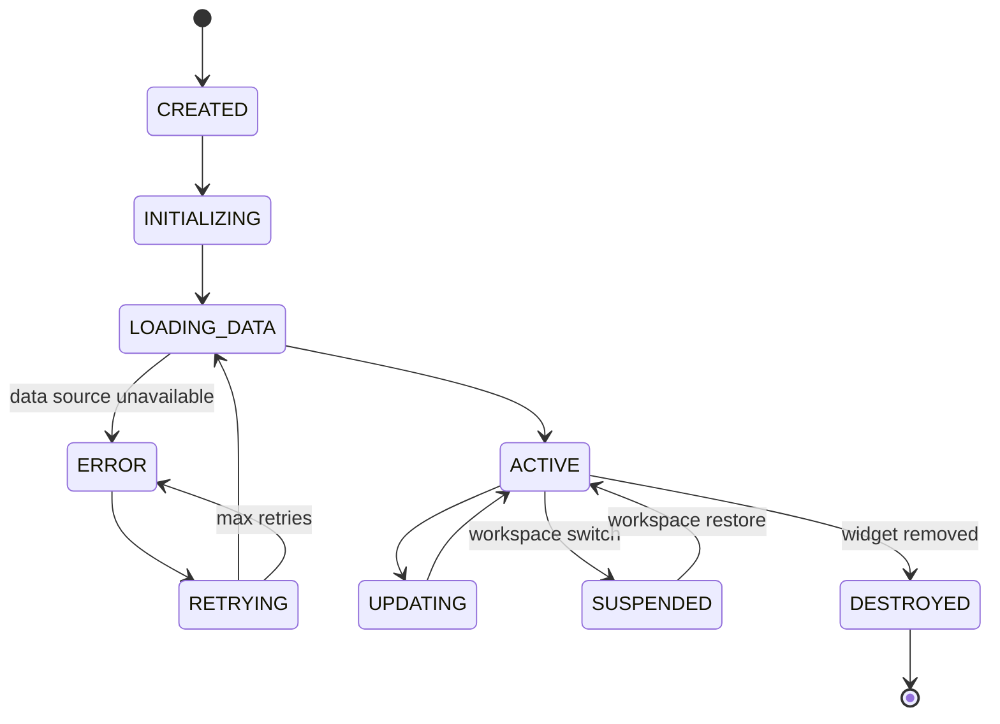

# Dashboard Widgets

## Document type
Document type: [REFERENCE]

## Version
**Version:** 0.3.0 | **Status:** Draft | **Last Updated:** 2026-07-27 | **Owner:** Dashboard Team

## Purpose
Defines the reusable dashboard widgets — widget lifecycle, data binding, refresh cadence, display states, and error handling.

---

## 1. Widget Groups

| Group | Widgets | Update Cadence | Data Source |
|-------|---------|----------------|-------------|
| **Trading** | Spread monitor, P&L tracker, trade list, order book | Real-time (event-driven) | Event bus |
| **Wallet** | Balance, exposure, gas balance, transaction history | 10s poll | Wallet Manager |
| **Risk** | Exposure gauge, circuit breaker status, loss tracker | 5s poll | Risk Engine |
| **AI** | Confidence score, active model, provider status | 30s poll | AI Pipeline |
| **Chains** | Chain health, RPC latency, block height | 15s poll | Network Manager |
| **System** | CPU, RAM, thread count, event queue depth | 5s poll | Runtime |
| **Monitoring** | Health check status, log stream, event stream | Real-time | Event bus / Health |
| **Charts** | Price chart, spread chart, P&L chart | 30s aggregate | Market Data |

---

## 2. Widget Lifecycle



### Lifecycle Hooks
| Hook | Purpose | Implementation |
|------|---------|----------------|
| `onInit()` | Allocate resources, bind data sources | Must complete within 1000ms |
| `onData(data)` | Update widget state from new data | Debounced at 100ms |
| `onRefresh()` | Force data reload | Called on user refresh or cadence timeout |
| `onSuspend()` | Release UI resources on workspace switch | Free framebuffer, keep data |
| `onResume()` | Rebuild UI after suspend | Full re-render |
| `onDestroy()` | Clean up subscriptions, timers, memory | Must complete within 500ms |

---

## 3. Display States

| State | Visual | Transitions |
|-------|--------|-------------|
| **Loading** | Skeleton / spinner | → Active, → Error |
| **Active** | Live data | → Updating, → Error, → Suspended |
| **Warning** | Yellow border + warning icon | Threshold exceeded (e.g., high gas) |
| **Error** | Red border + error detail | → Retrying (auto), → Error (stale) |
| **Stale** | Grey overlay + "last updated Xs ago" | Data source disconnected > 30s |
| **Suspended** | Dimmed, no updates | → Active on workspace restore |
| **Empty** | "No data" placeholder | No data source configured |

---

## 4. Data Binding

- Widgets subscribe to event streams via the dashboard IPC bridge.
- Data arrives via typed IPC channels (typed messages, see `IPC-PROTOCOL.md`).
- Widgets must handle out-of-order delivery (sequence numbers).
- Widgets must debounce high-frequency updates (< 50ms intervals).
- Widgets must not mutate received data — treat as immutable.

---

## 5. Error Handling

| Error | Widget Action | User Feedback |
|-------|---------------|---------------|
| Data source unavailable | Show Error state, retry every 5s | "Data unavailable — retrying..." |
| Data schema mismatch | Show Error state, log to console | "Widget update failed — incompatible data" |
| Rendering error | Catch in error boundary, show fallback | "Widget crashed — reload" button |
| Timeout (no data > 30s) | Show Stale state | "Last updated <ts> — data may be outdated" |
| Permission denied | Show Empty state | "Access denied — contact operator" |

---

## 6. Widget Registration

Widgets are registered in the widget registry (`registry://dashboard/widgets`):

```
{
  "id": "wallet-balance",
  "name": "Wallet Balance",
  "version": "1.0.0",
  "data_sources": ["wallet.balance"],
  "update_cadence_ms": 10000,
  "min_width": 200,
  "min_height": 100,
  "permissions": ["wallet:read"]
}
```

---

## Cross-References

- **DASHBOARD-LAYOUT.md** — Panel composition and widget placement.
- **DASHBOARD-WORKSPACES.md** — Widget state persistence across workspaces.
- **DASHBOARD-RUNTIME.md** — Dashboard initialization and data flow.
- **UI-COMPONENT-SPEC.md** — Widget base component.
- **EVENT-OWNERSHIP-MATRIX.md** — Widget data source events.
- **CONFIGURATION-REFERENCE.md** — Widget config keys.

---

## Version History

| Version | Date | Changes | Author |
|---------|------|---------|--------|
| 0.3.0 | 2026-07-27 | Full widget lifecycle, display states, data binding, error handling, registration | Dashboard Team |
| 0.1.0 | 2026-07-27 | Initial stub | Dashboard Team |