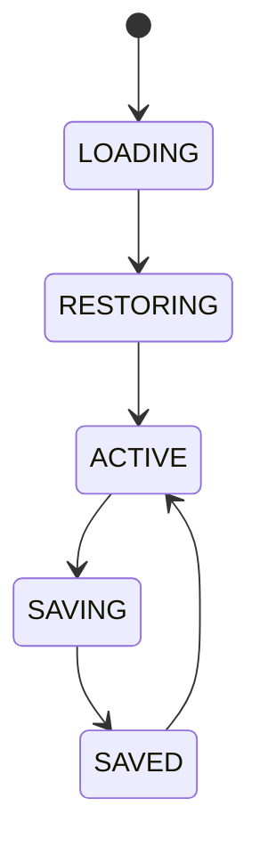

# Dashboard Workspaces

## Purpose
Defines workspace persistence, restore, sharing, and isolation for desktop sessions.

## State schema
Workspace is a JSON blob containing layout, filters, active_widgets, and user_preferences.

## Lifecycle

## Multi-profile
Support workspace_1, workspace_2, etc. Each workspace is isolated.

## Crash recovery
On startup restore last workspace; if corrupt, fall back to default workspace.

## Configuration
- AUTO_SAVE_DEBOUNCE_MS.
- MAX_WORKSPACE_HISTORY.
- WORKSPACE_STORAGE_PATH.

## Cross-references
- `UI-DASHBOARD-SPEC.md`
- `WINDOWS-DESKTOP.md`
- `RECOVERY-AND-FAILOVER.md`

For workspace management, see `WORKSPACE-MANAGER.md`.