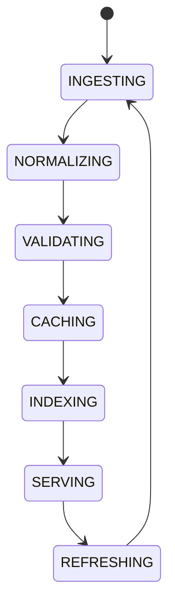

# Data Governance

## Purpose
Defines the central owner for data normalization, validation, provenance, caching, and graph linking.

## Scope
Market data, token metadata, chain metadata, DEX metadata, AI knowledge, execution history, and analytics inputs.

## State machine

## Failure modes
Invalid source, stale cache, broken provenance, incompatible schema.

## Recovery
Reject invalid records, refresh from source, and replay lineage from durable storage.

## Cross-references
- `MARKET-DATA.md`
- `KNOWLEDGE-GRAPH.md`
- `AI-MEMORY-SYSTEM.md`
- `REGISTRY-SYSTEM.md`
