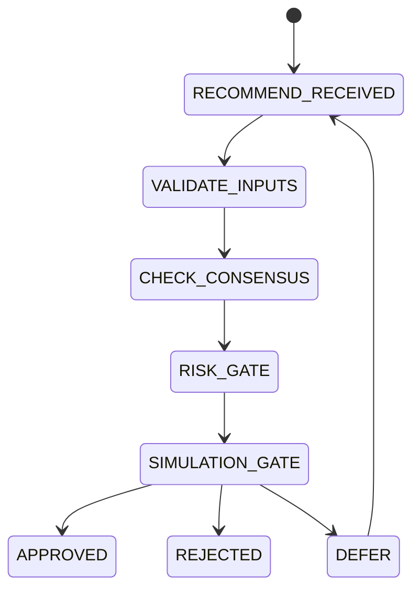

# Decision Engine

## Document type
Document type: [CONTRACT]

## Version
**Version:** 1.0.0 | **Status:** Canonical | **Last Updated:** 2026-07-29 | **Owner:** Trading Team

## Purpose
Defines the authoritative gatekeeper between recommendation and execution.

## State machine

## Veto hierarchy
- Risk Agent can veto.
- Planner can override only with 2/3 consensus.
- Human override via dashboard always wins.

## Timeout
Decisions expire after `DECISION_TTL_SECONDS` unless executed.

## Cross-references
- `AI-CONSENSUS.md`
- `RISK-ENGINE.md`
- `ORCHESTRATOR.md`
- `TRADING-LIFECYCLE.md`

## Operational Contract
Defines the authoritative gatekeeper between recommendation and execution, including veto hierarchy and timeouts.

## Example
An AI recommendation is blocked when policy or risk gates fail.

## Approval flow
- Must define how approval or veto is surfaced to the Windows UI.

## Required details
- Define UI approval and veto wiring.

## Decision rules
- Define approval, veto, and notification flow to the Windows UI.
- Define how decision outcomes are logged and replayed.

---

## Version History

| Version | Date | Changes | Author |
|---------|------|---------|--------|
| 1.0.0 | 2026-07-29 | Added formal Document type declaration, Version block, and Version History section to satisfy [CONTRACT] compliance (`architecture-tests/validate_contracts.py`, `architecture-tests/validate_ownership.py`). Substantive content unchanged. | Trading Team |
