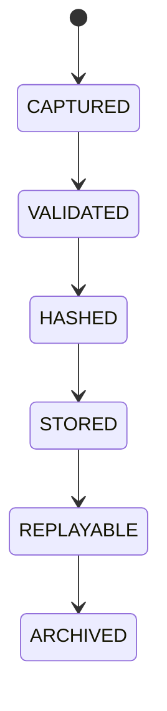

# Decision Ledger

## Purpose
Defines the immutable record of every autonomous decision and outcome.

## State machine

## Required fields
Unique Decision ID, timestamp, trigger event, market snapshot, AI recommendation, deterministic calculations, policy evaluation, risk score, simulation result, final decision, execution result, post-execution outcome.

## Failure modes
Missing record, tampered record, incomplete lineage, replay mismatch.

## Recovery
Rebuild from source logs, reject incomplete traces, escalate to audit.

## Cross-references
- `DECISION-ENGINE.md`
- `GOVERNANCE-EXPLAINABILITY.md`
- `EXPLAINABILITY.md`
- `DECISION-LOG.md`
