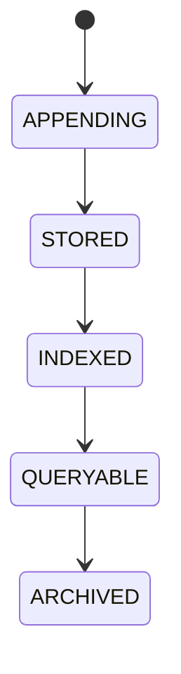

# Decision Log

## Purpose
Defines the human-readable operational log of major platform decisions and outcomes.

## Scope
Trade decisions, strategy decisions, provider changes, recovery actions, policy overrides, and operational events.

## Responsibilities
- Record decision summaries.
- Provide audit-friendly narrative context.
- Link to immutable ledger and explainability artifacts.
- Support replay and forensic review.

## Interfaces
- Input: decision summary, actor, timestamp, related ids.
- Output: append-only log entry and queryable references.
- Events: decision logged, decision updated by follow-up note, replay requested.

## State machine

## Configuration
Retention policy, index policy, redaction policy, and log verbosity.

## Failure handling
Missing context, duplicate entry, storage failure, or redaction error.

## Recovery
Rebuild index, rehydrate from source record, or mark entry incomplete.

## Security considerations
Avoid exposing secrets, private keys, or sensitive prompt data.

## Performance expectations
Append operations must remain low-latency and queryable at scale.

## Extension points
Alternative indexes, export formats, and enriched summaries.

## Cross references
- `DECISION-LEDGER.md`
- `GOVERNANCE-EXPLAINABILITY.md`
- `EXPLAINABILITY.md`
- `AUDIT-TRAIL` (future owner if introduced)

## Implementation constraints
Must remain append-first and non-destructive.

## Future compatibility notes
May be extended with structured event links without changing existing entries.

## Example
Trade executed after simulation passed, risk accepted, and policy approved; later replay links to the ledger and outcome.

## Future compatibility notes
Structured event linkage may be added while preserving append-only history.
