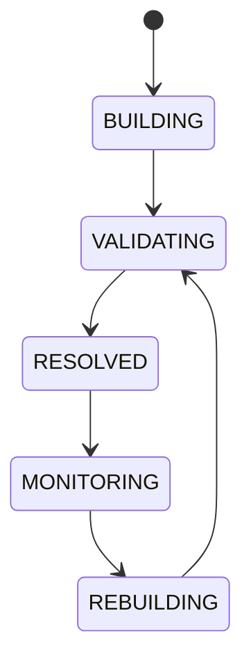

# Dependency Graph

## Purpose
Defines the system-wide dependency graph used for scheduling, upgrades, debugging, and safe startup ordering.

## Graph scope
Execution, simulation, risk, market data, chains, DEXs, wallets, providers, dashboards, notifications, and plugins.

## State machine

## Failure modes
Circular dependency, missing node, stale edge, incompatible version.

## Recovery
Break cycles through explicit ownership, reload graph, and isolate incompatible components.

## Cross-references
- `ARCHITECTURE.md`
- `APEX-ARCHITECTURE.md`
- `SERVICE-REGISTRY.md`
- `ORCHESTRATOR.md`
