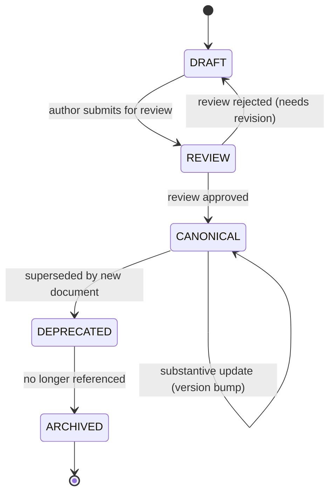

# Documentation Status Review Workflow

## Document type
Document type: [CONTRACT]

## Version
**Version:** 1.0.0 | **Status:** Canonical | **Last Updated:** 2026-07-27 | **Owner:** Architecture Team

## Purpose
Defines the documentation review workflow — status metadata per document, review SLAs, approval gates, version tracking, and lifecycle transitions for every document in the repository.

---

## 1. Document Status Lifecycle



| Status | Description | Editable? | Authority | Review Required |
|--------|-------------|-----------|-----------|----------------|
| **Draft** | Initial content; not yet reviewed | Yes (author only) | Author | No |
| **Review** | Submitted for team review; awaiting approval | No (locked) | Reviewer team | Yes (2+ reviewers) |
| **Canonical** | Approved and authoritative; trusted for implementation | Yes (with version bump) | Architecture owner | Yes (for substantive changes) |
| **Deprecated** | Superseded; still available for reference but no longer authoritative | No (read-only) | Architecture owner | No (supersession review) |
| **Archived** | Removed from active navigation; available in history only | No | N/A | No |

---

## 2. Document Metadata Requirements

Every document in the repository must carry the following metadata in its body:

| Field | Required | Format | Description |
|-------|----------|--------|-------------|
| **Version** | Yes | `MAJOR.MINOR.PATCH` (semver) | Current document version |
| **Status** | Yes | `Draft`, `Review`, `Canonical`, `Deprecated`, `Archived` | Current lifecycle status |
| **Last Updated** | Yes | ISO-8601 date | Date of last substantive change |
| **Owner** | Yes | Team name | Team responsible for content accuracy |
| **Document Type** | Yes | `[INDEX]`, `[OVERVIEW]`, `[REFERENCE]`, `[CONTRACT]`, `[GUIDE]`, `[REGISTRY]` | Document purpose classification |

### Version Rules
| Change Type | Version Bump | Review Required |
|-------------|-------------|-----------------|
| Typo/formatting fix | PATCH (0.0.1) | No |
| New section or clarification | MINOR (0.1.0) | Yes (1 reviewer) |
| Behavioral change or contract modification | MAJOR (1.0.0) | Yes (2+ reviewers + architecture owner) |
| Deprecated → superseded | MAJOR | Yes (architecture owner) |

---

## 3. Review SLAs

| Change Type | Review SLA | Maximum Reviewers | Override |
|-------------|-----------|-------------------|----------|
| PATCH (formatting) | No review needed | 0 | Auto-approve |
| MINOR (clarification) | 2 business days | 1 reviewer | Architecture owner can fast-approve |
| MAJOR (behavioral) | 5 business days | 2+ reviewers + architecture owner | Architecture owner emergency approval (recorded) |
| New document (Draft → Review) | 5 business days | 2+ reviewers | Architecture owner approval required |
| Deprecation | 2 business days | Architecture owner only | N/A |

---

## 4. Approval Gates

| Gate | Condition | Required Approvals | Override |
|------|-----------|--------------------|----------|
| **G1: Content accuracy** | All facts and claims verified | 1 domain expert + 1 reviewer | Architecture owner override |
| **G2: Cross-reference validity** | All referenced documents exist and are Canonical | Automated check + 1 reviewer | Architecture owner override |
| **G3: No duplicate authority** | Document does not claim behavior owned by another doc | Automated check + 1 reviewer | Architecture owner override |
| **G4: 5 Prime Directives compliance** | Lifecycle, interface, owner, cross-cutting, short-doc rules met | Architecture owner only | N/A |
| **G5: Implementation determinism** | A developer can implement the described behavior without guessing | 2 reviewers | Architecture owner override |

---

## 5. Review Workflow

```
1. Author creates/updates document → sets Status: Draft + Version bump.
2. Author submits for review → Status: Review (document locked).
3. Reviewers evaluate against gates G1–G5.
4. If all gates pass → Status: Canonical (document unlocked for future MINOR/PATCH).
5. If any gate fails → Status: Draft (author revises; re-submit).
6. Architecture owner records approval in audit trail.
7. Document metadata updated in DOCUMENTATION-MAP.md.
```

---

## 6. Quarterly Review Cycle

All Canonical documents are reviewed quarterly for:

| Check | Description | Action |
|-------|-------------|--------|
| **Accuracy** | Does the document still reflect current implementation? | Update or deprecate |
| **Cross-references** | Are all references still valid? | Fix broken refs |
| **Authority** | Does the document still own its claimed scope? | Transfer ownership if needed |
| **Determinism** | Can an engineer still implement from this doc without guessing? | Deepen if ambiguous |
| **Duplicate check** | Is any content duplicated across docs? | Consolidate; redirect |

---

## Cross-References

- **DOCUMENTATION-MAP.md** — Document authority hierarchy.
- **CANONICAL-SOURCE-RULES.md** — Canonical source rules.
- **DOCUMENTATION-LIFECYCLE.md** — Documentation lifecycle governance.
- **CROSS-REFERENCE-INDEX.md** — Cross-reference validation.
- **TRACEABILITY-MATRIX.md** — Documentation traceability.

---

## Version History

| Version | Date | Changes | Author |
|---------|------|---------|--------|
| 1.0.0 | 2026-07-27 | New: documentation status review workflow with lifecycle, metadata, SLAs, approval gates, quarterly cycle | Architecture Team |
