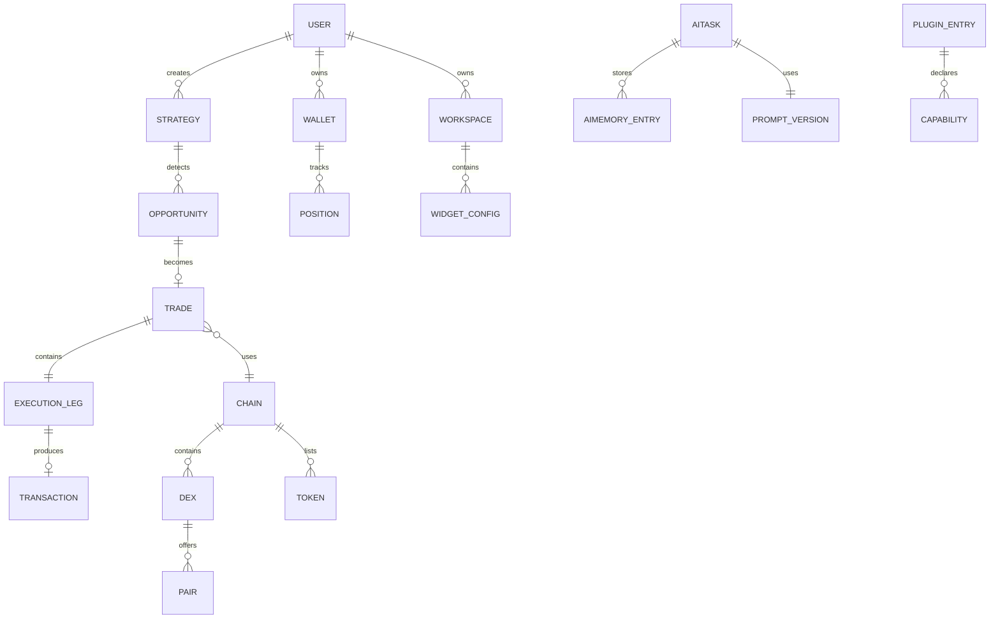

# Domain Model

## Document type
Document type: [CONTRACT]

## Version
**Version:** 1.1.0 | **Status:** Canonical | **Last Updated:** 2026-07-27 | **Owner:** Architecture Team

## Purpose
Defines the canonical platform entities, their identifiers, relationships, invariants, and vocabulary for the entire system domain — including trading, wallet, service, AI, plugin, and Windows desktop entities.

---

## 1. Core Entities

### 1.1 Trading Entities

| Entity | Primary Key | Key Fields | Relationships | Invariants | Owner Doc |
|--------|------------|------------|---------------|-----------|-----------|
| **User** | `user_id` (UUID) | `{role, permissions, created_at}` | Owns Wallets, Strategies, Workspaces | Each user has exactly one role; permissions derive from role | PERMISSION-MODEL.md |
| **Wallet** | `wallet_id` (UUID) | `{address, chain_id, network, enabled, max_gas_price}` | Belongs to User; tracks Positions, Transactions | Address must be checksummed; one wallet per address per chain | WALLET-MANAGEMENT.md |
| **Strategy** | `strategy_id` (UUID) | `{name, type, parameters, risk_limits, enabled}` | Owned by User; generates Opportunities | Parameters must pass schema validation; risk limits > 0 | STRATEGIES.md |
| **Opportunity** | `opportunity_id` (UUID) | `{strategy_id, chains, pairs, spread_bps, estimated_profit, detected_at}` | Created by Strategy; evaluated by Risk; may become Trade | Spread must be > min_arb_spread_pct; estimated_profit must be positive | OPPORTUNITY-DETECTION.md |
| **Trade** | `trade_id` (UUID) | `{wallet_id, strategy_id, chains, pairs, state, profit, gas_total, correlation_id}` | Created from Opportunity; contains Execution Legs | State transitions follow TRADING-LIFECYCLE.md; must have 2 legs (buy + sell) | TRADING-ENGINE.md |
| **ExecutionLeg** | `leg_id` (UUID) | `{trade_id, leg_number, chain_id, direction, tx_hash, state, retry_count}` | Part of Trade; links to Transaction | Leg number ∈ {1, 2}; direction ∈ {buy, sell}; state follows EXECUTION-STATE-MACHINE.md | EXECUTION-ENGINE.md |
| **Position** | `position_id` (UUID) | `{wallet_id, token, amount, entry_price, state}` | Belongs to Wallet; updated by Trade | Position amount must be non-negative; entry_price > 0 | POSITION-MANAGEMENT.md |
| **Order** | `order_id` (UUID) | `{trade_id, leg_id, type, amount, price, state}` | Part of Execution Leg; tracked by Execution | Amount > 0; price > 0 | ORDER-MANAGEMENT.md |

### 1.2 Chain/Market Entities

| Entity | Primary Key | Key Fields | Relationships | Invariants | Owner Doc |
|--------|------------|------------|---------------|-----------|-----------|
| **Chain** | `chain_id` (text, e.g., "polygon") | `{name, rpc_url, block_time_ms, confirmations, enabled}` | Contains DEXs, Tokens, Oracles; used by Trades | RPC URL must resolve; confirmations > 0; block_time > 0 | CHAIN-REGISTRY.md |
| **DEX** | `dex_id` (text) | `{name, chain_id, router_address, factory_address, version}` | Belongs to Chain; contains Pairs | Address must be checksummed; chain_id must exist | DEX-REGISTRY.md |
| **Token** | `token_id` (address + chain) | `{symbol, decimals, address, chain_id, coingecko_id}` | Belongs to Chain; part of Pairs | Decimals > 0; address checksummed; symbol ≤ 10 chars | TOKEN-REGISTRY.md |
| **Pair** | `pair_id` (tokenA + tokenB + dex) | `{token_a, token_b, dex_id, reserve_a, reserve_b}` | Belongs to DEX; used by Opportunities | Both tokens must exist; reserves > 0 for active pairs | PAIR-DISCOVERY.md |
| **Oracle** | `oracle_id` (text) | `{name, chain_id, feed_address, heartbeat, deviation_threshold}` | Belongs to Chain | Feed address valid; heartbeat configured | ORACLE-REGISTRY.md |

### 1.3 AI Entities

| Entity | Primary Key | Key Fields | Relationships | Invariants | Owner Doc |
|--------|------------|------------|---------------|-----------|-----------|
| **AITask** | `task_id` (UUID) | `{session_id, intent, model, provider, prompt_version, state, confidence, cost}` | Uses PromptVersion; creates AIMemory | Cost ≤ max_per_request_usd; confidence ≥ threshold for valid result | AI-PIPELINE.md |
| **AIMemoryEntry** | `memory_id` (UUID) | `{category, content, relevance_score, recency_score, ttl_days}` | Injected into future Prompts | Content hash unique (dedup); score ∈ [0,1]; TTL enforced | AI-MEMORY.md |
| **PromptVersion** | `prompt_version_id` (UUID) | `{template_hash, segments, total_tokens, strategy}` | Used by AITask | Total tokens ≤ max_tokens; system segment never pruned | PROMPT-LIFECYCLE.md |

### 1.4 Windows/Desktop Entities

| Entity | Primary Key | Key Fields | Relationships | Invariants | Owner Doc |
|--------|------------|------------|---------------|-----------|-----------|
| **Workspace** | `workspace_id` (UUID) | `{name, layout_profile, panels, active_tab, created_at}` | Belongs to User; contains WidgetConfigs | Layout must pass schema validation; panels reference valid routes | DASHBOARD-WORKSPACES.md |
| **WidgetConfig** | `widget_config_id` (UUID) | `{widget_type, position, size, data_source, settings}` | Part of Workspace; references Dashboard data | Widget type must exist in widget catalog | DASHBOARD-WIDGETS.md |
| **PluginEntry** | `plugin_id` (text) | `{name, version, capabilities, state, manifest_hash}` | Has PluginSandbox; declares Capabilities | Manifest must pass validation; capabilities subset of registry | PLUGIN-SDK.md |

---

## 2. Domain Relationships (Canonical)

---

## 3. Domain Invariants

| Invariant ID | Description | Enforcement | Violation |
|-------------|-------------|-------------|----------|
| INV-001 | A portfolio always belongs to a single wallet owner | DB foreign key constraint | DB error; reject mutation |
| INV-002 | No trade may proceed without risk approval | Risk check pipeline in Trading Engine | Trade REJECTED |
| INV-003 | A wallet's nonce must never go backward | Nonce sequence tracking in Wallet Manager | TX rejected by chain; nonce conflict resolution |
| INV-004 | Plugin capabilities must be subset of declared manifest | Capability enforcer at IPC gate | `security.violation` event; plugin disabled |
| INV-005 | AI must never access secrets directly | Prompt injection filter + IPC gate | `security.violation` Critical event; AI call aborted |
| INV-006 | All execution state transitions must be persisted before committing | DB write-before-transition rule | Invariant violation; crash recovery may fail |
| INV-007 | Event ordering keys must produce FIFO delivery within key | SPSC channel per key in event bus | Architecture test; consumer defers processing |
| INV-008 | Config reload must be all-or-nothing (batch validation) | Config manager batch validation | Batch rejected; old config retained |
| INV-009 | No plugin-to-plugin direct communication | Sandbox process isolation | `security.violation` event |

---

## 4. Windows-Specific Entities

| Entity | Primary Key | Key Fields | Description |
|--------|------------|------------|-------------|
| **WindowsServiceConfig** | `service_id` | `{start_type: auto|manual|disabled, restart_policy, log_to_event_log}` | Windows SCM registration |
| **WindowsPowerProfile** | `profile_id` | `{battery_threshold_low_pct, battery_threshold_critical_pct, sleep_behavior, resume_behavior}` | Power event handling rules |
| **WindowsNetworkProfile** | `profile_id` | `{proxy_enabled, firewall_rules_auto, dns_override}` | Network configuration for Windows |

---

## Cross-References

- **ARCHITECTURE.md** — System architecture boundaries.
- **DATABASE-SCHEMA.md** — DDL for all persistent entities.
- **STATE-MANAGEMENT.md** — State ownership rules.
- **CONFIGURATION.md** — Configuration entity governance.
- **API-CONTRACTS.md** — API surface for entity operations.
- **TRACEABILITY-MATRIX.md** — Domain requirement coverage.

---

## Version History

| Version | Date | Changes | Author |
|---------|------|---------|--------|
| 1.1.0 | 2026-07-27 | Full entity definitions with PKs, relationships, invariants, Windows entities, ER diagram | Architecture Team |
| 1.0.0 | 2025-01-15 | Initial stub (12 entity names only) | Architecture Team |
