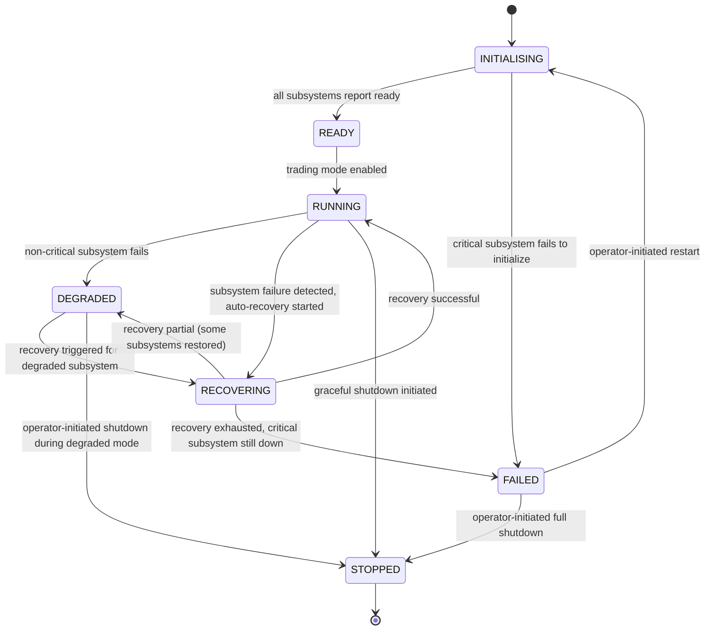

# Engine State Machine

## Document type
Document type: [CONTRACT]

## Version
**Version:** 1.1.0 | **Status:** Canonical | **Last Updated:** 2026-07-27 | **Owner:** Runtime Team

## Purpose
Defines the complete engine lifecycle state machine — states, transitions, timeouts, recovery transitions, forbidden transitions, failure transitions, and startup/shutdown state coupling.

---

## 1. State Machine Definition

---

## 2. State Definitions

| State | Description | Entry Condition | Exit Condition | Timeout | Persistent? |
|-------|-------------|-----------------|----------------|---------|-------------|
| **INITIALISING** | Engine is loading config, starting subsystems, establishing connections | Process start or operator restart | All subsystems reach READY or a critical subsystem fails | `runtime.startup_timeout_ms` (60s) | No (transient) |
| **READY** | All subsystems initialized; trading not yet active | All subsystem latch countdown complete | Trading mode switch to `Active` | None (stable) | Yes |
| **RUNNING** | Engine is fully operational; trading active | Trading mode enabled | Subsystem failure or shutdown command | None (stable) | Yes |
| **DEGRADED** | One or more non-critical subsystems are down; core trading may continue | Non-critical health check fails | Recovery completes or shutdown | `runtime.degraded_timeout_ms` (300s) — if exceeded, transition to RECOVERING | Yes |
| **RECOVERING** | Auto-recovery is in progress for a failed subsystem | Recovery triggered | Recovery succeeds (→ RUNNING) or fails (→ FAILED/DEGRADED) | `runtime.recovery_timeout_ms` (120s) | No (transient) |
| **FAILED** | Critical subsystem failure; engine cannot operate safely | Critical health check fails or recovery exhausted | Operator restart or shutdown | None (waits for operator) | Yes |
| **STOPPED** | Engine is shut down; no processing | Graceful shutdown completed | Process exits | None (terminal) | Yes |

---

## 3. Transition Definitions

### Allowed Transitions

| From | To | Trigger | Precondition | Postcondition | Event Emitted |
|------|----|---------|--------------|---------------|---------------|
| INITIALISING | READY | All subsystems report `READY` | Config valid; secrets loaded; DB connected; event bus started; RPC connections established | Engine state persisted as `READY` | `runtime.started` |
| INITIALISING | FAILED | Critical subsystem fails to initialize | Any subsystem fails `runtime.startup_timeout_ms` | Failed subsystem isolated; startup abort logged | `system.error` (severity Critical) |
| READY | RUNNING | Trading mode switched to `Active` | Risk engine loaded; wallet initialized; market data subscribed | Trading engine accepts opportunities | `runtime.mode.transition` (READY → RUNNING) |
| RUNNING | DEGRADED | Non-critical subsystem health check fails | Failed subsystem is NOT trading, wallet, or risk | Trading continues; failed subsystem isolated | `runtime.health.failed` |
| RUNNING | RECOVERING | Subsystem failure detected, auto-recovery enabled | `runtime.failover.enabled` = true | Failed subsystem under recovery management | `runtime.failover.started` |
| RUNNING | STOPPED | Graceful shutdown signal | Operator command or Windows shutdown event | New opportunities rejected; in-flight trades allowed to complete | `runtime.shutting_down` |
| DEGRADED | RECOVERING | Recovery trigger (timeout exceeded or manual) | Degraded timeout exceeded or operator triggers recovery | Recovery coordinator activated | `runtime.failover.started` |
| DEGRADED | STOPPED | Operator shutdown during degraded mode | Operator command | Immediate drain; no recovery attempted | `runtime.shutting_down` |
| RECOVERING | RUNNING | Recovery successful | Health check confirms subsystem restored | All subsystems operational; trading resumes | `runtime.health.restored` + `runtime.failover.completed` |
| RECOVERING | DEGRADED | Partial recovery | Some subsystems restored, some still down | Trading resumes with limitations; still-degraded subsystems logged | `system.warning` (partial recovery) |
| RECOVERING | FAILED | Recovery exhausted | All recovery attempts failed; critical subsystem still down | Engine cannot operate; operator intervention required | `system.error` (recovery exhausted) |
| FAILED | INITIALISING | Operator restart | Operator command or scheduled restart | Fresh startup sequence begins | `runtime.starting` |
| FAILED | STOPPED | Operator full shutdown | Operator command | Process terminates | `runtime.stopped` |

### Forbidden Transitions

| From | To | Reason |
|------|----|--------|
| FAILED | RUNNING | Cannot jump to running without re-initializing |
| RUNNING | INITIALISING | Cannot re-init without stopping first |
| STOPPED | RUNNING | Must go through INITIALISING → READY → RUNNING |
| FAILED | READY | Must go through INITIALISING |
| DEGRADED | INITIALISING | Must stop first, then re-initialize |

### Recovery Transitions

| Failure | Recovery Path | Max Attempts | Cooldown |
|---------|--------------|-------------|----------|
| RPC connection loss | DEGRADED → RECOVERING → RUNNING | 5 attempts (30s interval) | 60s between recovery cycles |
| AI provider failure | RUNNING → DEGRADED → RECOVERING → RUNNING | 3 attempts (per provider fallback chain) | Provider cooldown per `ai.providers.failure_cooldown_ms` |
| Database connection loss | RUNNING → DEGRADED → RECOVERING → RUNNING | 10 attempts (5s interval) | 15s between recovery cycles |
| Event bus corruption | RUNNING → RECOVERING → RUNNING | 1 attempt (full bus restart) | 30s cooldown |
| Worker pool exhaustion | RUNNING → DEGRADED → RECOVERING → RUNNING | Auto-scale workers up to max | No cooldown (elastic) |

---

## 4. Startup / Shutdown State Coupling

### Startup Latch
The engine uses a `std::latch(6)` to coordinate subsystem startup:
- Event Bus → READY (counts down)
- Database Pool → READY (counts down)
- Chain/RPC Connections → READY (counts down)
- Wallet Manager → READY (counts down)
- AI Pipeline → READY (counts down)
- Trading Engine → READY (counts down)

All 6 subsystems must reach READY before the engine transitions from INITIALISING → READY. If any subsystem fails within `runtime.startup_timeout_ms`, the engine transitions to FAILED.

### Shutdown Sequence
On shutdown, subsystems are stopped in reverse dependency order:
1. Trading Engine → STOPPED
2. AI Pipeline → STOPPED
3. Wallet Manager → STOPPED
4. Chain/RPC Connections → CLOSED
5. Database Pool → FLUSHED + STOPPED
6. Event Bus → DRAINED + STOPPED

Engine transitions to STOPPED after all subsystems acknowledge.

### Config Reload Coupling
- Engine in RUNNING state: hot-reload keys are applied immediately.
- Engine in INITIALISING: all config applied on startup.
- Engine in FAILED: config reload blocked until operator restarts.
- Engine in STOPPED: no config reload processing.

---

## 5. Timeout Semantics

| Timeout | Default | Range | Config Key | Action on Expiry |
|---------|---------|-------|------------|------------------|
| Startup timeout | 60,000 ms | 10,000–300,000 | `runtime.startup_timeout_ms` | Transition to FAILED |
| Shutdown timeout | 30,000 ms | 10,000–120,000 | `runtime.shutdown_timeout_ms` | Force terminate process |
| Degraded timeout | 300,000 ms | 60,000–600,000 | `runtime.degraded_timeout_ms` | Transition to RECOVERING |
| Recovery timeout | 120,000 ms | 30,000–360,000 | `runtime.recovery_timeout_ms` | Transition to FAILED |
| Health check interval | 5,000 ms | 1,000–60,000 | `runtime.health_check_interval_ms` | Probe all subsystems |
| Health check probe timeout | 3,000 ms | 500–30,000 | `runtime.health_check_timeout_ms` | Mark subsystem as failed |

---

## 6. Observability

Every state transition emits an event:

| Transition | Event | Payload |
|------------|-------|---------|
| INITIALISING → READY | `runtime.started` | `{phase_count, total_startup_ms, subsystem_statuses}` |
| INITIALISING → FAILED | `system.error` | `{subsystem, reason, severity: Critical}` |
| READY → RUNNING | `runtime.mode.transition` | `{from: Ready, to: Running, reason}` |
| RUNNING → DEGRADED | `runtime.health.failed` | `{subsystem, degraded_capabilities}` |
| RUNNING → RECOVERING | `runtime.failover.started` | `{subsystem, recovery_strategy}` |
| RECOVERING → RUNNING | `runtime.health.restored` | `{subsystem, recovery_duration_ms}` |
| RECOVERING → FAILED | `system.error` | `{subsystem, recovery_attempts, reason}` |
| RUNNING → STOPPED | `runtime.shutting_down` | `{reason, in_flight_trades}` |

---

## Cross-References

- **RUNTIME-OPERATIONS.md** — Startup/shutdown/recovery sequencing.
- **ORCHESTRATOR.md** — Orchestration state machine coordination.
- **HEALTHCHECKS.md** — Health probe definitions and failure timing.
- **RECOVERY-AND-FAILOVER.md** — Recovery orchestration.
- **STATE-MANAGEMENT.md** — Global state management contract.
- **TRACEABILITY-MATRIX.md** — REQ-RUNTIME-001, REQ-RUNTIME-002.
- **CONFIGURATION-REFERENCE.md** — `runtime.*` config keys.

---

## Version History

| Version | Date | Changes | Author |
|---------|------|---------|--------|
| 1.1.0 | 2026-07-27 | Complete state machine with states, transitions, forbidden paths, recovery paths, startup/shutdown coupling, timeouts, observability | Runtime Team |
| 1.0.0 | 2025-01-15 | Initial stub | Runtime Team |
