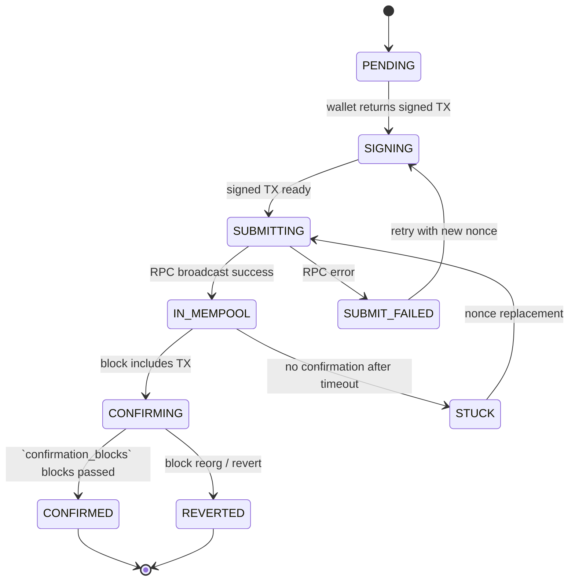

# Execution Engine

## Document type
Document type: [REFERENCE]

## Version
**Version:** 0.2.0 | **Status:** Draft | **Last Updated:** 2026-07-27 | **Owner:** Trading Team

## Purpose
Defines chain transaction execution, confirmation, cancellation, and recovery — with explicit execution sequencing, timeout handling, and retry/resume behavior.

---

## 1. Transaction Lifecycle State Machine

---

## 2. Execution Sequencing

### 2.1 Pre-Submission
1. Validate wallet has sufficient native token for gas: `balance >= gas_estimate × gas_multiplier`.
2. Validate target contract address matches expected DEX/pair.
3. Validate calldata encoding against ABI schema.
4. Estimate gas via `eth_estimateGas` (or equivalent).
5. If gas > `execution.gas.max_gas_limit`, abort with `GAS_LIMIT_EXCEEDED`.

### 2.2 Submission
1. Wallet signs transaction offline (no private key exposure to network).
2. Submit via `eth_sendRawTransaction` to primary RPC endpoint.
3. If primary RPC fails → fallback to secondary RPC endpoint.
4. Record TX hash, nonce, and submission timestamp.

### 2.3 Confirmation
1. Poll `eth_getTransactionReceipt` every `execution.poll_interval_ms` (default 1000ms).
2. Confirmation threshold: `execution.confirmation_blocks` (default 2 for EVM).
3. For each new block containing our TX, increment confirmation count.
4. Once count >= threshold, mark CONFIRMED.
5. Extract `logs` for event-driven downstream actions (e.g., swap event).

### 2.4 Reorg Handling
1. If a block reorg drops our TX below the confirmation threshold, decrement count.
2. If count reaches 0, transition to `REVERTED`.
3. Reorg safe depth: `execution.reorg_safe_depth` (default 12 blocks for EVM).

---

## 3. Timeout Handling

| Phase | Timeout | Config Key | Action on Timeout |
|-------|---------|------------|-------------------|
| Gas estimation | 5000ms | `execution.timeout_ms` | Retry 1×, then ABORT with `GAS_ESTIMATE_FAILED` |
| TX submission | 10000ms | `execution.timeout_ms` | Fallback RPC → retry → ABORT with `SUBMISSION_FAILED` |
| Mempool confirmation | `execution.timeout_ms` (30000ms) | `execution.timeout_ms` | Mark STUCK, attempt nonce replacement |
| Block confirmation | `execution.confirmation_timeout_ms` (60000ms) | `execution.confirmation_timeout_ms` | Mark REVERTED, return to caller |
| Total execution | `execution.total_timeout_ms` (120000ms) | `execution.total_timeout_ms` | Force abort, all retries exhausted |

---

## 4. Retry & Resume Behavior

### 4.1 Retry Strategy

| Error Type | Retry Count | Backoff | Backoff Cap | Next Action |
|------------|-------------|---------|-------------|-------------|
| RPC timeout (submit) | 3 | Exponential (1s, 2s, 4s) | 10s | Fallback RPC |
| RPC timeout (confirm) | 5 | Exponential (1s, 2s, 4s, 8s, 16s) | 30s | Fallback RPC |
| Nonce too low | 1 | Immediate | N/A | Increment nonce, resubmit |
| Gas too low | 3 | Incremental (10%, 20%, 30%) | 2× initial | Resubmit with higher gas |
| Insufficient funds | 0 | N/A | N/A | ABORT immediately |
| Revert (known) | 0 | N/A | N/A | Return revert reason to caller |
| Revert (unknown) | 1 | Immediate | N/A | Simulate with `eth_call` first |

### 4.2 Nonce Replacement (Stuck TX)
1. When TX is unconfirmed after `execution.timeout_ms` in mempool.
2. Create replacement TX with same nonce, 1.5× gas price, same calldata.
3. Submit replacement.
4. Wait `execution.confirmation_blocks` for replacement to confirm.
5. If replacement also stuck → escalate to operator (max 2 replacements).

### 4.3 Crash Resume
1. On restart, load incomplete transactions from persistent store.
2. For each TX in-flight, query chain for current status:
   - If confirmed → advance to next step.
   - If unconfirmed → wait for confirmation within grace timeout.
   - If not found → treat as not submitted, abort.
3. Nonce conflicts are resolved by scanning chain for the expected nonce.

---

## 5. Wallet & Signing Context

| Wallet Type | Signing Method | Security Level | Supported Chains |
|-------------|---------------|----------------|------------------|
| Software (encrypted keystore) | Offline signing | Medium | All EVM, Solana, Cosmos |
| Hardware wallet | Via provider API | High | EVM only |
| External (MetaMask, WalletConnect) | Via DApp bridge | Medium | EVM only |
| Exchange API | API key signing | Low-medium | CEX only |

All signing happens in the wallet process (Trust Domain T1). The execution engine receives only the signed transaction bytes — never the private key.

---

## 6. Gas Optimization

| Strategy | Description | Config Key |
|----------|-------------|------------|
| Dynamic gas pricing | Use `eth_maxPriorityFeePerGas` + base fee | `execution.gas.dynamic_enabled` |
| Max gas cap | Hard limit on total gas per TX | `execution.gas.max_gas_limit` |
| Multiplier | `gas_estimate × gas_multiplier` for safety margin | `execution.gas.multiplier` (default 1.2) |
| Priority fee floor | Minimum tip to validator | `execution.gas.priority_fee_gwei` (default 1) |

---

## Cross-References

- **TRADING-ENGINE.md** — Trade-level coordination that calls execution.
- **TRANSACTION-LIFECYCLE.md** — Detailed TX lifecycle per chain.
- **GAS-OPTIMISATION.md** — Gas calculation and optimization strategies.
- **MEV-PROTECTION.md** — MEV-resistant submission strategies.
- **WALLET-MANAGEMENT.md** — Wallet signing and key derivation.
- **RISK-ENGINE.md** — Risk checks before submission.
- **CONFIGURATION-REFERENCE.md** — Execution config keys (`execution.*`).
- **TRACEABILITY-MATRIX.md** — Execution requirement coverage.

---

## Version History

| Version | Date | Changes | Author |
|---------|------|---------|--------|
| 0.2.0 | 2026-07-27 | Full execution lifecycle, timeout handling, retry/resume, gas optimization | Trading Team |
| 0.1.0 | 2026-07-27 | Initial stub | Trading Team |