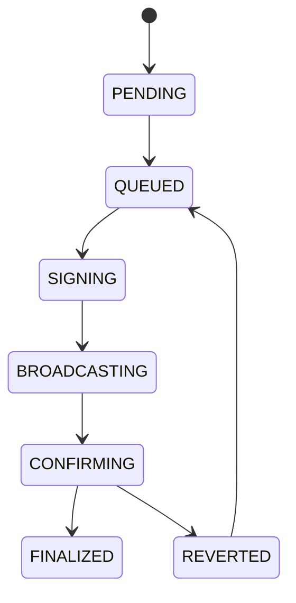

# Execution Lifecycle

## Purpose
Defines execution state transitions from queued order to final chain outcome.

## State machine

## Allowed transitions
- PENDING -> QUEUED.
- QUEUED -> SIGNING.
- SIGNING -> BROADCASTING.
- BROADCASTING -> CONFIRMING.
- CONFIRMING -> FINALIZED or REVERTED.
- REVERTED -> QUEUED.

## Forbidden transitions
- PENDING -> BROADCASTING.
- SIGNING -> FINALIZED.
- FINALIZED -> CONFIRMING.

## Recovery
- REVERTED may return to QUEUED after retry policy succeeds.

## Cross-references
- `TRADING-LIFECYCLE.md`
- `ORCHESTRATOR.md`
- `DOMAIN-MODEL.md`
