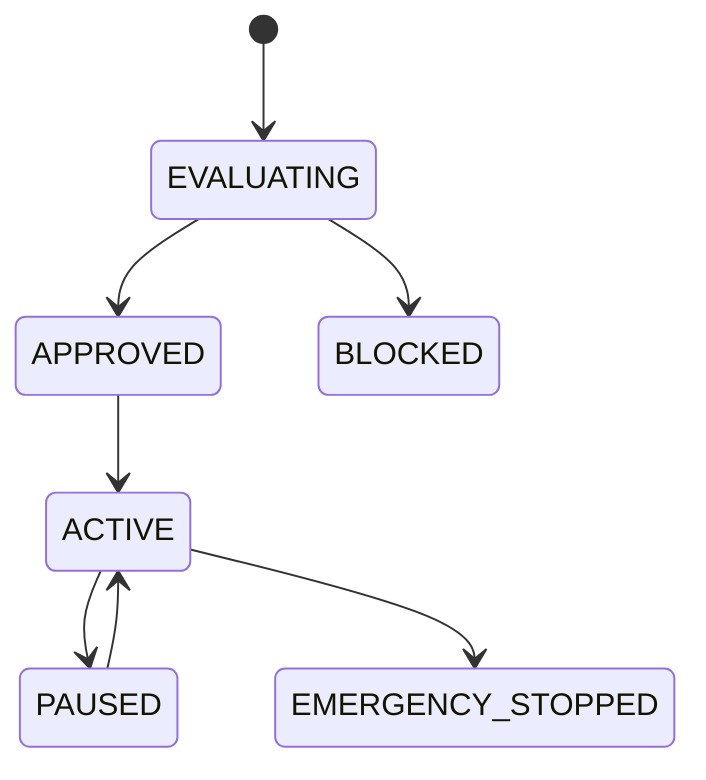

# Execution Policies

## Purpose
Defines the policy layer for gas, exposure, trading windows, profit thresholds, retry policy, emergency stop, and pause policy.

## State machine

## Failure modes
Threshold breach, policy conflict, emergency stop, invalid pause state.

## Recovery
Stop execution, notify operators, and require approval to resume.

## Cross-references
- `RISK-ENGINE.md`
- `POLICY-ENGINE.md`
- `TRADING-LIFECYCLE.md`
- `EXECUTION-LIFECYCLE.md`
