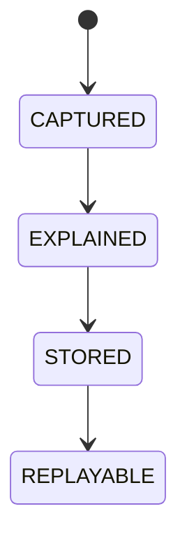

# Explainability

## Document type
This document is an overview, reference, or index as noted below.

# Explainability

## Purpose
Defines the mandatory trace format for every decision, recommendation, and action.

## Required fields
Decision ID, rationale, confidence, alternatives considered, inputs used, gates passed, veto source, and timestamp.

## State machine

## Failure modes
Missing rationale, incomplete inputs, untraceable decision, expired replay data.

## Recovery
Reject storage, request re-evaluation, or mark the decision as non-compliant.

## Cross-references
- `ai/orchestration/AI-ORCHESTRATION.md`
- `DECISION-ENGINE.md`
- `LEARNING-PIPELINE.md`
- `METRICS.md`

For governance-grade trace compliance, see `GOVERNANCE-EXPLAINABILITY.md`.
## Operational Contract
Defines the responsibilities, invariants, and expected behavior for this component.

## Example
An input is validated before any state-changing action.

## Arbitrage explanations
- Must explain why opportunities were taken or skipped.

## Required details
- Define why decisions were taken or skipped.

## Explanation rules
- Explain why actions were taken, skipped, or delayed.
- Capture inputs, outputs, and decision context for auditability.

## Explanation rules
- Explain why actions were taken, skipped, or delayed.
- Capture inputs, outputs, and decision context.
