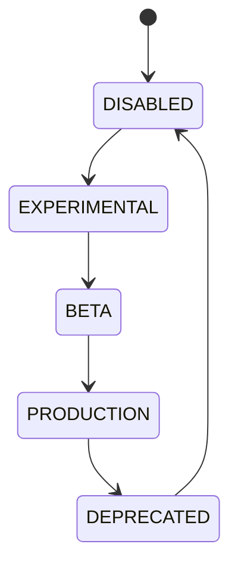

# Feature Flags

## Purpose
Defines controlled rollout states for all product capabilities.

## States
Experimental, Beta, Production, Deprecated, Disabled.

## State machine

## Failure modes
Unsafe rollout, invalid default, conflicting environment override.

## Recovery
Rollback, disable, or pin to previous version.

## Cross-references
- `CONFIGURATION.md`
- `POLICY-ENGINE.md`
- `VERSIONING.md`

## Operational Contract
Defines the responsibilities, invariants, and expected behavior for this component.

## Example
An input is validated before any state-changing action.
