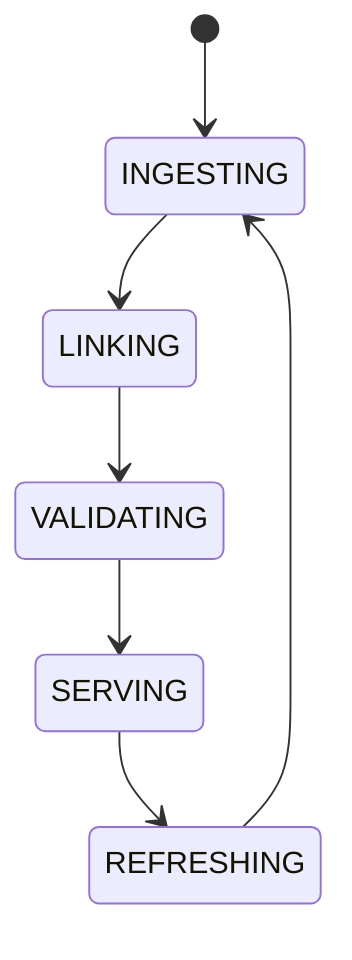

# Knowledge Graph

## Purpose
Defines the structured graph linking protocols, tokens, strategies, chains, DEXs, risks, and AI agents.

## State machine

## Failure modes
Stale node, broken edge, duplicate entity, invalid relation, version drift.

## Recovery
Refresh source nodes, revalidate relations, and isolate stale subgraphs.

## Cross-references
- `AI-MEMORY-SYSTEM.md`
- `CHAIN-INTELLIGENCE.md`
- `MARKET-INTELLIGENCE.md`
- `DOMAIN-MODEL.md`
