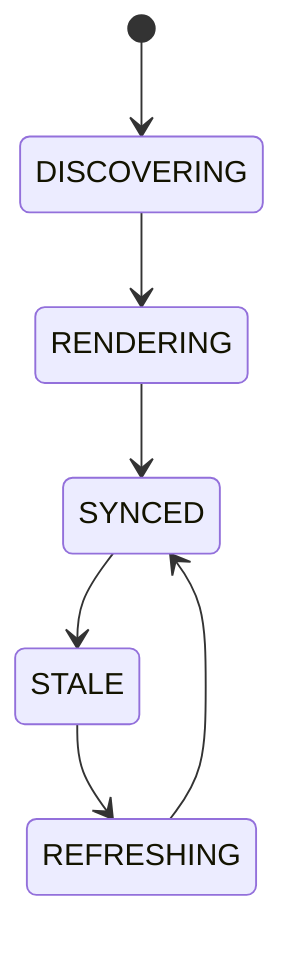

# Live Architecture Viewer

## Purpose
Defines the authoritative live topology and runtime visualization layer for modules, queues, events, and health.

## Scope
Strategies, workers, AI, chains, DEXs, wallets, providers, queues, and event routes.

## State machine

## Failure modes
Stale graph, missing node, invalid edge, render failure.

## Recovery
Refresh topology from kernel, requery registries, and fall back to cached graph.

## Cross-references
- `APEX-KERNEL.md`
- `DEPENDENCY-GRAPH.md`
- `HEALTHCHECKS.md`
- `UI-DASHBOARD-SPEC.md`
