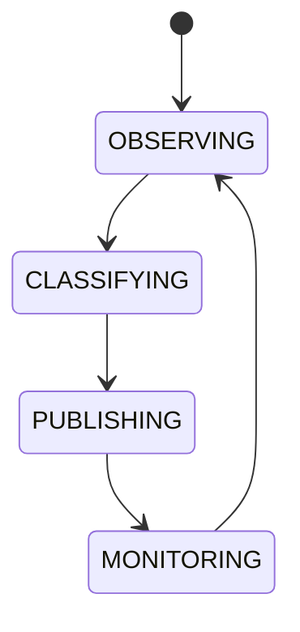

# Market Regime Detection

## Document type
This document is an overview, reference, or index as noted below.

# Market Regime Detection

## Purpose
Defines the classification of market regimes that influence strategy selection and scheduling.

## Regimes
Trending, ranging, high volatility, low liquidity, congestion, panic, recovery.

## State machine

## Failure modes
Misclassification, stale classification, noisy signal.

## Recovery
Reclassify with fresh data and reduce confidence if unstable.

## Cross-references
- `MARKET-INTELLIGENCE.md`
- `STRATEGY-ROTATION.md`
- `ORCHESTRATOR.md`

## Operational Contract
Defines the responsibilities, invariants, and expected behavior for this component.

## Example
An input is validated before any state-changing action.
