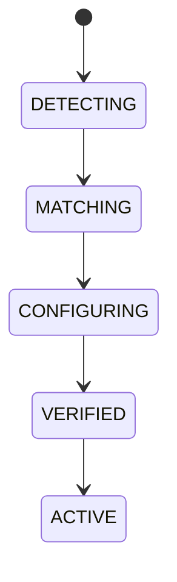

# Model Capability Negotiation

## Purpose
Defines automatic capability detection and configuration for chosen AI providers.

## Capabilities
Streaming, Reasoning, Vision, Tool Calling, JSON, Embeddings, Long Context.

## State machine

## Failure modes
Capability mismatch, false positive, provider regression.

## Recovery
Downgrade features, switch providers, or reject unsupported capability use.

## Cross-references
- `AI-PROVIDER-MANAGER.md`
- `AI-GATEWAY.md`
- `INTERFACE-PROVIDER-ADAPTER.md`
