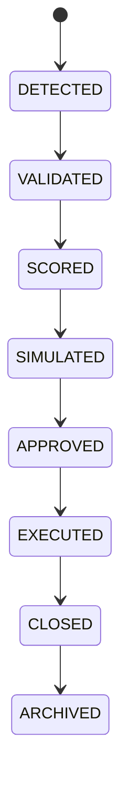

# Opportunity Lifecycle

## Purpose
Defines the lifecycle from detection to archival.

## State machine

## Cross-references
- `OPPORTUNITY-DETECTION.md`
- `OPPORTUNITY-RANKING.md`
- `TRADING-LIFECYCLE.md`

## Operational Contract
Defines the lifecycle from discovery through validation, scoring, simulation, approval, execution, closure, and archive.

## Example
An opportunity moves to approval only after scoring and simulation pass configured thresholds.
