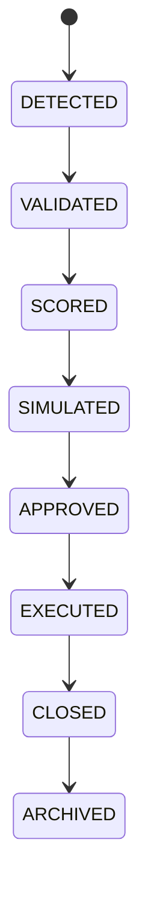

# Opportunity Lifecycle

## Purpose
Defines the lifecycle from detection to archival.

## State machine

## Cross-references
- `OPPORTUNITY-DETECTION.md`
- `OPPORTUNITY-RANKING.md`
- `TRADING-LIFECYCLE.md`
