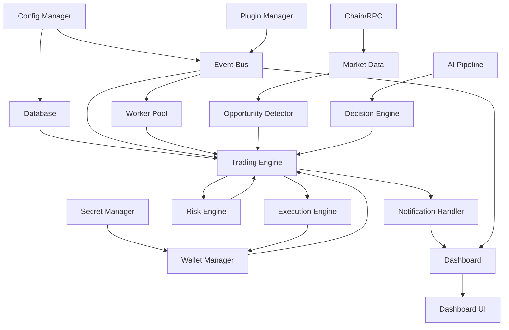

# Orchestrator

## Purpose
Defines the single authoritative runtime orchestrator that coordinates all subsystem sequencing — startup ordering, subsystem priority, cross-system dependency resolution, health-driven state transitions, sleep/resume coordination, recovery delegation, and graceful shutdown ordering. The Orchestrator is the master lifecycle coordinator; it does NOT own the internal behavior of any subsystem, but it does own the sequencing, gating, and coordination rules that govern when subsystems may start, stop, recover, or transition between operational states.

---

## 1. Orchestrator Identity and Scope

### 1.1 What the Orchestrator Owns
- **Startup sequencing**: The ordered list of subsystem initialization phases with latch gates.
- **Shutdown sequencing**: The reverse-order shutdown with drain timing.
- **Health aggregation**: Computing aggregate health score and transitioning platform mode.
- **Recovery delegation**: Classifying failure severity and delegating to RECOVERY-COORDINATION.
- **Sleep/resume coordination**: Orchestrating the checkpoint/reconnect/reconcile cycle.
- **Subsystem gating**: Which subsystems may operate based on platform mode.
- **Config reload coordination**: Distributing config.updated events in dependency order.

### 1.2 What the Orchestrator Does NOT Own
- Trading Engine internals (owned by TRADING-ENGINE.md).
- AI orchestration internals (owned by AI-ORCHESTRATION.md).
- Execution internals (owned by EXECUTION-ENGINE.md).
- Plugin internals (owned by PLUGIN-LIFECYCLE.md).
- Dashboard internals (owned by DASHBOARD-RUNTIME.md).
- Individual state machines (owned by respective state machine docs).
- Event delivery mechanics (owned by EVENT-BUS.md).
- Database operations (owned by DATABASE-SCHEMA.md).

---

## 2. Startup Sequencing Algorithm

### 2.1 Phase-Gated Initialization

The Orchestrator starts subsystems in 5 phases. Each phase has a latch that blocks progress until all subsystems in that phase report READY.

```
Phase 0: Kernel (config, secrets)
  1. Config Manager → load config, validate schema → READY
  2. Secret Manager → mount OS keychain → READY
  Latch(2): Both must be READY before Phase 1 starts.

Phase 1: Foundation (event bus, database, workers)
  3. Event Bus → create channels, start dispatcher threads → READY
  4. Database → open connection, run pending migrations → READY
  5. Worker Pool → spawn min_workers → READY
  Latch(3): All must be READY before Phase 2 starts.

Phase 2: Infrastructure (RPC, wallet, market data, AI)
  6. Chain/RPC adapters → connect to each configured chain, verify eth_blockNumber → READY
  7. Wallet Manager → load wallet configs, verify keychain entries → READY
  8. Market Data Engine → subscribe to price feeds for tracked pairs → READY
  9. AI Pipeline → initialize providers, verify connectivity → READY
  Latch(4): All must be READY before Phase 3 starts.

Phase 3: Application (trading, execution, risk, AI orchestrator)
  10. Trading Engine → load strategies, register as event consumer → READY
  11. Execution Engine → register gas pricers, load DEX router ABIs → READY
  12. Risk Engine → load risk policy, set circuit breaker thresholds → READY
  13. AI Orchestrator → register agents, load tool registry → READY
  Latch(4): All must be READY before Phase 4 starts.

Phase 4: Extensions (plugins, dashboard)
  14. Plugin Manager → scan plugin dir, validate manifests → READY
  15. Dashboard → load shell, restore workspace, subscribe to IPC → READY
  No latch: Extensions may start in parallel; failures are non-blocking.
```

### 2.2 Startup Timeout Budgets

| Phase | Timeout Budget | Config Key | Failure Action |
|-------|---------------|------------|----------------|
| Phase 0 | 5s | `runtime.startup.kernel_timeout_ms` | Abort startup (cannot operate without config/secrets) |
| Phase 1 | 10s | `runtime.startup.foundation_timeout_ms` | Abort startup (cannot persist events without foundation) |
| Phase 2 | 30s | `runtime.startup.infrastructure_timeout_ms` | Enter Degraded mode; retry failed subsystems |
| Phase 3 | 10s | `runtime.startup.application_timeout_ms` | Enter Degraded mode; trading may be throttled |
| Phase 4 | 15s | `runtime.startup.extensions_timeout_ms` | Continue without failed extensions; log warning |

**Total maximum startup budget**: 70s (`runtime.startup_timeout_ms`).

If total startup exceeds this budget → enter Safe mode; require operator intervention.

### 2.3 Partial Startup Failure Handling

| Scenario | Action |
|----------|--------|
| One chain/RPC fails in Phase 2 | Mark chain as UNHEALTHY; continue startup; trading disabled for that chain |
| AI provider fails in Phase 2 | Enter Degraded mode; AI advisory disabled; risk-only trading |
| One plugin fails in Phase 4 | Disable that plugin; log warning; other plugins continue |
| Dashboard fails in Phase 4 | Headless mode; continue operation without UI |
| Foundation subsystem fails | Cannot proceed → Safe mode; operator intervention required |
| >50% of Phase 2 subsystems fail | Cannot reliably operate → Safe mode |

---

## 3. Platform Mode State Machine

The Orchestrator tracks a single platform mode that gates all subsystem behavior.

```mermaid
stateDiagram-v2
  [*] --> STARTING
  STARTING --> ACTIVE: All phases complete; health_score ≥ 0.9
  STARTING --> DEGRADED: Some subsystems failed; health_score 0.5–0.9
  STARTING --> SAFE: Foundation subsystems failed; health_score < 0.3
  ACTIVE --> DEGRADED: health_score drops to 0.5–0.9
  DEGRADED --> ACTIVE: health_score recovers ≥ 0.9
  DEGRADED --> RECOVERY: health_score drops < 0.5
  DEGRADED --> SAFE: health_score drops < 0.3
  RECOVERY --> ACTIVE: recovery successful; health_score ≥ 0.9
  RECOVERY --> DEGRADED: partial recovery; health_score 0.5–0.9
  RECOVERY --> SAFE: recovery fails; health_score < 0.3
  ACTIVE --> SUSPENDED: Windows sleep event
  DEGRADED --> SUSPENDED: Windows sleep event
  SUSPENDED --> RESUMING: Windows resume event
  RESUMING --> ACTIVE: all checks pass
  RESUMING --> RECOVERY: checks detect issues
  ACTIVE --> SHUTTING_DOWN: shutdown signal received
  DEGRADED --> SHUTTING_DOWN: shutdown signal received
  RECOVERY --> SHUTTING_DOWN: shutdown signal received
  SAFE --> SHUTTING_DOWN: shutdown signal received
  SHUTTING_DOWN --> STOPPED: all subsystems drained
```



| Platform Mode | Trading | AI | Plugins | Dashboard | Health Score Range |
|--------------|---------|-----|---------|-----------|-------------------|
| **STARTING** | No | No | No | No | N/A (initializing) |
| **ACTIVE** | Yes | Yes | Yes | Yes | ≥ 0.9 |
| **DEGRADED** | Yes (limited) | Partial | Limited | Yes (stale) | 0.5–0.9 |
| **RECOVERY** | No | No | No | Recovery UI | < 0.5 (recovering) |
| **SAFE** | No | No | No | Error UI | < 0.3 (requires operator) |
| **SUSPENDED** | No | No | No | No | N/A (checkpoint saved) |
| **RESUMING** | No | No | No | No | N/A (reconnecting) |
| **SHUTTING_DOWN** | Drain | Drain | Drain | Closing | N/A |
| **STOPPED** | No | No | No | No | N/A (terminal) |

### 3.1 Mode Transition Rules

| Transition | Trigger | Orchestrator Action |
|-----------|---------|---------------------|
| → ACTIVE | health_score ≥ 0.9 for 3 consecutive checks | Enable all subsystems; emit `runtime.mode.transition(→Active)` |
| → DEGRADED | health_score drops below 0.9 | Throttle trading; disable affected subsystems; emit `runtime.mode.transition(→Degraded)` |
| → RECOVERY | health_score drops below 0.5 | Delegate to RECOVERY-COORDINATION; emit `runtime.mode.transition(→Recovery)` |
| → SAFE | health_score drops below 0.3 OR foundation subsystem fails | Disable all trading; show operator UI; emit `runtime.mode.transition(→Safe)` |
| → SUSPENDED | Windows PBT_APMSUSPEND | Save checkpoint; close connections; zero secrets; emit `runtime.mode.transition(→Suspended)` |
| → RESUMING | Windows PBT_APMRESUMEAUTOMATIC | Reconnect RPCs; reconcile state; emit `runtime.mode.transition(→Resuming)` |
| → SHUTTING_DOWN | User/system shutdown signal | Drain subsystems reverse-order; emit `runtime.mode.transition(→ShuttingDown)` |

---

## 4. Subsystem Gating Matrix

The Orchestrator gates subsystem operations based on current platform mode and subsystem health:

| Subsystem | ACTIVE | DEGRADED | RECOVERY | SAFE | SUSPENDED |
|-----------|--------|----------|----------|------|-----------|
| Trading Engine | Full | Throttled (skip low-confidence) | Paused | Disabled | Suspended |
| Execution Engine | Full | Limited chains only | Paused | Disabled | Suspended |
| Risk Engine | Full | Full (mandatory) | Full (mandatory) | Full (audit only) | Suspended |
| AI Pipeline | Full | Provider fallback only | Disabled | Disabled | Suspended |
| AI Orchestrator | Full | Risk-only advisory | Disabled | Disabled | Suspended |
| Plugin Manager | Full | Active but limited | Disabled | Disabled | Suspended |
| Dashboard | Full | Partial (stale data OK) | Recovery progress | Error display | Frozen |
| Market Data | Full | Stale feeds tolerated | Critical chains only | Disabled | Suspended |
| Chain/RPC | All chains | Failed chains paused | Critical chains only | Disabled | Suspended |
| Wallet Manager | Full | Failed wallets paused | Reconcile only | Disabled | Suspended |
| Worker Pool | Full | Reduced capacity | Recovery tasks only | Minimal (health checks) | Suspended |
| Event Bus | Full | Full | Full (recovery events) | Minimal (health events) | Suspended |
| Database | Full | Full | Full | Full (audit read) | Suspended |
| Config Manager | Full | Hot-reload only | Blocked | Blocked | Suspended |

---

## 5. Shutdown Sequencing Algorithm

Shutdown follows reverse startup order with drain timing:

```
Phase 4 (reverse): Extensions shutdown
  1. Dashboard → close UI, unsubscribe IPC → IDLE (budget: 5s)
  2. Plugin Manager → unload all plugins, close sandboxes → UNLOADED (budget: 15s)

Phase 3 (reverse): Application shutdown
  3. AI Orchestrator → drain pending AI requests → IDLE (budget: 10s)
  4. Risk Engine → log final risk state → STOPPED (budget: 2s)
  5. Execution Engine → complete in-flight executions OR timeout → STOPPED (budget: 30s)
  6. Trading Engine → stop new trades, complete in-flight → STOPPED (budget: 30s)

Phase 2 (reverse): Infrastructure shutdown
  7. AI Pipeline → drain provider requests → IDLE (budget: 5s)
  8. Market Data → unsubscribe feeds → STOPPED (budget: 2s)
  9. Wallet Manager → lock keychain → STOPPED (budget: 2s)
  10. Chain/RPC → close connections → STOPPED (budget: 2s)

Phase 1 (reverse): Foundation shutdown
  11. Worker Pool → drain workers → TERMINATED (budget: 10s)
  12. Database → flush buffer, close connection → STOPPED (budget: 5s)
  13. Event Bus → drain pending events → STOPPED (budget: 5s)

Phase 0 (reverse): Kernel shutdown
  14. Secret Manager → zero secrets in memory (SecureZeroMemory) → STOPPED (budget: 1s)
  15. Config Manager → persist runtime state for next startup → STOPPED (budget: 1s)
```

**Total maximum shutdown budget**: 110s (`runtime.shutdown_timeout_ms`).

If shutdown exceeds budget → force terminate; crash recovery on next startup.

### 5.1 In-Flight Trade Handling During Shutdown

| Scenario | Action | Timeout |
|----------|--------|---------|
| Trade in Leg 1 executing | Wait for confirmation or nonce replacement | 30s |
| Trade in Leg 1 confirmed, Leg 2 pending | Execute Leg 2 (critical path) | 30s |
| Trade in Leg 2 executing | Wait for confirmation | 30s |
| Trade in risk check | Discard opportunity | Immediate |
| Trade in AI advisory | Discard; no new AI requests | Immediate |

---

## 6. Sleep/Resume Coordination

### 6.1 Sleep Sequence (Orchestrator-coordinated)

```
1. Orchestrator receives WM_POWERBROADCAST: PBT_APMSUSPEND.
2. Orchestrator → SUSPENDED mode.
3. Orchestrator sends checkpoint signal to all subsystems:
   a. Trading Engine: persist in-flight trades to DB.
   b. Wallet Manager: zero secrets in memory.
   c. Chain/RPC: close all WebSocket/HTTP connections.
   d. Market Data: unsubscribe all feeds.
   e. Worker Pool: pause all timers and health checks.
   f. Dashboard: save workspace state.
4. Orchestrator saves own platform mode + health score to checkpoint table.
5. Orchestrator emits runtime.mode.transition(→Suspended).
6. Process enters low-power wait state.
```

### 6.2 Resume Sequence (Orchestrator-coordinated)

```
1. Orchestrator receives WM_POWERBROADCAST: PBT_APMRESUMEAUTOMATIC.
2. Orchestrator → RESUMING mode.
3. Orchestrator initiates recovery scan (see RECOVERY-COORDINATION.md §3):
   a. Load saved checkpoint from DB.
   b. Re-establish RPC connections (per chain, with fallback).
   c. Query chain for actual state of in-flight trades.
   d. Re-subscribe to price feeds.
   e. Verify wallet balances match DB cache.
4. If all checks pass → Orchestrator → ACTIVE mode.
5. If issues detected → Orchestrator → RECOVERY mode (delegate to RECOVERY-COORDINATION).
6. Orchestrator emits runtime.mode.transition(→Active) or runtime.recovery.completed.
```

---

## 7. Recovery Delegation

The Orchestrator does NOT perform recovery itself. It classifies failure severity and delegates to RECOVERY-COORDINATION.md.

| Failure Severity | Health Score Impact | Orchestrator Action |
|-----------------|--------------------|--------------------|
| **Minor** (1 non-critical subsystem) | 0.5–0.9 | Transition to DEGRADED; auto-recovery per subsystem playbook |
| **Moderate** (1 critical subsystem) | < 0.5 | Transition to RECOVERY; delegate to Recovery Coordinator |
| **Severe** (2+ critical subsystems) | < 0.3 | Transition to SAFE; delegate to Recovery Coordinator with operator alert |
| **Catastrophic** (foundation failure) | 0.0 | Transition to SAFE; require operator intervention; no auto-recovery |

### 7.1 Recovery Delegation Protocol

```
1. Orchestrator detects subsystem failure (health check or event).
2. Orchestrator updates aggregate health score.
3. Orchestrator transitions platform mode if threshold crossed.
4. If RECOVERY or SAFE:
   a. Orchestrator emits runtime.mode.transition event with mode + failure details.
   b. Orchestrator delegates to Recovery Coordinator (see RECOVERY-COORDINATION.md §2).
   c. Recovery Coordinator executes phased recovery (see RECOVERY-COORDINATION.md §5).
5. Orchestrator monitors recovery progress via health checks.
6. Orchestrator transitions back to DEGRADED or ACTIVE when health score recovers.
```

---

## 8. Config Reload Coordination

When Config Manager validates a config change, the Orchestrator distributes the `config.updated` event to affected subsystems in dependency order:

```
1. Config Manager validates change (all-or-nothing).
2. Config Manager identifies affected subsystems.
3. Orchestrator builds dependency-ordered notification list:
   a. Foundation subsystems first (Database, Event Bus).
   b. Infrastructure subsystems (Chain/RPC, Wallet, Market Data, AI).
   c. Application subsystems (Trading, Execution, Risk).
   d. Extensions (Plugins, Dashboard).
4. Orchestrator sends config.updated to each subsystem in order.
5. Each subsystem applies change atomically.
6. For restart-required keys: Orchestrator marks for restart; does NOT apply immediately.
7. Orchestrator emits runtime.config.reload.completed or runtime.config.reload.failed.
```

---

## 9. Cross-Subsystem Dependency Graph

The Orchestrator uses this dependency graph to determine sequencing and recovery priority:



---

## 10. Orchestrator Performance Expectations

| Metric | Target | Config Key |
|--------|--------|------------|
| Startup time (full) | < 30s (typical), < 70s (max) | `runtime.startup_timeout_ms` |
| Shutdown time (graceful) | < 30s (typical), < 110s (max) | `runtime.shutdown_timeout_ms` |
| Health check cycle | 5s (critical), 10s (high), 30s (low) | `runtime.health_check_interval_ms` |
| Mode transition latency | < 1s (from health check detection to mode change) | — |
| Recovery delegation latency | < 500ms (from detection to delegation) | — |
| Config reload distribution | < 2s (from validation to all subsystems notified) | — |
| Sleep checkpoint time | < 5s (all subsystems checkpointed) | — |
| Resume recovery scan | < 10s (all checks complete) | — |

---

## 11. Orchestrator Configuration Ownership

| Config Section | Key | Default | Authority | Reloadable |
|---------------|-----|---------|-----------|------------|
| `runtime.startup.*` | `startup_timeout_ms` | 70000 | ORCHESTRATOR.md | No (restart required) |
| `runtime.startup.*` | `kernel_timeout_ms` | 5000 | ORCHESTRATOR.md | No |
| `runtime.startup.*` | `foundation_timeout_ms` | 10000 | ORCHESTRATOR.md | No |
| `runtime.startup.*` | `infrastructure_timeout_ms` | 30000 | ORCHESTRATOR.md | No |
| `runtime.startup.*` | `application_timeout_ms` | 10000 | ORCHESTRATOR.md | No |
| `runtime.startup.*` | `extensions_timeout_ms` | 15000 | ORCHESTRATOR.md | No |
| `runtime.shutdown.*` | `shutdown_timeout_ms` | 110000 | ORCHESTRATOR.md | No |
| `runtime.health.*` | `health_check_interval_ms` | 5000 | HEALTHCHECKS.md | Yes |
| `runtime.mode.*` | `mode_transition_threshold` | 0.9 | ORCHESTRATOR.md | Yes |
| `runtime.worker.*` | `min_workers` | 4 | WORKER-POOL.md | Yes |
| `runtime.worker.*` | `max_workers` | 16 | WORKER-POOL.md | Yes |

---

## Cross-References

- **AI-ORCHESTRATION.md** — AI agent orchestration (agent sequencing within AI subsystem).
- **RUNTIME-OPERATIONS.md** — Runtime operational procedures.
- **RUNTIME-FLOW-LIFECYCLE.md** — Detailed runtime flow step-by-step sequences.
- **RECOVERY-COORDINATION.md** — Recovery coordination for multi-failure scenarios.
- **STATE-MACHINE-INDEX.md** — Inter-state-machine coupling and startup/shutdown state coordination.
- **HEALTHCHECKS.md** — Health probe definitions and health state machine.
- **ENGINE-STATE-MACHINE.md** — Engine lifecycle states (master lifecycle).
- **SERVICE-STATE-MACHINE.md** — Windows service lifecycle.
- **CONFIGURATION-REFERENCE.md** — Config key reload semantics.
- **WORKER-POOL.md** — Worker pool lifecycle and scaling.
- **PLUGIN-LIFECYCLE.md** — Plugin lifecycle state machine.
- **DASHBOARD-RUNTIME.md** — Dashboard initialization and IPC bridge.
- **WINDOWS-APP-ARCHITECTURE.md** — Windows process model and power events.
- **END-TO-END-WIRING-CONTRACT.md** — Full data flow from signal to dashboard.
- **TRACEABILITY-MATRIX.md** — REQ-RUNTIME-001, REQ-RUNTIME-002.

---
