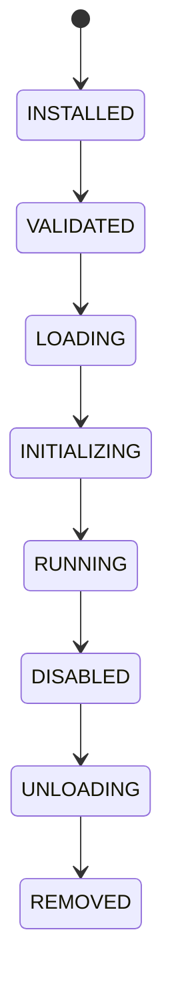

# Plugin Lifecycle

## Document type
This document is an overview, reference, or index as noted below.

# Plugin Lifecycle

## Purpose
Defines the canonical lifecycle for plugins.

## State machine

## Cross-references
- `PLUGIN-SDK.md`
- `PLUGIN-MARKETPLACE.md`
- `PROVIDER-RESILIENCE.md`

## Operational Contract
Defines plugin installation, validation, loading, initialization, runtime, disablement, unload, and removal.

## Example
A plugin is unloaded before version migration.

## Required details
- Define signing, versioning, sandboxing, and side-by-side plugin behavior.

## Lifecycle model
- Initial state: defined by the lifecycle owner.
- Terminal state: defined by the lifecycle owner.
- Allowed transitions: explicitly listed by the lifecycle owner.
- Forbidden transitions: explicitly listed by the lifecycle owner.
- Recovery transitions: explicitly listed by the lifecycle owner.
- Failure transitions: explicitly listed by the lifecycle owner.
