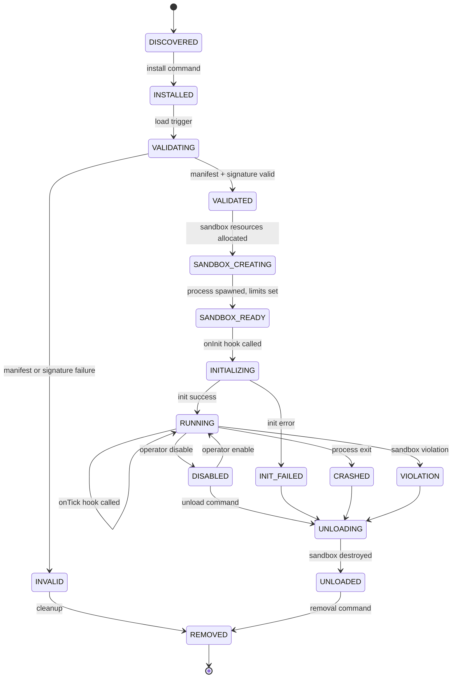

# Plugin Lifecycle

## Document type
Document type: [REFERENCE]

## Version
**Version:** 0.2.0 | **Status:** Draft | **Last Updated:** 2026-07-27 | **Owner:** Plugin Team

## Purpose
Defines the complete lifecycle for plugins — installation, validation, loading, initialization, runtime, disablement, unload, removal, and recovery.

---

## 1. Plugin Lifecycle State Machine

---

## 2. Transition Details

| Transition | From → To | Trigger | Actions |
|------------|-----------|---------|---------|
| Install | DISCOVERED → INSTALLED | Operator / auto-install | Copy files, register in plugin registry, set up data directory |
| Validate | INSTALLED → VALIDATING | On load | Verify manifest schema, check signature, check API compatibility |
| Validate fail | VALIDATING → INVALID | Any validation failure | Log error, notify operator |
| Sandbox create | VALIDATED → SANDBOX_CREATING | Passed validation | Spawn process, set resource limits, establish IPC |
| Sandbox ready | SANDBOX_CREATING → SANDBOX_READY | Process alive + IPC established | Register IPC channels |
| Init | SANDBOX_READY → INITIALIZING | Sandbox ready | Call `onInit` hook with 10s timeout |
| Init fail | INITIALIZING → INIT_FAILED | Timeout or error | Log, disable, notify |
| Run | INITIALIZING → RUNNING | `onInit` returns `{ready: true}` | Enable tick subscription |
| Disable | RUNNING → DISABLED | Operator command | Suspend tick subscription, call `onSuspend` |
| Enable | DISABLED → RUNNING | Operator command | Resume tick subscription, call `onResume` |
| Crash | RUNNING → CRASHED | Process exit (non-zero) | Auto-restart once; second crash → permanent disable |
| Violation | RUNNING → VIOLATION | Sandbox violation detected | Immediate kill, log violation, notify security |
| Unload | any → UNLOADING | Unload command / disable | Call `onUnload` or force kill after 5s timeout |
| Remove | UNLOADED → REMOVED | Removal command | Delete files, clean up registry, notify marketplace |

---

## 3. Failure & Recovery

| Failure | Detection | Auto-Recovery | Max Retries |
|---------|-----------|---------------|-------------|
| Sandbox process crash | Process exit signal | Restart plugin | 1 (second crash ⇒ disabled) |
| IPC timeout | No response for 5s | Retry IPC, then restart | 2 |
| Initialization failure | `onInit` error | Log, disable | 0 (operator must re-enable) |
| Memory violation | RSS > limit | Kill plugin | 0 (operator must re-enable) |
| CPU violation | CPU > limit for 10s | Throttle | 3 violations ⇒ disable |
| Network violation | Unauthorized endpoint | Block, warn | 3 violations ⇒ disable |

---

## 4. Side-by-Side Versioning

- Multiple versions of the same plugin can coexist if they have different `id` values (e.g., `my-strategy@1.0`, `my-strategy@2.0`).
- Only one version can be active at a time per plugin ID.
- Version migration: operator can switch active version; state migration is the plugin's responsibility.

---

## Cross-References

- **PLUGIN-SANDBOX-CONTRACT.md** — Sandbox isolation and capability system.
- **PLUGIN-SDK.md** — Plugin API reference and hooks.
- **PLUGIN-MARKETPLACE.md** — Distribution marketplace.
- **PLUGIN-STATE-MACHINE.md** — Detailed state machine reference.
- **TRUST-BOUNDARIES.md** — Plugin trust domain T4.
- **CONFIGURATION-REFERENCE.md** — Plugin lifecycle config keys (`plugin.*`).

---

## Version History

| Version | Date | Changes | Author |
|---------|------|---------|--------|
| 0.2.0 | 2026-07-27 | Full lifecycle with state machine, transition details, failure recovery, side-by-side versioning | Plugin Team |
| 0.1.0 | 2026-07-27 | Initial stub | Plugin Team |