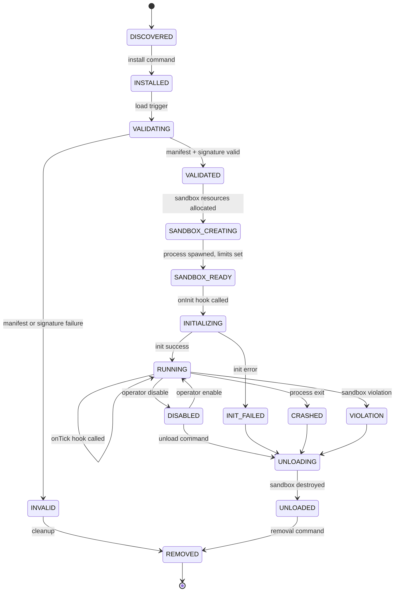

# Plugin Lifecycle

## Document type
Document type: [CONTRACT]

## Version
**Version:** 1.0.0 | **Status:** Canonical | **Last Updated:** 2026-07-29 | **Owner:** Runtime Team

## Purpose
Defines the complete lifecycle for plugins — discovery, dependency resolution, capability negotiation, version compatibility, isolation, permissions, resource quotas, crash recovery, marketplace verification, digital signatures, update lifecycle, and cross-subsystem integration.

---

## 1. Plugin Lifecycle State Machine



---

## 2. Transition Details

| Transition | From → To | Trigger | Actions |
|------------|-----------|---------|---------|
| Install | DISCOVERED → INSTALLED | Operator / auto-install | Copy files, register in plugin registry, set up data directory |
| Validate | INSTALLED → VALIDATING | On load | Verify manifest schema, check signature, check API compatibility |
| Validate fail | VALIDATING → INVALID | Any validation failure | Log error, notify operator |
| Sandbox create | VALIDATED → SANDBOX_CREATING | Passed validation | Spawn process, set resource limits, establish IPC |
| Sandbox ready | SANDBOX_CREATING → SANDBOX_READY | Process alive + IPC established | Register IPC channels |
| Init | SANDBOX_READY → INITIALIZING | Sandbox ready | Call `onInit` hook with 10s timeout |
| Init fail | INITIALIZING → INIT_FAILED | Timeout or error | Log, disable, notify |
| Run | INITIALIZING → RUNNING | `onInit` returns `{ready: true}` | Enable tick subscription |
| Disable | RUNNING → DISABLED | Operator command | Suspend tick subscription, call `onSuspend` |
| Enable | DISABLED → RUNNING | Operator command | Resume tick subscription, call `onResume` |
| Crash | RUNNING → CRASHED | Process exit (non-zero) | Auto-restart once; second crash → permanent disable |
| Violation | RUNNING → VIOLATION | Sandbox violation detected | Immediate kill, log violation, notify security |
| Unload | any → UNLOADING | Unload command / disable | Call `onUnload` or force kill after 5s timeout |
| Remove | UNLOADED → REMOVED | Removal command | Delete files, clean up registry, notify marketplace |

---

## 3. Failure & Recovery

| Failure | Detection | Auto-Recovery | Max Retries |
|---------|-----------|---------------|-------------|
| Sandbox process crash | Process exit signal | Restart plugin | 1 (second crash ⇒ disabled) |
| IPC timeout | No response for 5s | Retry IPC, then restart | 2 |
| Initialization failure | `onInit` error | Log, disable | 0 (operator must re-enable) |
| Memory violation | RSS > limit | Kill plugin | 0 (operator must re-enable) |
| CPU violation | CPU > limit for 10s | Throttle | 3 violations ⇒ disable |
| Network violation | Unauthorized endpoint | Block, warn | 3 violations ⇒ disable |

---

## 4. Side-by-Side Versioning

- Multiple versions of the same plugin can coexist if they have different `id` values (e.g., `my-strategy@1.0`, `my-strategy@2.0`).
- Only one version can be active at a time per plugin ID.
- Version migration: operator can switch active version; state migration is the plugin's responsibility.

---

## 5. Plugin Discovery

### 5.1 Discovery Sources

| Source | Discovery Method | Priority | Trust Level |
|--------|-----------------|----------|-------------|
| **Local directory** | Scan `plugins/` directory for manifest files | High | Verified (local) |
| **Marketplace** | Query marketplace API for installed plugin updates | Medium | Marketplace-verified |
| **Git repository** | Clone from configured git URL | Low | User-verified |
| **File path** | Direct path specified in config | High | Verified (local) |

### 5.2 Discovery Algorithm

```
1. Scan all discovery sources for plugin manifests.
2. For each manifest found:
   a. Validate manifest schema against schemas/plugin.schema.json.
   b. Check API compatibility version against runtime.api_version.
   c. Check minimum runtime version against plugin.min_runtime_version.
   d. Check dependency availability (see §6).
   e. Check marketplace signature (see §10).
3. Valid plugins registered in discovery registry.
4. Invalid plugins logged as INVALID, reason stored.
5. Duplicate plugin IDs: highest version wins; if same version → local wins.
```

---

## 6. Dependency Resolution

### 6.1 Dependency Types

| Type | Description | Resolution | Failure |
|------|-------------|-----------|---------|
| **Hard dependency** | Plugin requires another plugin to function | Must be installed and RUNNING before this plugin can INIT | Block load, show "Missing dependency: X" |
| **Soft dependency** | Plugin enhances with another plugin | Optional; plugin loads without it | Log warning, reduced functionality |
| **Runtime dependency** | Plugin requires a runtime feature (e.g., "AI") | Feature must be available | Block load if feature unavailable |
| **Version dependency** | Plugin requires specific version of another plugin | Version range must match (semver) | Block load, show "Version conflict" |

### 6.2 Dependency Resolution Algorithm

```
1. Collect all discovered plugins.
2. Build dependency graph (directed).
3. Topological sort: determine load order (dependencies first).
4. If circular dependency detected → reject all involved plugins, log error.
5. If missing hard dependency → reject dependent plugin.
6. If missing soft dependency → mark as "degraded", load anyway.
7. If version conflict → attempt to find compatible version; if not found → reject.
8. Load plugins in topological order.
```

---

## 7. Capability Negotiation

### 7.1 Request-Grant Protocol

```
1. Plugin manifest declares requested capabilities (e.g., "ohlc_data", "signal", "dashboard_widget").
2. Plugin Manager evaluates each capability request against:
   a. Runtime capability availability (is the feature available?).
   b. Permission policy (does the plugin's trust level allow this capability?).
   c. Resource budget (is there sufficient quota for this capability?).
3. Granted capabilities: listed in plugin's active grant set.
4. Denied capabilities: plugin informed, must handle gracefully (soft dependency).
5. Capability grants are immutable after INITIALIZING — no runtime changes.
```

### 7.2 Capability Matrix

| Capability | Trust Level Required | Resource Cost | Max Per Plugin | Description |
|-----------|---------------------|--------------|---------------|-------------|
| `ohlc_data` | T4 (basic) | 1 IPC channel | 1 | Subscribe to OHLC price data |
| `signal` | T4 (basic) | 1 IPC channel + 1 widget | 1 | Publish trading signals |
| `dashboard_widget` | T4 (basic) | 2 MB + 200 DOM nodes | 2 | Display widget on dashboard |
| `strategy` | T4 (enhanced) | 5 MB + Worker Pool slot | 1 | Run custom trading strategy |
| `ai_tool` | T4 (enhanced) | AI context injection | 3 | Register AI tool |
| `notification` | T4 (basic) | Notification channel | 5 | Send notifications |
| `storage` | T4 (basic) | 10 MB file quota | 1 | Store persistent data |
| `network` | T4 (restricted) | NEVER granted to T4 | 0 | Direct network access (blocked) |

---

## 8. Version Compatibility

| Runtime API Version | Plugin min_runtime_version | Compatibility | Action |
|---------------------|---------------------------|---------------|--------|
| Matches exactly | Same version | ✅ Full | Load normally |
| Runtime > plugin min | Runtime is newer | ✅ Backward | Load with deprecation warnings |
| Runtime < plugin min | Runtime is older | ❌ Incompatible | Reject |
| Major version mismatch | Different major | ❌ Breaking | Reject |

---

## 9. Update Lifecycle

```
1. Marketplace publishes new version of installed plugin.
2. Update Manager checks: signature, API compatibility, dependency compatibility.
3. If checks pass → download new version to staging directory.
4. Notify plugin: onUpgradeAvailable(new_version).
5. Operator confirms update (or auto-update if configured).
6. RUNNING → DISABLED → UNLOADING → UNLOADED → load new version.
7. New version: DISCOVERED → VALIDATING → ... → RUNNING.
8. If new version fails → rollback: load previous version from cache.
9. Rollback timeout: plugin.update.rollback_timeout_ms (default 120000ms).
```

---

## 10. Marketplace Verification & Digital Signatures

### 10.1 Verification Process

```
1. Plugin downloaded from marketplace.
2. Verify publisher identity (X.509 certificate chain to trusted root).
3. Verify manifest signature (RSA/ECDSA on manifest JSON).
4. Verify package integrity (SHA-256 checksum matches manifest).
5. Verify timestamp (signature within validity period).
6. Check certificate revocation (OCSP/CRL).
7. If all pass → eligible for VALIDATING.
8. If any fail → INVALID, reason stored.
```

### 10.2 Signature Requirements

| Requirement | Failure Action |
|-------------|---------------|
| Publisher certificate chain valid | Reject: "Untrusted publisher" |
| Manifest signature valid | Reject: "Manifest signature invalid" |
| Package checksum valid | Reject: "Package integrity failed" |
| Signature timestamp current | Reject: "Signature expired" |
| Certificate not revoked | Reject: "Publisher certificate revoked" |

- Local plugins: signature optional, trust level "local", flagged "unverified".
- Operator can sign local plugins with self-generated certificate.

---

## 11. Resource Quotas

| Resource | Default Quota | Enforcement | Exceeded Action |
|----------|--------------|-------------|-----------------|
| **Memory** | 50 MB | Sandbox RSS monitoring | Kill process, CRASHED |
| **CPU** | 5% total | Sandbox CPU accounting | Throttle → disable after 3 violations |
| **Disk** | 10 MB | File quota in sandbox | Block writes |
| **IPC bandwidth** | 50 msg/s | IPC bridge rate limit | Drop excess, warn |
| **Network** | 0 (blocked) | Sandbox firewall | Kill process, VIOLATION |
| **Widgets** | 2 | Dashboard widget registry | Reject widget creation |
| **DOM nodes** | 200 per widget | Sandbox DOM counter | Kill widget render |
| **AI context** | 500 tokens/request | AI pipeline quota | Reject with "Quota exceeded" |

---

## 12. Cross-Subsystem Integration

### 12.1 Who Calls Plugin Lifecycle

| Caller | Purpose | Contract |
|--------|---------|----------|
| Marketplace | Publish plugin update | `marketplace.update.available` event |
| Dashboard Operator | Install/unload/disable/enable | `dashboard.command` IPC |
| Task Scheduler | Scheduled maintenance | `scheduler.plugin.maintenance` task |
| Config Manager | Plugin config change | `config.updated` event |
| Recovery Coordination | Restart crashed plugin | `recovery.plugin.restart` API |

### 12.2 Events Plugin Lifecycle Emits

| Event | Payload | Consumer |
|-------|---------|----------|
| `plugin.discovered` | `{plugin_id, name, version, source, trust_level}` | Plugin Manager, Dashboard |
| `plugin.loaded` | `{plugin_id, name, version, capabilities_granted, sandbox_pid}` | Runtime, Dashboard |
| `plugin.unloaded` | `{plugin_id, name, reason, duration_running_ms}` | Runtime, Dashboard |
| `plugin.crashed` | `{plugin_id, name, exit_code, last_words, auto_restart}` | Runtime, Dashboard, Notification |
| `plugin.violation` | `{plugin_id, name, capability, violation_type, action}` | Security, Dashboard |
| `plugin.update.available` | `{plugin_id, new_version, changelog_url}` | Dashboard, Operator |
| `plugin.update.completed` | `{plugin_id, old_version, new_version, rollback_needed}` | Dashboard, Marketplace |

---

## Cross-References

- **PLUGIN-SANDBOX-CONTRACT.md** — Sandbox isolation and capability system.
- **PLUGIN-SDK.md** — Plugin API reference and hooks.
- **PLUGIN-MARKETPLACE.md** — Distribution marketplace.
- **PLUGIN-STATE-MACHINE.md** — Detailed state machine reference.
- **APP-BUILDER-PLUGIN-SYSTEM.md** — Manifest governance, API stability policy.
- **TRUST-BOUNDARIES.md** — Plugin trust domain T4.
- **PERMISSION-MODEL.md** — Plugin permission enforcement.
- **CONFIGURATION-REFERENCE.md** — Plugin lifecycle config keys (`plugin.*`).
- **END-TO-END-WIRING-CONTRACT.md** — Cross-subsystem wiring.
- **TRACEABILITY-MATRIX.md** — REQ-PLUGIN-004.

---

## Version History

| Version | Date | Changes | Author |
|---------|------|---------|--------|
| 1.0.0 | 2026-07-29 | Added formal Document type declaration, Version block, and Version History section to satisfy [CONTRACT] compliance (`architecture-tests/validate_contracts.py`, `architecture-tests/validate_ownership.py`). Substantive content unchanged. | Runtime Team |
