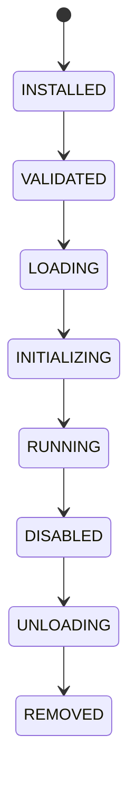

# Plugin Lifecycle

## Purpose
Defines the canonical lifecycle for plugins.

## State machine

```mermaid
stateDiagram-v2
  [*] --> INSTALLED
  INSTALLED --> VALIDATED
  VALIDATED --> LOADING
  LOADING --> INITIALIZING
  INITIALIZING --> RUNNING
  RUNNING --> DISABLED
  DISABLED --> UNLOADING
  UNLOADING --> REMOVED
```

## Cross-references
- `PLUGIN-SDK.md`
- `PLUGIN-MARKETPLACE.md`
- `PROVIDER-RESILIENCE.md`
