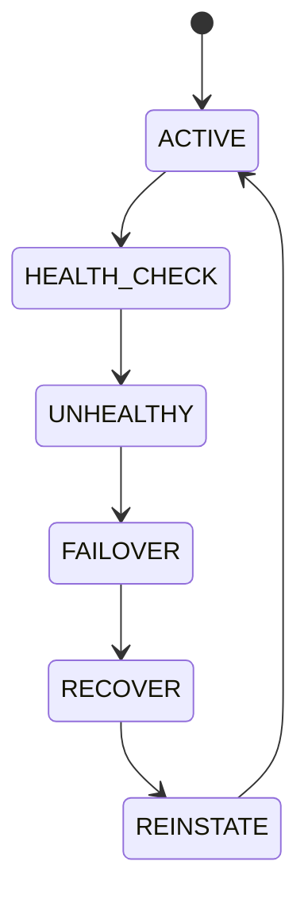

# Provider Resilience

## Purpose
Defines provider health checking, failover, capability detection, latency monitoring, and reinstatement.

## State machine

## Content
Primary and secondary provider lists are explicitly configured. Health probes run at a fixed interval and compare latency, capability, and availability.

## Configuration
- PRIMARY_PROVIDER.
- SECONDARY_PROVIDERS.
- HEALTH_CHECK_INTERVAL.
- FAILOVER_THRESHOLD.
- FAILBACK_POLICY.

## Failure modes
If all providers fail, enter degraded mode and alert operations.

## Cross-references
- `AI-PROVIDER-MANAGER.md`
- `AI-GATEWAY.md`
- `HEALTHCHECKS.md`
- `PERFORMANCE-SLOS.md`
