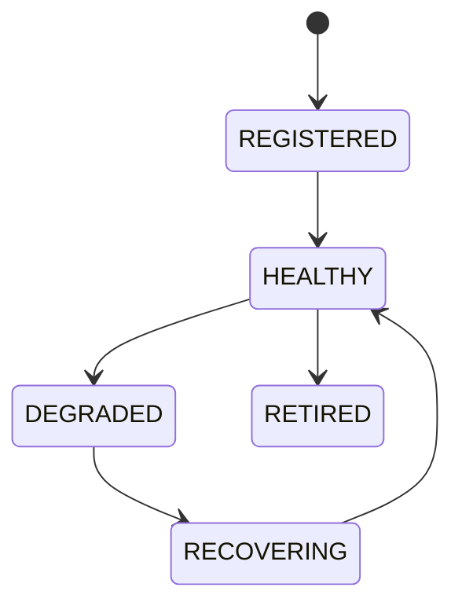

# Resource Manager

## Purpose
Defines unified resource lifecycle management for wallets, workers, chains, AI, plugins, RPC, storage, and queues.

## State machine

## Failure modes
Missing resource, stale version, health degradation, exhaustion.

## Recovery
Rebind resource, replace endpoint, restart service, or retire resource.

## Cross-references
- `APEX-KERNEL.md`
- `SERVICE-REGISTRY.md`
- `REGISTRY-SYSTEM.md`
- `WORKER-POOL.md`

## Operational Contract
Defines allocation, quotas, cleanup, contention handling, and resource lifecycle.

## Example
A worker is paused when resource usage exceeds limits.
