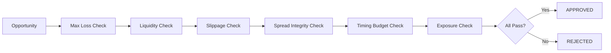

# Risk Engine

## Purpose
Defines trading risk checks used before and during execution — with explicit formulas, limits, circuit breakers, and abort behavior.

---

## 1. Risk Check Pipeline

Each trade opportunity passes through the risk pipeline sequentially. All checks must PASS for the trade to proceed.



---

## 2. Risk Check Definitions

### 2.1 Max Loss Check
**Purpose**: Ensure worst-case loss does not exceed configured limit.

```
condition: estimated_loss_usd <= risk.max_loss_per_trade_usd
default:   risk.max_loss_per_trade_usd = 50.00
source:    CONFIGURATION-REFERENCE.md
```

Failure action: REJECT with code `LOSS_LIMIT_EXCEEDED`.

### 2.2 Liquidity Check
**Purpose**: Ensure DEX pools have sufficient depth for the trade size.

```
condition: trade_size_usd <= pool_liquidity_usd × risk.max_liquidity_usage_pct
default:   risk.max_liquidity_usage_pct = 0.05 (5%)
source:    On-chain pool query
```

Failure action: REJECT with code `LIQUIDITY_INSUFFICIENT`.

### 2.3 Slippage Check
**Purpose**: Ensure expected slippage is within acceptable range.

```
condition: expected_slippage_pct <= risk.max_slippage_pct
default:   risk.max_slippage_pct = 1.0 (1%)
expected_slippage_pct = (reserve_in / (reserve_in + trade_size)) - 1
```

Failure action: REJECT with code `SLIPPAGE_EXCEEDED`.

### 2.4 Spread Integrity Check
**Purpose**: Verify the arbitrage spread is real (not a stale price or flash loan artifact).

```
condition: (chain_A_price / chain_B_price) - 1 >= risk.min_arb_spread_pct
default:   risk.min_arb_spread_pct = 0.3 (0.3%)
validation: Prices must be within `risk.price_freshness_ms` (default 5000ms)
```

Failure action: REJECT with code `SPREAD_INVALID`.

### 2.5 Timing Budget Check
**Purpose**: Ensure the arbitrage can complete within the estimated timing window.

```
condition: estimated_execution_ms <= risk.timing_budget_ms
default:   risk.timing_budget_ms = 30000 (30s)
estimated_execution_ms = gas_estimate / blocks_per_second + chain_latency_ms
```

Failure action: REJECT with code `TIMING_BUDGET_EXCEEDED`.

### 2.6 Exposure Check
**Purpose**: Prevent over-concentration in any single asset, chain, or strategy.

```
condition_a: position_size_usd / portfolio_value_usd <= risk.max_exposure_per_asset_pct
condition_b: open_trades_on_chain <= risk.max_concurrent_trades_per_chain
default:     risk.max_exposure_per_asset_pct = 0.10 (10%)
             risk.max_concurrent_trades_per_chain = 3
```

Failure action: REJECT with code `EXPOSURE_LIMIT_EXCEEDED`.

---

## 3. Circuit Breakers

### 3.1 Cascade Circuit Breaker
If a leg of a multi-leg trade fails, subsequent legs on related chains are blocked for `risk.circuit_breaker.cooloff_ms` (default 60000ms).

```
trigger:   trade leg failure on chain X
action:    block all trades involving chain X for cooloff_ms
```

### 3.2 Profitability Circuit Breaker
If N consecutive trades result in net loss, trading is paused for escalating intervals.

```
trigger:   risk.circuit_breaker.consecutive_losses (default 3)
action:    pause trading for: 1st trip → 60s, 2nd → 300s, 3rd → 3600s
reset:     A profitable trade resets the counter
```

### 3.3 Volatility Circuit Breaker
If network gas prices exceed threshold, reduce trade frequency.

```
trigger:   base_fee_gwei > risk.circuit_breaker.gas_spike_threshold_gwei (default 500)
action:    throttle trade rate to 1/10 of normal; skip low-profit opportunities (< risk.min_arb_spread_pct × 2)
```

---

## 4. Partial Fill Handling

| Scenario | Action |
|----------|--------|
| Leg 1 partially filled (fills < `risk.partial_fill.min_pct`) | Abort trade, attempt reversal |
| Leg 1 partially filled (fills >= min_pct) | Continue to Leg 2 with adjusted position |
| Leg 2 partially filled | Accept fill; record actual profit (may be negative) |
| Cross-leg exposure | Sum of all leg values must not exceed `risk.max_exposure_per_trade_usd` |

Default `risk.partial_fill.min_pct`: 0.8 (80%).

---

## 5. Risk Engine Observability

Every risk check produces an event:

| Event | Payload | Producer |
|-------|---------|----------|
| `risk.check.passed` | `{trade_id, check_name, value, limit}` | Risk Engine |
| `risk.check.failed` | `{trade_id, check_name, value, limit, reason_code}` | Risk Engine |
| `risk.circuit_breaker.tripped` | `{breaker_type, chain, cooloff_ms}` | Risk Engine |
| `risk.circuit_breaker.reset` | `{breaker_type, chain}` | Risk Engine |

---

## Cross-References

- **TRADING-ENGINE.md** — Trade flow that invokes risk checks.
- **EXECUTION-ENGINE.md** — Execution that may trigger post-submit risk events.
- **TRADING-LIFECYCLE.md** — Where risk checks fit in the lifecycle.
- **ARBITRAGE-WINDOW-MANAGER.md** — Timing window calculation.
- **OPPORTUNITY-RANKING.md** — Risk-adjusted scoring.
- **CONFIGURATION-REFERENCE.md** — Risk config keys (`risk.*`).
- **TRACEABILITY-MATRIX.md** — Risk requirement coverage.

---
