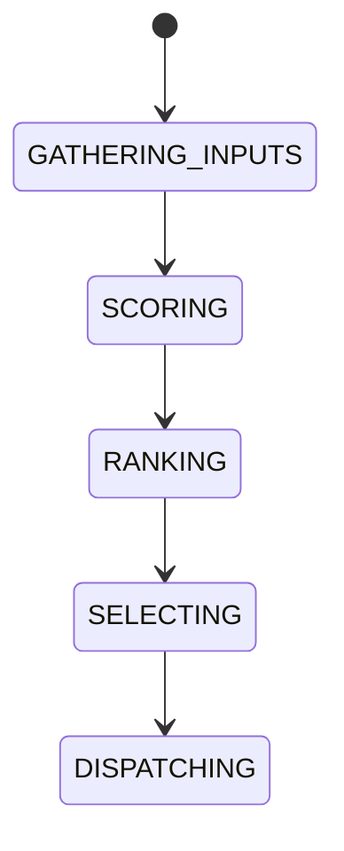

# Route Scoring Model

## Purpose
Defines the mathematical scoring model used for route selection.

## Score factors
Profit, confidence, historical success, gas, liquidity, latency, complexity.

## State machine

## Failure modes
Invalid inputs, unstable ranking, stale market data.

## Recovery
Recompute score, refresh data, or fall back to next-best route.

## Cross-references
- `ROUTE-OPTIMIZATION.md`
- `SIMULATION-ENGINE.md`
- `RISK-ENGINE.md`

## Operational Contract
Defines route features, weights, score calculation, and selection criteria.

## Example
A route with stronger liquidity and lower cost ranks higher.
