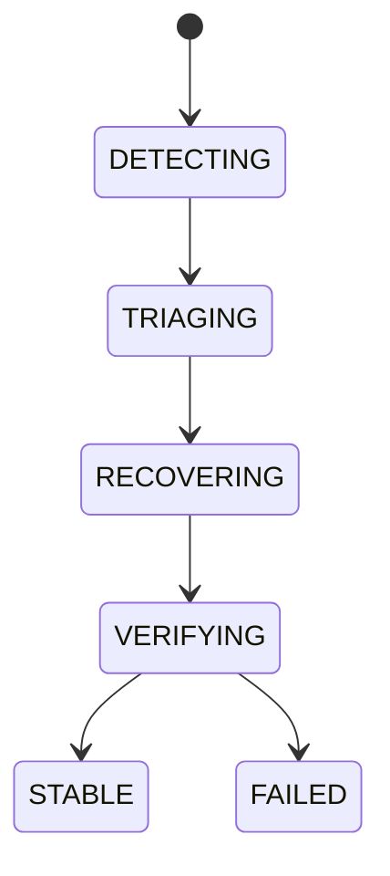

# Self Healing

## Document type
This document is an overview, reference, or index as noted below.

# Self-Healing

## Purpose
Defines the canonical recovery actions for workers, RPC, providers, caches, wallets, and queues.

## State machine

## Failure modes
Transient failure, repeated failure, unrecoverable failure.

## Recovery
Restart worker, reconnect RPC, switch provider, reload cache, recover queue, notify operators.

## Cross-references
- `HEALTHCHECKS.md`
- `PROVIDER-RESILIENCE.md`
- `RECOVERY-AND-FAILOVER.md`

## Operational Contract
Defines the responsibilities, invariants, and expected behavior for this component.

## Example
An input is validated before any state-changing action.
