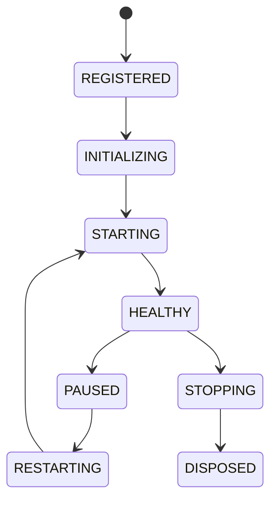

# Service Lifecycle

## Document type
This document is an overview, reference, or index as noted below.

# Service Lifecycle

## Purpose
Defines the canonical lifecycle for all services.

## State machine

## Cross-references
- `APEX-KERNEL.md`
- `ORCHESTRATOR.md`
- `HEALTHCHECKS.md`

## Operational Contract
Defines service registration, initialization, start, healthy, paused, restarting, stopping, and disposed transitions.

## Example
A worker service transitions to paused during maintenance.

## Windows service lifecycle
- Must define SCM states and recovery actions.

## Required details
- Define SCM lifecycle states and recovery actions.

## Windows SCM
- Define install, start, stop, restart, and recovery states under Windows SCM.
- Define delayed start and service account behavior.

## Service states
- Define install, start, stop, restart, and recovery states under Windows SCM.
- Define delayed start and service account behavior.

## Service rules
- Define install, start, stop, restart, and recovery states under Windows SCM.
- Define delayed start and service account behavior.

## Lifecycle model
- Initial state: defined by the lifecycle owner.
- Terminal state: defined by the lifecycle owner.
- Allowed transitions: explicitly listed by the lifecycle owner.
- Forbidden transitions: explicitly listed by the lifecycle owner.
- Recovery transitions: explicitly listed by the lifecycle owner.
- Failure transitions: explicitly listed by the lifecycle owner.
