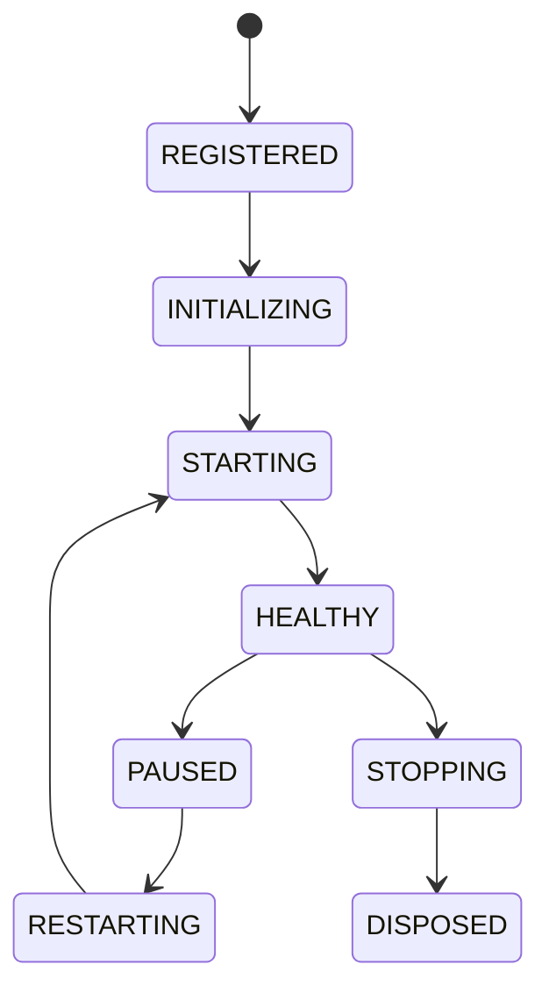

# Service Lifecycle

## Purpose
Defines the canonical lifecycle for all services.

## State machine

```mermaid
stateDiagram-v2
  [*] --> REGISTERED
  REGISTERED --> INITIALIZING
  INITIALIZING --> STARTING
  STARTING --> HEALTHY
  HEALTHY --> PAUSED
  PAUSED --> RESTARTING
  RESTARTING --> STARTING
  HEALTHY --> STOPPING
  STOPPING --> DISPOSED
```

## Cross-references
- `APEX-KERNEL.md`
- `ORCHESTRATOR.md`
- `HEALTHCHECKS.md`
